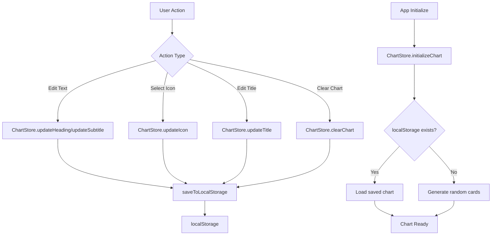

# The Talking Chart - Nuxt 3 Architecture

## Overview

This document outlines the architecture for rebuilding "The Talking Chart" - a visual communication chart builder for individuals with communication difficulties. The rebuild modernizes the stack from Vue 2 + BootstrapVue to Nuxt 3 + Vue 3 + Tailwind CSS.

---

## Table of Contents

1. [Project Structure](#1-project-structure)
2. [Component Architecture](#2-component-architecture)
3. [State Management](#3-state-management)
4. [Page Structure](#4-page-structure)
5. [Styling Strategy](#5-styling-strategy)
6. [GitHub Pages Deployment](#6-github-pages-deployment)
7. [Icon Management](#7-icon-management)
8. [Accessibility Guidelines](#8-accessibility-guidelines)
9. [Development Workflow](#9-development-workflow)

---

## 1. Project Structure

### Directory Layout

```
visual-communication-app/
├── .github/
│   └── workflows/
│       └── deploy.yml              # GitHub Actions deployment
├── .nuxt/                          # Nuxt build output (gitignored)
├── assets/
│   ├── css/
│   │   └── main.css                # Tailwind imports + custom styles
│   └── fonts/                      # Custom fonts if needed
├── components/
│   ├── chart/
│   │   ├── ChartGrid.vue           # 20-card grid container
│   │   ├── ChartCard.vue           # Individual card component
│   │   └── ChartHeading.vue        # Editable chart title
│   ├── icons/
│   │   ├── IconPicker.vue          # Modal icon selector
│   │   ├── IconGrid.vue            # Icon display grid
│   │   ├── IconCategoryFilter.vue  # Category tabs/chips
│   │   └── IconSearch.vue          # Search input component
│   ├── layout/
│   │   ├── TheNavbar.vue           # Navigation bar
│   │   ├── TheFooter.vue           # Footer component
│   │   └── PrintWatermark.vue      # Print-only watermark
│   ├── ui/
│   │   ├── BaseButton.vue          # Reusable button
│   │   ├── BaseModal.vue           # Modal wrapper
│   │   ├── BaseInput.vue           # Styled input
│   │   ├── ConfirmDialog.vue       # Confirmation modal
│   │   └── LoadingSpinner.vue      # Loading indicator
│   └── home/
│       ├── HeroSection.vue         # Landing hero
│       └── AboutSection.vue        # About content
├── composables/
│   ├── useChart.ts                 # Chart state logic
│   ├── useLocalStorage.ts          # localStorage abstraction
│   ├── useIcons.ts                 # Icon filtering/search
│   └── usePrint.ts                 # Print functionality
├── layouts/
│   └── default.vue                 # Main layout with navbar/footer
├── pages/
│   ├── index.vue                   # Landing page
│   └── create.vue                  # Chart builder page
├── plugins/
│   └── pinia.ts                    # Pinia setup
├── public/
│   └── icons/                      # SVG icons (copied from /img/icons)
├── stores/
│   ├── chart.ts                    # Chart state store
│   └── icons.ts                    # Icon manifest store
├── types/
│   ├── chart.ts                    # Chart-related types
│   └── icon.ts                     # Icon-related types
├── utils/
│   ├── iconManifest.ts             # Icon manifest generator
│   └── constants.ts                # App constants
├── app.vue                         # Root app component
├── nuxt.config.ts                  # Nuxt configuration
├── tailwind.config.ts              # Tailwind configuration
├── tsconfig.json                   # TypeScript config
└── package.json                    # Dependencies
```

---

## 2. Component Architecture

### Component Hierarchy

```
App
├── layouts/default.vue
│   ├── TheNavbar
│   ├── <slot />
│   └── TheFooter
│
├── pages/index.vue (Home)
│   ├── HeroSection
│   └── AboutSection
│
└── pages/create.vue (Chart Builder)
    ├── ChartHeading
    ├── ChartGrid
    │   └── ChartCard (x20)
    │       └── IconPicker (modal)
    │           ├── IconCategoryFilter
    │           ├── IconSearch
    │           └── IconGrid
    └── PrintWatermark (print-only)
```

### Component Specifications

#### Chart Components

##### [`ChartGrid.vue`](components/chart/ChartGrid.vue)

**Responsibility**: Container for the 20-card grid layout

| Prop | Type | Required | Default | Description |
|------|------|----------|---------|-------------|
| cards | ChartCard[] | Yes | - | Array of 20 card objects |

| Event | Payload | Description |
|-------|---------|-------------|
| update:card | { index: number, card: ChartCard } | Card updated |
| clear-chart | - | Clear all cards requested |

##### [`ChartCard.vue`](components/chart/ChartCard.vue)

**Responsibility**: Individual card with icon, heading, and subtitle

| Prop | Type | Required | Default | Description |
|------|------|----------|---------|-------------|
| card | ChartCard | Yes | - | Card data object |
| index | number | Yes | - | Card position (0-19) |

| Event | Payload | Description |
|-------|---------|-------------|
| update:heading | string | Heading changed |
| update:subtitle | string | Subtitle changed |
| update:icon | string | Icon changed |
| open-picker | number | Open icon picker for card |

##### [`ChartHeading.vue`](components/chart/ChartHeading.vue)

**Responsibility**: Editable chart title with character limit

| Prop | Type | Required | Default | Description |
|------|------|----------|---------|-------------|
| modelValue | string | Yes | - | Current title |
| maxLength | number | No | 40 | Character limit |

| Event | Payload | Description |
|-------|---------|-------------|
| update:modelValue | string | Title changed |

#### Icon Picker Components

##### [`IconPicker.vue`](components/icons/IconPicker.vue)

**Responsibility**: Modal container for icon selection

| Prop | Type | Required | Default | Description |
|------|------|----------|---------|-------------|
| modelValue | boolean | Yes | - | Modal visibility |
| selectedIcon | string | No | - | Currently selected icon path |
| cardIndex | number | Yes | - | Which card is being edited |

| Event | Payload | Description |
|-------|---------|-------------|
| update:modelValue | boolean | Close modal |
| select | string | Icon selected |

##### [`IconGrid.vue`](components/icons/IconGrid.vue)

**Responsibility**: Display filtered icons in a grid

| Prop | Type | Required | Default | Description |
|------|------|----------|---------|-------------|
| icons | Icon[] | Yes | - | Icons to display |
| selectedIcon | string | No | - | Currently selected |

| Event | Payload | Description |
|-------|---------|-------------|
| select | Icon | Icon clicked |

##### [`IconCategoryFilter.vue`](components/icons/IconCategoryFilter.vue)

**Responsibility**: Category tabs/chips for filtering

| Prop | Type | Required | Default | Description |
|------|------|----------|---------|-------------|
| categories | string[] | Yes | - | Available categories |
| modelValue | string | No | 'all' | Selected category |

| Event | Payload | Description |
|-------|---------|-------------|
| update:modelValue | string | Category changed |

##### [`IconSearch.vue`](components/icons/IconSearch.vue)

**Responsibility**: Search input for filtering icons

| Prop | Type | Required | Default | Description |
|------|------|----------|---------|-------------|
| modelValue | string | No | '' | Search query |
| placeholder | string | No | 'Search icons...' | Input placeholder |

| Event | Payload | Description |
|-------|---------|-------------|
| update:modelValue | string | Search query changed |

#### UI Components

##### [`BaseButton.vue`](components/ui/BaseButton.vue)

| Prop | Type | Required | Default | Description |
|------|------|----------|---------|-------------|
| variant | 'primary' \| 'secondary' \| 'ghost' | No | 'primary' | Button style |
| size | 'sm' \| 'md' \| 'lg' | No | 'md' | Button size |
| disabled | boolean | No | false | Disabled state |
| loading | boolean | No | false | Loading state |
| icon | string | No | - | Icon name prefix |

| Event | Payload | Description |
|-------|---------|-------------|
| click | MouseEvent | Button clicked |

##### [`BaseModal.vue`](components/ui/BaseModal.vue)

| Prop | Type | Required | Default | Description |
|------|------|----------|---------|-------------|
| modelValue | boolean | Yes | - | Modal visibility |
| title | string | No | - | Modal title |
| size | 'sm' \| 'md' \| 'lg' \| 'xl' | No | 'md' | Modal size |
| scrollable | boolean | No | true | Content scrollable |

| Event | Payload | Description |
|-------|---------|-------------|
| update:modelValue | boolean | Close modal |
| close | - | Modal closed |

##### [`ConfirmDialog.vue`](components/ui/ConfirmDialog.vue)

| Prop | Type | Required | Default | Description |
|------|------|----------|---------|-------------|
| modelValue | boolean | Yes | - | Dialog visibility |
| title | string | No | 'Confirm' | Dialog title |
| message | string | Yes | - | Confirmation message |
| confirmText | string | No | 'Confirm' | Confirm button text |
| cancelText | string | No | 'Cancel' | Cancel button text |
| variant | 'danger' \| 'warning' \| 'info' | No | 'warning' | Dialog style |

| Event | Payload | Description |
|-------|---------|-------------|
| confirm | - | User confirmed |
| cancel | - | User cancelled |

### Type Definitions

#### [`types/chart.ts`](types/chart.ts)

```typescript
export interface ChartCard {
  id: string
  iconPath: string
  iconAlt: string
  heading: string      // max 12 chars
  subtitle: string     // max 19 chars
}

export interface ChartState {
  title: string        // max 40 chars
  cards: ChartCard[]   // always 20 cards
  lastModified: string // ISO timestamp
}

export const CHART_CONSTANTS = {
  MAX_TITLE_LENGTH: 40,
  MAX_HEADING_LENGTH: 12,
  MAX_SUBTITLE_LENGTH: 19,
  CARD_COUNT: 20,
  STORAGE_KEY_CHART: 'talkingChart_chart',
  STORAGE_KEY_TITLE: 'talkingChart_title',
} as const
```

#### [`types/icon.ts`](types/icon.ts)

```typescript
export interface Icon {
  id: string
  path: string
  alt: string
  category: IconCategory
  keywords: string[]  // for search
}

export type IconCategory = 
  | 'alphabet'
  | 'disability'
  | 'family'
  | 'feminine-hygiene'
  | 'health'

export interface IconCategoryInfo {
  id: IconCategory
  label: string
  icon: string  // representative icon
  count: number
}
```

---

## 3. State Management

### Pinia Store Design

#### [`stores/chart.ts`](stores/chart.ts)

```typescript
import { defineStore } from 'pinia'
import type { ChartCard, ChartState } from '~/types/chart'
import { CHART_CONSTANTS } from '~/types/chart'

export const useChartStore = defineStore('chart', {
  state: (): ChartState => ({
    title: 'My First Chart!',
    cards: [],
    lastModified: new Date().toISOString(),
  }),

  getters: {
    isChartEmpty: (state) => state.cards.every(card => 
      !card.heading && !card.subtitle
    ),
    cardCount: (state) => state.cards.length,
  },

  actions: {
    // Initialize chart from localStorage or create new
    initializeChart() {
      const savedChart = localStorage.getItem(CHART_CONSTANTS.STORAGE_KEY_CHART)
      const savedTitle = localStorage.getItem(CHART_CONSTANTS.STORAGE_KEY_TITLE)
      
      if (savedChart) {
        this.cards = JSON.parse(savedChart)
      } else {
        this.generateRandomCards()
      }
      
      if (savedTitle) {
        this.title = JSON.parse(savedTitle)
      }
    },

    // Generate 20 cards with random icons
    generateRandomCards() {
      const iconStore = useIconStore()
      this.cards = Array.from({ length: CHART_CONSTANTS.CARD_COUNT }, (_, i) => {
        const randomIcon = iconStore.getRandomIcon()
        return {
          id: `card-${i}`,
          iconPath: randomIcon.path,
          iconAlt: randomIcon.alt,
          heading: '',
          subtitle: '',
        }
      })
      this.saveToLocalStorage()
    },

    // Update single card
    updateCard(index: number, updates: Partial<ChartCard>) {
      if (index >= 0 && index < this.cards.length) {
        this.cards[index] = { ...this.cards[index], ...updates }
        this.saveToLocalStorage()
      }
    },

    // Update card heading
    updateHeading(index: number, heading: string) {
      const truncated = heading.slice(0, CHART_CONSTANTS.MAX_HEADING_LENGTH)
      this.updateCard(index, { heading: truncated })
    },

    // Update card subtitle
    updateSubtitle(index: number, subtitle: string) {
      const truncated = subtitle.slice(0, CHART_CONSTANTS.MAX_SUBTITLE_LENGTH)
      this.updateCard(index, { subtitle: truncated })
    },

    // Update card icon
    updateIcon(index: number, iconPath: string, iconAlt: string) {
      this.updateCard(index, { iconPath, iconAlt })
    },

    // Update chart title
    updateTitle(title: string) {
      this.title = title.slice(0, CHART_CONSTANTS.MAX_TITLE_LENGTH)
      this.saveToLocalStorage()
    },

    // Clear chart and regenerate
    clearChart() {
      this.title = 'My Next Chart!'
      this.generateRandomCards()
    },

    // Persist to localStorage
    saveToLocalStorage() {
      this.lastModified = new Date().toISOString()
      localStorage.setItem(
        CHART_CONSTANTS.STORAGE_KEY_CHART, 
        JSON.stringify(this.cards)
      )
      localStorage.setItem(
        CHART_CONSTANTS.STORAGE_KEY_TITLE, 
        JSON.stringify(this.title)
      )
    },
  },
})
```

#### [`stores/icons.ts`](stores/icons.ts)

```typescript
import { defineStore } from 'pinia'
import type { Icon, IconCategory } from '~/types/icon'
import iconManifest from '~/utils/iconManifest.json'

export const useIconStore = defineStore('icons', {
  state: () => ({
    icons: [] as Icon[],
    categories: [] as IconCategory[],
    loaded: false,
  }),

  getters: {
    // Get icons by category
    getIconsByCategory: (state) => (category: IconCategory | 'all') => {
      if (category === 'all') return state.icons
      return state.icons.filter(icon => icon.category === category)
    },

    // Search icons by keyword
    searchIcons: (state) => (query: string) => {
      const normalizedQuery = query.toLowerCase().trim()
      if (!normalizedQuery) return state.icons
      
      return state.icons.filter(icon => 
        icon.keywords.some(keyword => 
          keyword.toLowerCase().includes(normalizedQuery)
        ) ||
        icon.alt.toLowerCase().includes(normalizedQuery)
      )
    },

    // Filter and search combined
    filterIcons: (state) => (category: IconCategory | 'all', query: string) => {
      let filtered = category === 'all' 
        ? state.icons 
        : state.icons.filter(icon => icon.category === category)
      
      if (query.trim()) {
        const normalizedQuery = query.toLowerCase().trim()
        filtered = filtered.filter(icon =>
          icon.keywords.some(keyword => 
            keyword.toLowerCase().includes(normalizedQuery)
          ) ||
          icon.alt.toLowerCase().includes(normalizedQuery)
        )
      }
      
      return filtered
    },

    // Get random icon
    getRandomIcon: (state) => (): Icon => {
      return state.icons[Math.floor(Math.random() * state.icons.length)]
    },

    // Get category info
    categoryInfo: (state) => {
      const counts: Record<string, number> = {}
      state.icons.forEach(icon => {
        counts[icon.category] = (counts[icon.category] || 0) + 1
      })
      return Object.entries(counts).map(([id, count]) => ({
        id,
        label: formatCategoryLabel(id),
        count,
      }))
    },
  },

  actions: {
    // Load icon manifest
    async loadIcons() {
      if (this.loaded) return
      
      this.icons = iconManifest.icons
      this.categories = ['all', ...new Set(this.icons.map(i => i.category))] as IconCategory[]
      this.loaded = true
    },
  },
})

// Helper to format category labels
function formatCategoryLabel(category: string): string {
  return category
    .split('-')
    .map(word => word.charAt(0).toUpperCase() + word.slice(1))
    .join(' ')
}
```

### State Flow Diagram



---

## 4. Page Structure

### Routes

| Route | File | Description |
|-------|------|-------------|
| `/` | [`pages/index.vue`](pages/index.vue) | Landing page |
| `/create` | [`pages/create.vue`](pages/create.vue) | Chart builder |

### Page Layouts

#### [`layouts/default.vue`](layouts/default.vue)

```vue
<template>
  <div class="min-h-screen flex flex-col">
    <TheNavbar />
    <main class="flex-1">
      <slot />
    </main>
    <TheFooter class="print:hidden" />
    <PrintWatermark class="hidden print:block" />
  </div>
</template>
```

#### [`pages/index.vue`](pages/index.vue) - Landing Page

```vue
<template>
  <div>
    <HeroSection />
    <AboutSection />
  </div>
</template>
```

**Sections:**
1. **Hero**: Headline, description, CTA button to create chart
2. **About**: Story about the app, why it was created, contact link

#### [`pages/create.vue`](pages/create.vue) - Chart Builder

```vue
<template>
  <div class="chart-page">
    <!-- Action buttons (print/clear) - hidden when printing -->
    <div class="action-bar print:hidden">
      <BaseButton variant="primary" @click="handlePrint">
        Print
      </BaseButton>
      <BaseButton variant="ghost" @click="confirmClear">
        Clear Chart
      </BaseButton>
    </div>

    <!-- Chart title -->
    <ChartHeading v-model="chartStore.title" />

    <!-- Chart grid -->
    <ChartGrid :cards="chartStore.cards" />

    <!-- Icon picker modal -->
    <IconPicker 
      v-model="showIconPicker"
      :card-index="selectedCardIndex"
      @select="handleIconSelect"
    />

    <!-- Confirm dialog -->
    <ConfirmDialog
      v-model="showConfirm"
      title="Clear Chart?"
      message="Are you sure you want to clear your chart? Once deleted, your old chart cannot be recovered."
      confirm-text="Clear Chart"
      variant="danger"
      @confirm="handleClearConfirm"
    />
  </div>
</template>

<script setup lang="ts">
const chartStore = useChartStore()
const iconStore = useIconStore()

// Initialize on mount
onMounted(async () => {
  await iconStore.loadIcons()
  chartStore.initializeChart()
})

// Icon picker state
const showIconPicker = ref(false)
const selectedCardIndex = ref(0)

// Confirm dialog state
const showConfirm = ref(false)

// Handlers
function handlePrint() {
  window.print()
}

function confirmClear() {
  showConfirm.value = true
}

function handleClearConfirm() {
  chartStore.clearChart()
  showConfirm.value = false
}

function handleIconSelect(iconPath: string, iconAlt: string) {
  chartStore.updateIcon(selectedCardIndex.value, iconPath, iconAlt)
  showIconPicker.value = false
}
</script>
```

---

## 5. Styling Strategy

### Tailwind Configuration

#### [`tailwind.config.ts`](tailwind.config.ts)

```typescript
import type { Config } from 'tailwindcss'

export default <Config>{
  content: [
    './components/**/*.{js,vue,ts}',
    './layouts/**/*.vue',
    './pages/**/*.vue',
    './plugins/**/*.{js,ts}',
    './app.vue',
  ],
  theme: {
    extend: {
      colors: {
        // Primary brand colors - Modern SaaS palette
        primary: {
          50: '#f5f3f7',
          100: '#e8e4ec',
          200: '#d4cce5',
          300: '#b5a7d8',
          400: '#9580c9',
          500: '#7c5fb8',  // Main primary
          600: '#6b4c9f',
          700: '#5a3f83',
          800: '#4c366b',
          900: '#42305a',
          950: '#2a1d3a',
        },
        // Accent color - Coral/Salmon for warmth
        accent: {
          50: '#fff1f1',
          100: '#ffe1e1',
          200: '#ffc7c7',
          300: '#ffa0a0',
          400: '#ff6b6b',  // Main accent
          500: '#f04444',
          600: '#d23030',
          700: '#b02525',
          800: '#922222',
          900: '#792020',
          950: '#430c0c',
        },
        // Neutral grays
        neutral: {
          50: '#fafafa',
          100: '#f4f4f5',
          200: '#e4e4e7',
          300: '#d4d4d8',
          400: '#a1a1aa',
          500: '#71717a',
          600: '#52525b',
          700: '#3f3f46',
          800: '#27272a',
          900: '#18181b',
          950: '#09090b',
        },
      },
      fontFamily: {
        heading: ['Fredoka', 'sans-serif'],
        body: ['Inter', 'sans-serif'],
      },
      fontSize: {
        '2xs': ['0.625rem', { lineHeight: '0.875rem' }],
      },
      spacing: {
        '18': '4.5rem',
        '88': '22rem',
      },
      borderRadius: {
        '4xl': '2rem',
      },
      boxShadow: {
        'soft': '0 2px 15px -3px rgba(0, 0, 0, 0.07), 0 10px 20px -2px rgba(0, 0, 0, 0.04)',
        'card': '0 0 0 1px rgba(0, 0, 0, 0.05), 0 1px 2px 0 rgba(0, 0, 0, 0.05)',
        'card-hover': '0 0 0 1px rgba(0, 0, 0, 0.05), 0 4px 12px 0 rgba(0, 0, 0, 0.1)',
      },
      animation: {
        'fade-in': 'fadeIn 0.2s ease-out',
        'slide-up': 'slideUp 0.3s ease-out',
        'scale-in': 'scaleIn 0.2s ease-out',
      },
      keyframes: {
        fadeIn: {
          '0%': { opacity: '0' },
          '100%': { opacity: '1' },
        },
        slideUp: {
          '0%': { opacity: '0', transform: 'translateY(10px)' },
          '100%': { opacity: '1', transform: 'translateY(0)' },
        },
        scaleIn: {
          '0%': { opacity: '0', transform: 'scale(0.95)' },
          '100%': { opacity: '1', transform: 'scale(1)' },
        },
      },
    },
  },
  plugins: [],
}
```

### Color Palette Usage

| Element | Color | Tailwind Class |
|---------|-------|----------------|
| Primary buttons | primary-500 | `bg-primary-500` |
| Button hover | primary-600 | `hover:bg-primary-600` |
| Accent/Highlight | accent-400 | `text-accent-400` |
| Navbar bg | primary-800 | `bg-primary-800` |
| Card borders | neutral-200 | `border-neutral-200` |
| Text primary | neutral-900 | `text-neutral-900` |
| Text secondary | neutral-500 | `text-neutral-500` |
| Background | neutral-50 | `bg-neutral-50` |

### Typography

```css
/* Font stack */
--font-heading: 'Fredoka', sans-serif;  /* Headings, playful */
--font-body: 'Inter', sans-serif;        /* Body text, clean */

/* Font sizes */
--text-xs: 0.75rem;      /* 12px */
--text-sm: 0.875rem;     /* 14px */
--text-base: 1rem;       /* 16px */
--text-lg: 1.125rem;     /* 18px */
--text-xl: 1.25rem;      /* 20px */
--text-2xl: 1.5rem;      /* 24px */
--text-3xl: 1.875rem;    /* 30px */
--text-4xl: 2.25rem;     /* 36px */
```

### Responsive Breakpoints

| Breakpoint | Min Width | Use Case |
|------------|-----------|----------|
| sm | 640px | Small phones landscape |
| md | 768px | Tablets |
| lg | 1024px | Small laptops |
| xl | 1280px | Desktops |
| 2xl | 1536px | Large screens |

### Grid Layout

```vue
<!-- Chart grid responsive layout -->
<div class="grid grid-cols-2 sm:grid-cols-4 lg:grid-cols-5 gap-4">
  <!-- 20 cards -->
</div>
```

### Print Styles

```css
/* assets/css/main.css */

@media print {
  /* Hide UI elements */
  .print\:hidden {
    display: none !important;
  }
  
  /* Show print-only elements */
  .print\:block {
    display: block !important;
  }
  
  /* Chart styling for print */
  .chart-grid {
    page-break-inside: avoid;
  }
  
  .chart-card {
    break-inside: avoid;
    border: 1px solid #000;
  }
  
  /* Remove shadows and gradients */
  * {
    box-shadow: none !important;
    text-shadow: none !important;
  }
  
  /* Ensure text is black */
  body {
    color: #000;
    background: #fff;
  }
}
```

---

## 6. GitHub Pages Deployment

### Nuxt Configuration

#### [`nuxt.config.ts`](nuxt.config.ts)

```typescript
// https://nuxt.com/docs/api/configuration/nuxt-config
export default defineNuxtConfig({
  // GitHub Pages runs from subdirectory
  ssr: true,
  
  // App config
  app: {
    baseURL: '/visual-communication-app/',  // GitHub repo name
    head: {
      title: 'The Talking Chart - Visual Communication Charts',
      meta: [
        { name: 'description', content: 'Create free visual communication (PECS) charts for individuals with communication difficulties' },
        { name: 'viewport', content: 'width=device-width, initial-scale=1' },
        { charset: 'utf-8' },
      ],
      link: [
        { rel: 'icon', type: 'image/x-icon', href: '/favicon.ico' },
        { rel: 'preconnect', href: 'https://fonts.googleapis.com' },
        { rel: 'preconnect', href: 'https://fonts.gstatic.com', crossorigin: '' },
        { rel: 'stylesheet', href: 'https://fonts.googleapis.com/css2?family=Fredoka:wght@400;500;600;700&family=Inter:wght@400;500;600&display=swap' },
      ],
    },
  },

  // Modules
  modules: [
    '@pinia/nuxt',
    '@nuxtjs/tailwindcss',
  ],

  // Static generation
  nitro: {
    preset: 'github-pages',
    prerender: {
      routes: ['/', '/create'],
    },
  },

  // TypeScript
  typescript: {
    strict: true,
  },

  // Compatibility
  compatibilityDate: '2024-11-01',
})
```

### GitHub Actions Workflow

#### [`.github/workflows/deploy.yml`](.github/workflows/deploy.yml)

```yaml
name: Deploy to GitHub Pages

on:
  push:
    branches: ['main']
  workflow_dispatch:

permissions:
  contents: read
  pages: write
  id-token: write

concurrency:
  group: 'pages'
  cancel-in-progress: true

jobs:
  build:
    runs-on: ubuntu-latest
    steps:
      - name: Checkout
        uses: actions/checkout@v4

      - name: Setup Bun
        uses: oven-sh/setup-bun@v1
        with:
          bun-version: latest

      - name: Setup Pages
        uses: actions/configure-pages@v4

      - name: Install dependencies
        run: bun install

      - name: Generate icon manifest
        run: bun run generate:icons

      - name: Build
        run: bun run build

      - name: Upload artifact
        uses: actions/upload-pages-artifact@v3
        with:
          path: './.output/public'

  deploy:
    environment:
      name: github-pages
      url: ${{ steps.deployment.outputs.page_url }}
    runs-on: ubuntu-latest
    needs: build
    steps:
      - name: Deploy to GitHub Pages
        id: deployment
        uses: actions/deploy-pages@v4
```

### Build Scripts

#### [`package.json`](package.json)

```json
{
  "name": "the-talking-chart",
  "version": "2.0.0",
  "private": true,
  "type": "module",
  "scripts": {
    "build": "nuxt build",
    "dev": "nuxt dev",
    "generate": "nuxt generate",
    "generate:icons": "tsx utils/generateIconManifest.ts",
    "preview": "nuxt preview",
    "postinstall": "nuxt prepare",
    "typecheck": "nuxt typecheck"
  },
  "dependencies": {
    "@pinia/nuxt": "^0.5.0",
    "pinia": "^2.1.0",
    "vue": "^3.4.0",
    "vue-router": "^4.2.0"
  },
  "devDependencies": {
    "@nuxtjs/tailwindcss": "^6.11.0",
    "nuxt": "^3.10.0",
    "tailwindcss": "^3.4.0",
    "tsx": "^4.7.0",
    "typescript": "^5.3.0"
  }
}
```

---

## 7. Icon Management

### Icon Organization

Icons are stored in [`public/icons/`](public/icons/) preserving the original structure:

```
public/icons/
├── alphabet/
│   ├── alphabet-001-A.svg
│   ├── alphabet-002-b.svg
│   └── ... (36 files)
├── disability/
│   ├── disability-001-house.svg
│   └── ... (50 files)
├── family/
│   ├── family-001-dad.svg
│   └── ... (50 files)
├── feminine-hygiene/
│   ├── feminine-hygiene-001-absorb.svg
│   └── ... (28 files)
└── health/
    ├── health-001-weight-scale.svg
    └── ... (14 files)
```

### Icon Manifest Generation

#### [`utils/generateIconManifest.ts`](utils/generateIconManifest.ts)

```typescript
import fs from 'fs'
import path from 'path'

interface IconEntry {
  id: string
  path: string
  alt: string
  category: string
  keywords: string[]
}

const CATEGORY_MAP: Record<string, string> = {
  alphabet: 'alphabet',
  disability: 'disability',
  family: 'family',
  'feminine hygiene': 'feminine-hygiene',
  health: 'health',
}

// Keywords for better search
const CATEGORY_KEYWORDS: Record<string, string[]> = {
  alphabet: ['letter', 'abc', 'text', 'character'],
  disability: ['accessibility', 'wheelchair', 'medical', 'aid', 'disabled'],
  family: ['people', 'relatives', 'parents', 'children', 'home'],
  'feminine hygiene': ['period', 'menstrual', 'sanitary', 'personal care'],
  health: ['medical', 'doctor', 'hospital', 'checkup', 'examination'],
}

function extractNameFromFilename(filename: string): string {
  // Remove prefix and extension
  // e.g., "alphabet-001-A.svg" -> "A"
  // e.g., "family-001-dad.svg" -> "dad"
  const parts = filename.replace('.svg', '').split('-')
  const name = parts.slice(2).join(' ')
  return name || parts[parts.length - 1]
}

function generateManifest(): void {
  const iconsDir = path.join(process.cwd(), 'public', 'icons')
  const icons: IconEntry[] = []

  // Read all category directories
  const categories = fs.readdirSync(iconsDir, { withFileTypes: true })
    .filter(dirent => dirent.isDirectory())
    .map(dirent => dirent.name)

  categories.forEach(category => {
    const categoryPath = path.join(iconsDir, category)
    const files = fs.readdirSync(categoryPath)
      .filter(file => file.endsWith('.svg'))

    files.forEach((file, index) => {
      const name = extractNameFromFilename(file)
      const normalizedCategory = CATEGORY_MAP[category] || category
      
      icons.push({
        id: `${category}-${index + 1}`,
        path: `/icons/${category}/${file}`,
        alt: `${category} ${name}`,
        category: normalizedCategory,
        keywords: [
          name,
          category,
          ...CATEGORY_KEYWORDS[normalizedCategory] || [],
        ].filter(Boolean),
      })
    })
  })

  const manifest = {
    generated: new Date().toISOString(),
    total: icons.length,
    categories: Object.keys(CATEGORY_MAP).length,
    icons,
  }

  // Write manifest
  const outputPath = path.join(process.cwd(), 'utils', 'iconManifest.json')
  fs.writeFileSync(outputPath, JSON.stringify(manifest, null, 2))
  
  console.log(`✅ Generated manifest with ${icons.length} icons`)
}

generateManifest()
```

### Generated Manifest Structure

#### [`utils/iconManifest.json`](utils/iconManifest.json)

```json
{
  "generated": "2024-01-15T00:00:00.000Z",
  "total": 178,
  "categories": 5,
  "icons": [
    {
      "id": "alphabet-1",
      "path": "/icons/alphabet/alphabet-001-A.svg",
      "alt": "alphabet A",
      "category": "alphabet",
      "keywords": ["A", "alphabet", "letter", "abc", "text", "character"]
    },
    // ... more icons
  ]
}
```

### Icon Component Usage

```vue
<template>
  
</template>
```

---

## 8. Accessibility Guidelines

### ARIA Labels

```vue
<!-- Chart card -->
<div 
  role="button"
  tabindex="0"
  :aria-label="`Card ${index + 1}: ${card.heading || 'Empty heading'}. Click to change icon.`"
  @click="openIconPicker"
  @keydown.enter="openIconPicker"
  @keydown.space.prevent="openIconPicker"
>

<!-- Icon picker modal -->
<div 
  role="dialog"
  aria-modal="true"
  aria-labelledby="icon-picker-title"
>

<!-- Icon grid item -->
<button
  role="radio"
  :aria-checked="isSelected"
  :aria-label="icon.alt"
  @click="selectIcon"
>
```

### Keyboard Navigation

| Key | Action |
|-----|--------|
| Tab | Move between cards/buttons |
| Enter/Space | Activate card, open picker |
| Arrow keys | Navigate icon grid |
| Escape | Close modal |
| Home/End | Jump to first/last icon |

### Focus Management

```typescript
// composables/useFocusTrap.ts
export function useFocusTrap(containerRef: Ref<HTMLElement | null>) {
  const focusableSelectors = [
    'button:not([disabled])',
    'input:not([disabled])',
    '[tabindex]:not([tabindex="-1"])',
  ].join(', ')

  function trapFocus(event: KeyboardEvent) {
    if (event.key !== 'Tab') return
    
    const container = containerRef.value
    if (!container) return

    const focusables = container.querySelectorAll(focusableSelectors)
    const first = focusables[0] as HTMLElement
    const last = focusables[focusables.length - 1] as HTMLElement

    if (event.shiftKey && document.activeElement === first) {
      event.preventDefault()
      last.focus()
    } else if (!event.shiftKey && document.activeElement === last) {
      event.preventDefault()
      first.focus()
    }
  }

  return { trapFocus }
}
```

### Color Contrast

All color combinations must meet WCAG 2.1 AA standards:
- Normal text: 4.5:1 minimum
- Large text: 3:1 minimum
- UI components: 3:1 minimum

---

## 9. Development Workflow

### Getting Started

```bash
# Install dependencies
bun install

# Generate icon manifest
bun run generate:icons

# Start development server
bun run dev

# Build for production
bun run build

# Preview production build
bun run preview

# Type check
bun run typecheck
```

### Git Workflow

```bash
# Create feature branch
git checkout -b feature/new-feature

# Make changes and commit
git add .
git commit -m "✨ Add new feature"

# Push and create PR
git push origin feature/new-feature
```

### Commit Convention (gitmoji)

| Emoji | Meaning |
|-------|---------|
| ✨ | New feature |
| 🐛 | Bug fix |
| 💄 | UI/styling |
| ♿ | Accessibility |
| 📝 | Documentation |
| 🔨 | Refactoring |
| ✅ | Tests |
| 🔧 | Configuration |

### File Naming Conventions

| Type | Convention | Example |
|------|------------|---------|
| Components | PascalCase | `ChartCard.vue` |
| Composables | camelCase with use prefix | `useChart.ts` |
| Stores | camelCase | `chart.ts` |
| Types | PascalCase | `chart.ts` |
| Utils | camelCase | `iconManifest.ts` |

---

## Summary

This architecture provides:

1. **Modern Stack**: Nuxt 3 + Vue 3 + TypeScript + Tailwind CSS
2. **Scalable Structure**: Clear separation of concerns
3. **Type Safety**: Full TypeScript coverage
4. **Accessibility**: WCAG 2.1 AA compliant
5. **Performance**: Static generation, lazy loading, optimized assets
6. **Maintainability**: Component-based architecture with clear responsibilities
7. **Deployability**: GitHub Pages ready with CI/CD

The rebuild maintains all existing functionality while adding:
- Icon category filtering
- Icon search
- Modern SaaS UI
- Responsive design
- Better accessibility
- Loading states and animations
