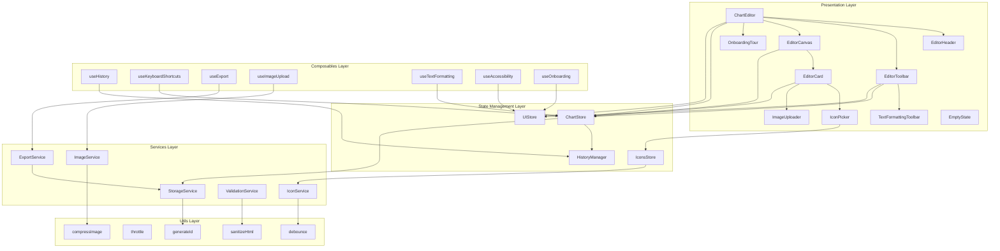
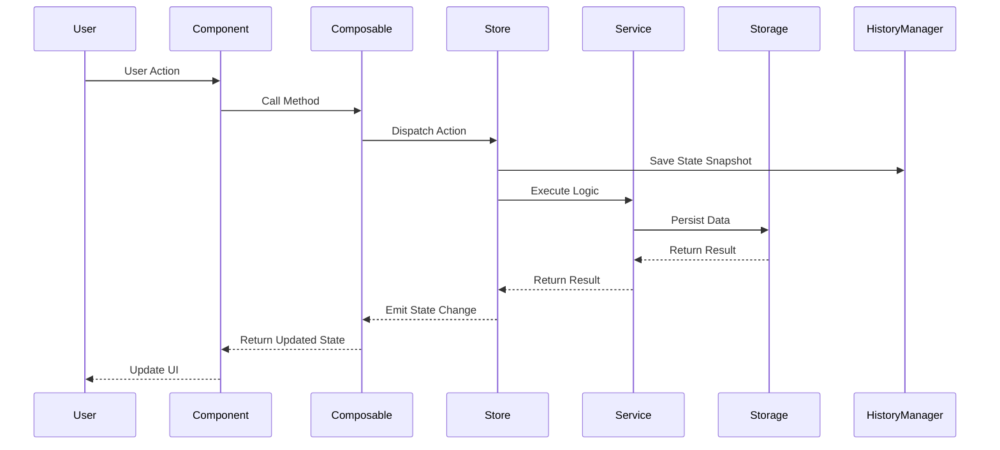
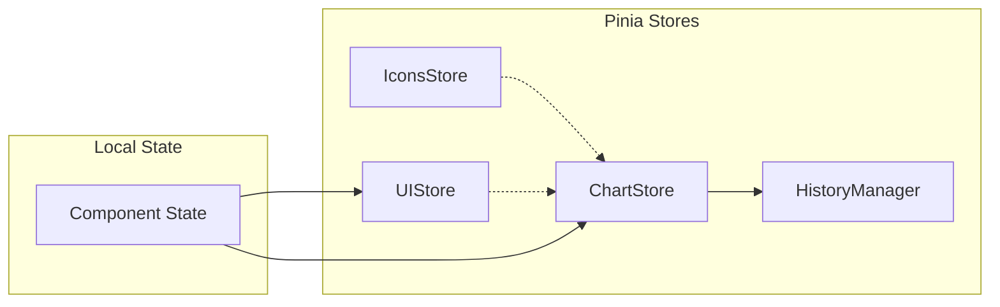
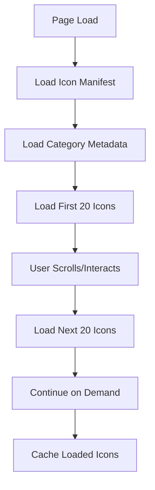

# Chart Editor Redesign Architecture

## Table of Contents
1. [Architecture Overview](#architecture-overview)
2. [Component Design](#component-design)
3. [State Management Design](#state-management-design)
4. [Type Definitions](#type-definitions)
5. [UX Design Decisions](#ux-design-decisions)
6. [Performance Strategy](#performance-strategy)
7. [Migration Plan](#migration-plan)
8. [Implementation Phases](#implementation-phases)

---

## Architecture Overview

### High-Level Architecture Diagram



### Data Flow Diagram



### Key Architectural Principles

1. **Separation of Concerns**: Clear boundaries between presentation, state, business logic, and data layers
2. **Single Responsibility**: Each component/composable/service has one clear purpose
3. **Dependency Inversion**: Higher-level modules don't depend on lower-level modules; both depend on abstractions
4. **Open/Closed**: Open for extension (new features), closed for modification (stable core)
5. **Composition over Inheritance**: Prefer composables and service composition
6. **Type Safety**: Leverage TypeScript for compile-time guarantees
7. **Performance First**: Lazy loading, debouncing, virtualization where needed

---

## Component Design

### Component Hierarchy

```
ChartEditor (Root)
├── EditorHeader
│   ├── TitleEditor
│   ├── ExportButton
│   └── UndoRedoControls
├── EditorToolbar
│   ├── LayoutSection
│   ├── CardsSection
│   ├── StyleSection
│   └── FormatSection
├── EditorCanvas
│   ├── CanvasTitle
│   ├── CanvasGrid
│   │   └── EditorCard (repeated)
│   └── CanvasWatermark
├── IconPicker
├── ImageUploader
├── TextFormattingToolbar
├── OnboardingTour
└── EmptyState
```

### Component Specifications

#### ChartEditor (Root Component)

**Purpose**: Main container orchestrating all editor components and managing overall state

**Props Interface**:
```typescript
interface ChartEditorProps {
  initialData?: ChartSaveDataV3
  readonly?: boolean
  maxCards?: number
}
```

**Emits Interface**:
```typescript
interface ChartEditorEmits {
  'save': [data: ChartSaveDataV3]
  'export': [format: ExportFormat, options: ExportOptions]
  'error': [error: EditorError]
  'ready': []
}
```

**Key Methods**:
- `initialize()`: Initialize editor with data
- `handleSave()`: Trigger save operation
- `handleExport()`: Trigger export operation
- `handleError()`: Centralized error handling
- `reset()`: Reset editor to initial state

**Dependencies**:
- All child components
- ChartStore
- UIStore
- useHistory composable
- useKeyboardShortcuts composable

---

#### EditorHeader

**Purpose**: Display chart title, export controls, and undo/redo actions

**Props Interface**:
```typescript
interface EditorHeaderProps {
  title: string
  isDirty: boolean
  isPreviewMode: boolean
  isExporting: boolean
  canUndo: boolean
  canRedo: boolean
  exportFormats: ExportFormat[]
}
```

**Emits Interface**:
```typescript
interface EditorHeaderEmits {
  'update:title': [title: string]
  'toggle-preview': []
  'export': [format: ExportFormat]
  'undo': []
  'redo': []
  'save': []
}
```

**Key Methods**:
- `handleTitleChange()`: Update chart title
- `handleExportClick()`: Show export options
- `handleUndo()`: Trigger undo action
- `handleRedo()`: Trigger redo action

**Dependencies**:
- AppButton component
- AppInput component
- ExportMenu component

---

#### EditorToolbar

**Purpose**: Provide controls for layout, cards, styling, and formatting with progressive disclosure

**Props Interface**:
```typescript
interface EditorToolbarProps {
  canvasSettings: CanvasSettings
  styleSettings: StyleSettings
  selectedCardId: string | null
  canAddCard: boolean
  isCollapsed: boolean
  activeSection: ToolbarSection | null
}
```

**Emits Interface**:
```typescript
interface EditorToolbarEmits {
  'update:canvas-settings': [settings: Partial<CanvasSettings>]
  'update:style-settings': [settings: Partial<StyleSettings>]
  'add-card': []
  'remove-selected': []
  'duplicate-selected': []
  'toggle-collapse': []
  'activate-section': [section: ToolbarSection]
}
```

**Key Methods**:
- `handleSectionToggle()`: Show/hide toolbar sections
- `handleLayoutChange()`: Apply layout preset
- `handleStyleChange()`: Apply style settings
- `handleAddCard()`: Add new card
- `handleRemoveCard()`: Remove selected card

**Dependencies**:
- LayoutSection component
- CardsSection component
- StyleSection component
- FormatSection component
- AppButton component

---

#### EditorCanvas

**Purpose**: Render the editable canvas with cards, supporting drag-and-drop reordering

**Props Interface**:
```typescript
interface EditorCanvasProps {
  cards: Card[]
  canvasSettings: CanvasSettings
  styleSettings: StyleSettings
  zoom: number
  isPreviewMode: boolean
  selectedCardId: string | null
  title: string
}
```

**Emits Interface**:
```typescript
interface EditorCanvasEmits {
  'select-card': [cardId: string]
  'update-card': [cardId: string, updates: Partial<Card>]
  'delete-card': [cardId: string]
  'duplicate-card': [cardId: string]
  'reorder-cards': [cards: Card[]]
  'deselect-all': []
}
```

**Key Methods**:
- `handleCardClick()`: Select card
- `handleDragEnd()`: Handle drag-and-drop reordering
- `handleCanvasClick()`: Deselect all cards
- `getGridStyle()`: Calculate grid CSS

**Dependencies**:
- EditorCard component
- vuedraggable library
- useDragAndDrop composable

---

#### EditorCard

**Purpose**: Display individual card with icon, heading, subtitle, and formatting options

**Props Interface**:
```typescript
interface EditorCardProps {
  card: Card
  isSelected: boolean
  isPreviewMode: boolean
  styleSettings: StyleSettings
  textFormatting: TextFormatting
}
```

**Emits Interface**:
```typescript
interface EditorCardEmits {
  'select': [cardId: string]
  'update': [cardId: string, updates: Partial<Card>]
  'delete': [cardId: string]
  'duplicate': [cardId: string]
  'format-text': [cardId: string, formatting: Partial<TextFormatting>]
  'change-icon': [cardId: string]
  'upload-image': [cardId: string]
}
```

**Key Methods**:
- `handleIconClick()`: Open icon picker
- `handleImageUpload()`: Trigger image upload
- `handleHeadingChange()`: Update heading
- `handleSubtitleChange()`: Update subtitle
- `applyTextFormatting()`: Apply text styles

**Dependencies**:
- IconPicker component
- ImageUploader component
- TextFormattingToolbar component
- CardActions component

---

#### IconPicker

**Purpose**: Modal for selecting icons from library with search and category filters

**Props Interface**:
```typescript
interface IconPickerProps {
  modelValue: boolean
  cardId: string
  currentIconId: string | null
  categories: IconCategory[]
}
```

**Emits Interface**:
```typescript
interface IconPickerEmits {
  'update:modelValue': [value: boolean]
  'select': [cardId: string, iconId: string]
  'upload-custom': [cardId: string, file: File]
}
```

**Key Methods**:
- `handleSearch()`: Filter icons by search query
- `handleCategoryFilter()`: Filter by category
- `handleIconSelect()`: Select icon
- `handleCustomUpload()`: Open custom image upload

**Dependencies**:
- IconsStore
- useVirtualScroll composable
- AppModal component
- AppInput component

---

#### ImageUploader

**Purpose**: Handle custom image uploads with validation and compression

**Props Interface**:
```typescript
interface ImageUploaderProps {
  modelValue: boolean
  cardId: string
  maxSize: number // in bytes
  allowedTypes: string[]
}
```

**Emits Interface**:
```typescript
interface ImageUploaderEmits {
  'update:modelValue': [value: boolean]
  'upload': [cardId: string, imageData: ImageData]
  'error': [error: UploadError]
}
```

**Key Methods**:
- `handleFileSelect()`: Process selected file
- `validateFile()`: Validate file type and size
- `compressImage()`: Compress image
- `generateThumbnail()`: Create thumbnail

**Dependencies**:
- ImageService
- useImageUpload composable
- AppModal component

---

#### TextFormattingToolbar

**Purpose**: Provide text formatting options (bold, italic, color, alignment)

**Props Interface**:
```typescript
interface TextFormattingToolbarProps {
  modelValue: boolean
  cardId: string
  currentFormatting: TextFormatting
  position: { x: number; y: number }
}
```

**Emits Interface**:
```typescript
interface TextFormattingToolbarEmits {
  'update:modelValue': [value: boolean]
  'apply-formatting': [cardId: string, formatting: Partial<TextFormatting>]
}
```

**Key Methods**:
- `handleBoldToggle()`: Toggle bold
- `handleItalicToggle()`: Toggle italic
- `handleColorChange()`: Change text color
- `handleAlignmentChange()`: Change text alignment

**Dependencies**:
- useTextFormatting composable
- AppButton component
- ColorPicker component

---

#### OnboardingTour

**Purpose**: Guided tour for first-time users

**Props Interface**:
```typescript
interface OnboardingTourProps {
  modelValue: boolean
  steps: TourStep[]
  currentStep: number
}
```

**Emits Interface**:
```typescript
interface OnboardingTourEmits {
  'update:modelValue': [value: boolean]
  'next-step': []
  'prev-step': []
  'skip': []
  'complete': []
}
```

**Key Methods**:
- `handleNext()`: Go to next step
- `handlePrev()`: Go to previous step
- `handleSkip()`: Skip tour
- `handleComplete()`: Complete tour

**Dependencies**:
- UIStore
- useOnboarding composable
- AppModal component

---

#### EmptyState

**Purpose**: Display helpful message when canvas is empty

**Props Interface**:
```typescript
interface EmptyStateProps {
  title: string
  description: string
  actionLabel: string
  showTutorial: boolean
}
```

**Emits Interface**:
```typescript
interface EmptyStateEmits {
  'action': []
  'start-tutorial': []
}
```

**Key Methods**:
- `handleActionClick()`: Trigger primary action
- `handleTutorialClick()`: Start onboarding tour

**Dependencies**:
- AppButton component

---

## State Management Design

### Store Architecture



### ChartStore

**State Properties**:
```typescript
interface ChartStoreState {
  // Core data
  id: string
  title: string
  cards: Card[]
  version: number

  // Settings
  canvasSettings: CanvasSettings
  styleSettings: StyleSettings
  exportSettings: ExportSettings

  // Editor state
  selectedCardId: string | null
  isPreviewMode: boolean
  zoom: number
  isDirty: boolean
  isExporting: boolean

  // Validation
  errors: ValidationError[]
  warnings: ValidationWarning[]
}
```

**Actions**:
```typescript
interface ChartStoreActions {
  // Initialization
  initialize(data?: ChartSaveDataV3): void
  reset(): void

  // Card operations
  addCard(card?: Partial<Card>): string
  updateCard(cardId: string, updates: Partial<Card>): void
  removeCard(cardId: string): void
  duplicateCard(cardId: string): string
  reorderCards(cardIds: string[]): void
  selectCard(cardId: string | null): void

  // Settings operations
  updateCanvasSettings(settings: Partial<CanvasSettings>): void
  updateStyleSettings(settings: Partial<StyleSettings>): void
  updateExportSettings(settings: Partial<ExportSettings>): void

  // Editor operations
  setTitle(title: string): void
  setZoom(zoom: number): void
  togglePreviewMode(): void
  deselectAll(): void

  // Export operations
  exportToPdf(options?: ExportOptions): Promise<void>
  exportToPng(options?: ExportOptions): Promise<void>
  exportToJpg(options?: ExportOptions): Promise<void>
  exportToSvg(options?: ExportOptions): Promise<void>

  // History operations
  undo(): void
  redo(): void
  clearHistory(): void

  // Persistence
  saveToStorage(): void
  loadFromStorage(): boolean
  exportData(): ChartSaveDataV3
  importData(data: ChartSaveDataV3): void

  // Validation
  validate(): ValidationResult
  clearErrors(): void
}
```

**Getters**:
```typescript
interface ChartStoreGetters {
  // Card getters
  selectedCard: Card | null
  hasCards: boolean
  cardCount: number
  canAddCard: boolean

  // Canvas getters
  canvasAspectRatio: number
  effectiveCardCount: number

  // History getters
  canUndo: boolean
  canRedo: boolean
  historySize: number

  // Validation getters
  isValid: boolean
  hasErrors: boolean
  hasWarnings: boolean

  // Export getters
  exportFilename: string
}
```

---

### HistoryManager (Undo/Redo)

**State Properties**:
```typescript
interface HistoryManagerState {
  past: ChartState[]
  present: ChartState | null
  future: ChartState[]
  maxSize: number
}
```

**Actions**:
```typescript
interface HistoryManagerActions {
  push(state: ChartState): void
  undo(): ChartState | null
  redo(): ChartState | null
  clear(): void
  canUndo(): boolean
  canRedo(): boolean
}
```

**Implementation Strategy**:
- Use memento pattern for state snapshots
- Limit history size (default: 50 states)
- Debounce state changes to avoid excessive snapshots
- Optimize by storing only changed fields

---

### IconsStore

**State Properties**:
```typescript
interface IconsStoreState {
  icons: Icon[]
  customIcons: CustomIcon[]
  categories: CategoryInfo[]
  isLoading: boolean
  error: Error | null
}
```

**Actions**:
```typescript
interface IconsStoreActions {
  loadIcons(): Promise<void>
  loadCustomIcons(): Promise<void>
  addCustomIcon(icon: CustomIcon): void
  removeCustomIcon(iconId: string): void
  searchIcons(query: string): Icon[]
  filterByCategory(category: IconCategory): Icon[]
  getIconById(id: string): Icon | undefined
  getRandomIcon(): Icon | undefined
  getRandomIcons(count: number): Icon[]
}
```

**Getters**:
```typescript
interface IconsStoreGetters {
  allIcons: Icon[]
  filteredIcons: Icon[]
  iconsByCategory: Record<IconCategory, Icon[]>
  totalIcons: number
}
```

---

### UIStore

**State Properties**:
```typescript
interface UIStoreState {
  // Toolbar state
  toolbarCollapsed: boolean
  activeToolbarSection: ToolbarSection | null

  // Modal state
  iconPickerOpen: boolean
  imageUploaderOpen: boolean
  textFormattingOpen: boolean

  // Onboarding state
  onboardingCompleted: boolean
  currentTourStep: number

  // Notifications
  notifications: Notification[]
  toasts: Toast[]

  // Accessibility
  reducedMotion: boolean
  highContrast: boolean
  fontSize: 'small' | 'medium' | 'large'

  // Theme
  theme: 'light' | 'dark' | 'auto'
}
```

**Actions**:
```typescript
interface UIStoreActions {
  // Toolbar actions
  toggleToolbar(): void
  setToolbarSection(section: ToolbarSection | null): void

  // Modal actions
  openIconPicker(cardId: string): void
  closeIconPicker(): void
  openImageUploader(cardId: string): void
  closeImageUploader(): void

  // Onboarding actions
  startOnboarding(): void
  nextTourStep(): void
  prevTourStep(): void
  skipOnboarding(): void
  completeOnboarding(): void

  // Notification actions
  addNotification(notification: Notification): void
  removeNotification(id: string): void
  clearNotifications(): void

  // Accessibility actions
  setReducedMotion(enabled: boolean): void
  setHighContrast(enabled: boolean): void
  setFontSize(size: 'small' | 'medium' | 'large'): void

  // Theme actions
  setTheme(theme: 'light' | 'dark' | 'auto'): void
}
```

---

### Persistence Strategy

**Storage Keys**:
```typescript
const STORAGE_KEYS = {
  CHART: 'talking-chart-data',
  HISTORY: 'talking-chart-history',
  UI: 'talking-chart-ui',
  CUSTOM_ICONS: 'talking-chart-custom-icons',
  ONBOARDING: 'talking-chart-onboarding',
} as const
```

**Storage Strategy**:
1. **Auto-save**: Save chart state to localStorage on every change (debounced)
2. **History persistence**: Save last 10 history states to localStorage
3. **UI persistence**: Save UI preferences (theme, toolbar state) to localStorage
4. **Custom icons**: Store custom icons in IndexedDB (for larger files)
5. **Session backup**: Create session backup every 5 minutes

**Data Versioning**:
- Current version: 3
- Migration functions for v1 → v2, v2 → v3
- Schema validation on load

---

## Type Definitions

### Core Data Models

```typescript
// ===== Card Types =====
interface Card {
  id: string
  iconId: string | null
  customIconId: string | null
  heading: string
  subtitle: string
  textFormatting: TextFormatting
  position?: { x: number; y: number }
  zIndex?: number
}

interface TextFormatting {
  bold: boolean
  italic: boolean
  underline: boolean
  color: string
  backgroundColor?: string
  fontSize: number
  alignment: 'left' | 'center' | 'right'
  lineHeight: number
}

// ===== Icon Types =====
interface Icon {
  id: string
  filename: string
  category: IconCategory
  alt: string
  keywords: string[]
  svg?: string // Inline SVG for faster loading
}

interface CustomIcon {
  id: string
  filename: string
  originalFilename: string
  dataUrl: string
  thumbnailUrl: string
  size: number
  createdAt: Date
}

type IconCategory = 'alphabet' | 'disability' | 'family' | 'feminine-hygiene' | 'health' | 'custom'

// ===== Settings Types =====
interface CanvasSettings {
  layout: LayoutPreset
  columns: number
  rows: number
  cardGap: number // in mm
  marginTop: number // in mm
  marginBottom: number // in mm
  marginLeft: number // in mm
  marginRight: number // in mm
}

interface StyleSettings {
  fontFamily: FontFamily
  headingFontSize: number // in pt
  subtitleFontSize: number // in pt
  theme: ColorTheme
  backgroundType: BackgroundType
  backgroundColor: string
  backgroundGradient: {
    start: string
    end: string
    direction: 'horizontal' | 'vertical' | 'diagonal'
  }
}

interface ExportSettings {
  quality: ExportQuality
  includeWatermark: boolean
  filename: string
  format: ExportFormat
}

// ===== Export Types =====
type ExportFormat = 'pdf' | 'png' | 'jpg' | 'svg'

type ExportQuality = 'standard' | 'high' | 'ultra'

interface ExportOptions {
  format: ExportFormat
  quality?: ExportQuality
  scale?: number
  transparent?: boolean
}

// ===== Layout Types =====
type LayoutPreset = '2x10' | '4x5' | '5x4' | '3x7' | 'custom'

type FontFamily = 'Inter' | 'Roboto' | 'Open Sans' | 'Lato' | 'Poppins'

type ColorTheme = 'neutral' | 'colorful' | 'high-contrast' | 'pastel' | 'dark'

type BackgroundType = 'solid' | 'gradient' | 'image'

// ===== UI Types =====
type ToolbarSection = 'layout' | 'cards' | 'style' | 'format'

interface Notification {
  id: string
  type: 'info' | 'success' | 'warning' | 'error'
  title: string
  message: string
  duration?: number
  actions?: NotificationAction[]
}

interface Toast {
  id: string
  type: 'info' | 'success' | 'warning' | 'error'
  message: string
  duration?: number
}

interface TourStep {
  id: string
  target: string
  title: string
  content: string
  position: 'top' | 'bottom' | 'left' | 'right'
  action?: TourStepAction
}

interface TourStepAction {
  label: string
  handler: () => void
}

// ===== Validation Types =====
interface ValidationError {
  id: string
  type: 'card' | 'canvas' | 'export'
  message: string
  cardId?: string
}

interface ValidationWarning {
  id: string
  type: 'card' | 'canvas' | 'export'
  message: string
  cardId?: string
}

interface ValidationResult {
  isValid: boolean
  errors: ValidationError[]
  warnings: ValidationWarning[]
}

// ===== Error Types =====
interface EditorError {
  code: string
  message: string
  details?: Record<string, unknown>
  timestamp: Date
}

interface UploadError {
  type: 'size' | 'format' | 'network' | 'unknown'
  message: string
  file?: File
}

// ===== Chart Save Data =====
interface ChartSaveDataV3 {
  version: 3
  id: string
  title: string
  cards: Card[]
  canvasSettings: CanvasSettings
  styleSettings: StyleSettings
  exportSettings: ExportSettings
  customIcons: CustomIcon[]
  createdAt: Date
  updatedAt: Date
}

// ===== History Types =====
interface ChartState {
  cards: Card[]
  canvasSettings: CanvasSettings
  styleSettings: StyleSettings
  timestamp: number
  description: string
}

// ===== Template Types =====
interface Template {
  id: string
  name: string
  description: string
  thumbnail: string
  category: TemplateCategory
  data: Partial<ChartSaveDataV3>
  isBuiltIn: boolean
}

type TemplateCategory = 'daily-routine' | 'communication' | 'education' | 'health' | 'custom'
```

### Component Props Types

```typescript
// ===== ChartEditor Props =====
interface ChartEditorProps {
  initialData?: ChartSaveDataV3
  readonly?: boolean
  maxCards?: number
  onReady?: () => void
  onSave?: (data: ChartSaveDataV3) => void
  onExport?: (format: ExportFormat, options: ExportOptions) => void
  onError?: (error: EditorError) => void
}

// ===== EditorHeader Props =====
interface EditorHeaderProps {
  title: string
  isDirty: boolean
  isPreviewMode: boolean
  isExporting: boolean
  canUndo: boolean
  canRedo: boolean
  exportFormats: ExportFormat[]
  showSaveButton?: boolean
}

// ===== EditorToolbar Props =====
interface EditorToolbarProps {
  canvasSettings: CanvasSettings
  styleSettings: StyleSettings
  selectedCardId: string | null
  canAddCard: boolean
  isCollapsed: boolean
  activeSection: ToolbarSection | null
  layoutPresets: LayoutPresetDefinition[]
  themes: ThemeDefinition[]
}

// ===== EditorCanvas Props =====
interface EditorCanvasProps {
  cards: Card[]
  canvasSettings: CanvasSettings
  styleSettings: StyleSettings
  zoom: number
  isPreviewMode: boolean
  selectedCardId: string | null
  title: string
  dragEnabled?: boolean
}

// ===== EditorCard Props =====
interface EditorCardProps {
  card: Card
  isSelected: boolean
  isPreviewMode: boolean
  styleSettings: StyleSettings
  textFormatting: TextFormatting
  showActions?: boolean
  allowCustomIcons?: boolean
}

// ===== IconPicker Props =====
interface IconPickerProps {
  modelValue: boolean
  cardId: string
  currentIconId: string | null
  categories: IconCategory[]
  allowCustomUpload?: boolean
  maxCustomSize?: number
}

// ===== ImageUploader Props =====
interface ImageUploaderProps {
  modelValue: boolean
  cardId: string
  maxSize: number
  allowedTypes: string[]
  compress?: boolean
  maxWidth?: number
  maxHeight?: number
}

// ===== TextFormattingToolbar Props =====
interface TextFormattingToolbarProps {
  modelValue: boolean
  cardId: string
  currentFormatting: TextFormatting
  position: { x: number; y: number }
  availableColors?: string[]
  availableFontSizes?: number[]
}

// ===== OnboardingTour Props =====
interface OnboardingTourProps {
  modelValue: boolean
  steps: TourStep[]
  currentStep: number
  showSkip?: boolean
  showProgress?: boolean
}

// ===== EmptyState Props =====
interface EmptyStateProps {
  title: string
  description: string
  actionLabel: string
  showTutorial?: boolean
  illustration?: string
}
```

### Event Payload Types

```typescript
// ===== ChartEditor Events =====
interface ChartEditorEvents {
  save: ChartSaveDataV3
  export: { format: ExportFormat; options: ExportOptions }
  error: EditorError
  ready: void
}

// ===== EditorHeader Events =====
interface EditorHeaderEvents {
  'update:title': string
  'toggle-preview': void
  'export': ExportFormat
  undo: void
  redo: void
  save: void
}

// ===== EditorToolbar Events =====
interface EditorToolbarEvents {
  'update:canvas-settings': Partial<CanvasSettings>
  'update:style-settings': Partial<StyleSettings>
  'add-card': void
  'remove-selected': void
  'duplicate-selected': void
  'toggle-collapse': void
  'activate-section': ToolbarSection
}

// ===== EditorCanvas Events =====
interface EditorCanvasEvents {
  'select-card': string
  'update-card': { cardId: string; updates: Partial<Card> }
  'delete-card': string
  'duplicate-card': string
  'reorder-cards': Card[]
  'deselect-all': void
}

// ===== EditorCard Events =====
interface EditorCardEvents {
  select: string
  update: { cardId: string; updates: Partial<Card> }
  delete: string
  duplicate: string
  'format-text': { cardId: string; formatting: Partial<TextFormatting> }
  'change-icon': string
  'upload-image': string
}

// ===== IconPicker Events =====
interface IconPickerEvents {
  'update:modelValue': boolean
  select: { cardId: string; iconId: string }
  'upload-custom': { cardId: string; file: File }
}

// ===== ImageUploader Events =====
interface ImageUploaderEvents {
  'update:modelValue': boolean
  upload: { cardId: string; imageData: ImageData }
  error: UploadError
}

// ===== TextFormattingToolbar Events =====
interface TextFormattingToolbarEvents {
  'update:modelValue': boolean
  'apply-formatting': { cardId: string; formatting: Partial<TextFormatting> }
}

// ===== OnboardingTour Events =====
interface OnboardingTourEvents {
  'update:modelValue': boolean
  'next-step': void
  'prev-step': void
  skip: void
  complete: void
}

// ===== EmptyState Events =====
interface EmptyStateEvents {
  action: void
  'start-tutorial': void
}
```

### Configuration Types

```typescript
// ===== Constants =====
const CARD_COUNT = 20
const MAX_HEADING_LENGTH = 12
const MAX_SUBTITLE_LENGTH = 19
const MAX_CARDS = 50
const MAX_HISTORY_SIZE = 50
const MAX_CUSTOM_ICON_SIZE = 5 * 1024 * 1024 // 5MB
const ALLOWED_IMAGE_TYPES = ['image/png', 'image/jpeg', 'image/webp', 'image/svg+xml']

// ===== Default Settings =====
const DEFAULT_CANVAS_SETTINGS: CanvasSettings = {
  layout: '4x5',
  columns: 4,
  rows: 5,
  cardGap: 5,
  marginTop: 15,
  marginBottom: 15,
  marginLeft: 15,
  marginRight: 15,
}

const DEFAULT_STYLE_SETTINGS: StyleSettings = {
  fontFamily: 'Inter',
  headingFontSize: 12,
  subtitleFontSize: 9,
  theme: 'neutral',
  backgroundType: 'solid',
  backgroundColor: '#ffffff',
  backgroundGradient: {
    start: '#ffffff',
    end: '#f3f4f6',
    direction: 'vertical',
  },
}

const DEFAULT_EXPORT_SETTINGS: ExportSettings = {
  quality: 'standard',
  includeWatermark: true,
  filename: 'my-communication-chart',
  format: 'pdf',
}

const DEFAULT_TEXT_FORMATTING: TextFormatting = {
  bold: false,
  italic: false,
  underline: false,
  color: '#000000',
  fontSize: 12,
  alignment: 'center',
  lineHeight: 1.2,
}

// ===== Zoom Levels =====
const ZOOM_LEVELS = [0.5, 0.75, 1.0, 1.25, 1.5, 2.0]

// ===== Layout Presets =====
const LAYOUT_PRESETS: Record<LayoutPreset, LayoutPresetDefinition> = {
  '2x10': { id: '2x10', name: '2 Columns', columns: 2, rows: 10, description: 'Two columns, ten rows' },
  '4x5': { id: '4x5', name: '4 Columns', columns: 4, rows: 5, description: 'Four columns, five rows' },
  '5x4': { id: '5x4', name: '5 Columns', columns: 5, rows: 4, description: 'Five columns, four rows' },
  '3x7': { id: '3x7', name: '3 Columns', columns: 3, rows: 7, description: 'Three columns, seven rows' },
  'custom': { id: 'custom', name: 'Custom', columns: 4, rows: 5, description: 'Custom layout' },
}

// ===== Theme Definitions =====
const THEMES: Record<ColorTheme, ThemeDefinition> = {
  neutral: {
    id: 'neutral',
    name: 'Neutral',
    colors: {
      primary: '#000000',
      secondary: '#666666',
      text: '#000000',
      background: '#ffffff',
      cardBackground: '#ffffff',
      border: '#e5e7eb',
    },
  },
  colorful: {
    id: 'colorful',
    name: 'Colorful',
    colors: {
      primary: '#3b82f6',
      secondary: '#8b5cf6',
      text: '#1f2937',
      background: '#f9fafb',
      cardBackground: '#ffffff',
      border: '#d1d5db',
    },
  },
  'high-contrast': {
    id: 'high-contrast',
    name: 'High Contrast',
    colors: {
      primary: '#000000',
      secondary: '#ffffff',
      text: '#000000',
      background: '#ffffff',
      cardBackground: '#ffffff',
      border: '#000000',
    },
  },
  pastel: {
    id: 'pastel',
    name: 'Pastel',
    colors: {
      primary: '#6b7280',
      secondary: '#9ca3af',
      text: '#374151',
      background: '#fef3c7',
      cardBackground: '#fffbeb',
      border: '#fcd34d',
    },
  },
  dark: {
    id: 'dark',
    name: 'Dark',
    colors: {
      primary: '#ffffff',
      secondary: '#9ca3af',
      text: '#ffffff',
      background: '#1f2937',
      cardBackground: '#374151',
      border: '#4b5563',
    },
  },
}

// ===== Font Family Definitions =====
const FONT_FAMILIES: Record<FontFamily, FontFamilyDefinition> = {
  Inter: { id: 'Inter', name: 'Inter', googleFont: 'Inter', weights: [400, 500, 600, 700] },
  Roboto: { id: 'Roboto', name: 'Roboto', googleFont: 'Roboto', weights: [400, 500, 700] },
  'Open Sans': { id: 'Open Sans', name: 'Open Sans', googleFont: 'Open+Sans', weights: [400, 600, 700] },
  Lato: { id: 'Lato', name: 'Lato', googleFont: 'Lato', weights: [400, 700, 900] },
  Poppins: { id: 'Poppins', name: 'Poppins', googleFont: 'Poppins', weights: [400, 500, 600, 700] },
}

// ===== Category Info =====
const CATEGORIES: CategoryInfo[] = [
  { id: 'alphabet', label: 'Alphabet', icon: '🔤', color: 'bg-blue-500' },
  { id: 'disability', label: 'Disability', icon: '♿', color: 'bg-purple-500' },
  { id: 'family', label: 'Family', icon: '👨‍👩‍👧‍👦', color: 'bg-pink-500' },
  { id: 'feminine-hygiene', label: 'Feminine Hygiene', icon: '🌸', color: 'bg-rose-500' },
  { id: 'health', label: 'Health', icon: '🏥', color: 'bg-green-500' },
  { id: 'custom', label: 'Custom', icon: '📷', color: 'bg-orange-500' },
]
```

---

## UX Design Decisions

### Toolbar Organization and Progressive Disclosure

**Design Principles**:
1. **Progressive Disclosure**: Show only essential controls by default, reveal advanced options on demand
2. **Context Awareness**: Toolbar sections activate based on current selection
3. **Visual Hierarchy**: Primary actions prominent, secondary actions grouped
4. **Collapsible Sections**: Each toolbar section can be collapsed to reduce cognitive load

**Toolbar Structure**:

```
┌─────────────────────────────────────┐
│ [≡] Toolbar                         │
├─────────────────────────────────────┤
│ ▼ Layout                            │
│   [2x10] [4x5] [5x4] [3x7] [Custom] │
├─────────────────────────────────────┤
│ ▼ Cards                             │
│   [+ Add Card]                      │
│   [Duplicate] [Remove]              │
├─────────────────────────────────────┤
│ ▼ Style                             │
│   Theme: [Neutral ▼]               │
│   Font: [Inter ▼]                   │
│   Background: [Solid ▼]             │
├─────────────────────────────────────┤
│ ▼ Format (card selected only)       │
│   [B] [I] [U] [Color] [Align]      │
└─────────────────────────────────────┘
```

**Progressive Disclosure Strategy**:

1. **Default State**: Show Layout and Cards sections collapsed
2. **Card Selected**: Auto-expand Format section
3. **Advanced Mode**: Show all sections expanded
4. **Compact Mode**: Show only icon-based toolbar with tooltips

**Keyboard Shortcuts for Toolbar**:
- `Ctrl/Cmd + 1-4`: Quick switch between toolbar sections
- `Ctrl/Cmd + T`: Toggle toolbar collapse
- `Tab`: Navigate between toolbar controls

---

### User Onboarding Flow

**Onboarding Strategy**:

1. **First Visit Detection**: Check localStorage for onboarding completion flag
2. **Optional Tour**: Provide "Show Tutorial" button in empty state
3. **Progressive Disclosure**: Introduce features as needed
4. **Skip and Resume**: Allow users to skip and resume later

**Tour Steps**:

```typescript
const ONBOARDING_STEPS: TourStep[] = [
  {
    id: 'welcome',
    target: '.chart-editor',
    title: 'Welcome to The Talking Chart!',
    content: 'Create visual communication charts for daily routines, activities, and more. Let me show you around.',
    position: 'bottom',
  },
  {
    id: 'add-card',
    target: '.toolbar-section-cards .add-card-button',
    title: 'Add Cards',
    content: 'Click here to add new cards to your chart. You can have up to 50 cards.',
    position: 'right',
  },
  {
    id: 'change-icon',
    target: '.editor-card .icon-button',
    title: 'Change Icons',
    content: 'Click on any card icon to choose from our library or upload your own images.',
    position: 'bottom',
  },
  {
    id: 'edit-text',
    target: '.editor-card .heading-input',
    title: 'Edit Text',
    content: 'Click on the heading or subtitle to edit the text. Use the format toolbar for bold, italic, and colors.',
    position: 'bottom',
  },
  {
    id: 'layout',
    target: '.toolbar-section-layout',
    title: 'Change Layout',
    content: 'Choose from preset layouts or customize the grid to fit your needs.',
    position: 'right',
  },
  {
    id: 'style',
    target: '.toolbar-section-style',
    title: 'Customize Style',
    content: 'Change themes, fonts, and colors to make your chart unique.',
    position: 'right',
  },
  {
    id: 'export',
    target: '.editor-header .export-button',
    title: 'Export Your Chart',
    content: 'Export to PDF, PNG, JPG, or SVG to print or share your chart.',
    position: 'bottom',
    action: {
      label: 'Try Export',
      handler: () => chartStore.exportToPdf(),
    },
  },
  {
    id: 'keyboard-shortcuts',
    target: '.keyboard-shortcuts-hint',
    title: 'Keyboard Shortcuts',
    content: 'Use Ctrl+Z to undo, Ctrl+Y to redo, and Ctrl+S to save. Press ? for all shortcuts.',
    position: 'bottom',
  },
  {
    id: 'complete',
    target: '.chart-editor',
    title: 'You\'re All Set!',
    content: 'Start creating your communication chart. Remember, you can always access this tour from the Help menu.',
    position: 'bottom',
  },
]
```

**Onboarding UI Components**:

1. **Tour Overlay**: Semi-transparent overlay highlighting target element
2. **Tooltip Card**: Positioned tooltip with title, content, and navigation
3. **Progress Indicator**: Step counter (e.g., "Step 3 of 8")
4. **Navigation Buttons**: Previous, Next, Skip, Complete
5. **Hotspots**: Pulsing indicators pointing to interactive elements

**Onboarding Triggers**:
- First visit (automatic)
- Empty state click on "Start Tutorial"
- Help menu → "Show Tutorial"
- Keyboard shortcut `Ctrl/Cmd + ?`

---

### Empty States

**Empty State Scenarios**:

1. **No Cards**: User has just started or cleared all cards
2. **No Icons Selected**: Card has no icon
3. **No Search Results**: Icon search returns no results
4. **Export Failed**: Export operation encountered error

**Empty State Design**:

```typescript
interface EmptyStateConfig {
  title: string
  description: string
  illustration: string
  actionLabel: string
  secondaryActionLabel?: string
  showTutorial?: boolean
}
```

**Example: No Cards Empty State**

```
┌─────────────────────────────────────┐
│                                     │
│        [Illustration SVG]           │
│                                     │
│      Your Chart is Empty            │
│                                     │
│  Start by adding cards or choose    │
│  from our template library.         │
│                                     │
│    [+ Add Card]  [Use Template]     │
│                                     │
│    [Watch Tutorial]                 │
│                                     │
└─────────────────────────────────────┘
```

**Empty State Guidelines**:
- Use friendly, encouraging language
- Provide clear next steps
- Include visual illustrations
- Offer tutorial access
- Link to templates when available

---

### Error Handling

**Error Types and Handling**:

1. **Validation Errors**:
   - Display inline error messages
   - Highlight affected fields
   - Provide fix suggestions

2. **Export Errors**:
   - Show toast notification
   - Provide retry option
   - Log error details

3. **Upload Errors**:
   - Show modal with error details
   - Explain why upload failed
   - Provide file requirements

4. **Storage Errors**:
   - Show warning banner
   - Attempt recovery
   - Fallback to session storage

**Error Display Components**:

1. **Inline Errors**: Small error text below form fields
2. **Toast Notifications**: Temporary notifications for non-critical errors
3. **Error Modals**: Detailed error information for critical errors
4. **Error Banner**: Persistent banner for storage/connection issues

**Error Recovery**:
- Auto-retry for transient errors
- Manual retry with one click
- Graceful degradation where possible
- Clear error messages with actionable next steps

---

### Accessibility Features

**WCAG 2.1 AA Compliance**:

1. **Keyboard Navigation**:
   - Full keyboard support for all interactions
   - Visible focus indicators
   - Logical tab order
   - Escape key to close modals

2. **Screen Reader Support**:
   - ARIA labels for all interactive elements
   - Live regions for dynamic content
   - Semantic HTML structure
   - Descriptive alt text for images

3. **Visual Accessibility**:
   - High contrast mode support
   - Adjustable font sizes
   - Reduced motion support
   - Color-blind friendly palettes

4. **Cognitive Accessibility**:
   - Clear error messages
   - Consistent UI patterns
   - Undo/redo for all actions
   - Progress indicators

**Keyboard Shortcuts**:

| Shortcut | Action |
|----------|--------|
| `Ctrl/Cmd + Z` | Undo |
| `Ctrl/Cmd + Y` or `Ctrl/Cmd + Shift + Z` | Redo |
| `Ctrl/Cmd + S` | Save |
| `Ctrl/Cmd + P` | Export PDF |
| `Ctrl/Cmd + D` | Duplicate selected card |
| `Delete` or `Backspace` | Delete selected card |
| `Escape` | Deselect / Close modal |
| `+` or `=` | Zoom in |
| `-` | Zoom out |
| `0` | Reset zoom |
| `Ctrl/Cmd + ?` | Show keyboard shortcuts |
| `Ctrl/Cmd + /` | Toggle toolbar |
| `Tab` | Next focusable element |
| `Shift + Tab` | Previous focusable element |

**ARIA Labels**:
```typescript
const ARIA_LABELS = {
  addCard: 'Add new card to chart',
  removeCard: 'Remove selected card',
  duplicateCard: 'Duplicate selected card',
  changeIcon: 'Change card icon',
  uploadImage: 'Upload custom image',
  exportPdf: 'Export chart as PDF',
  undo: 'Undo last action',
  redo: 'Redo last action',
  toggleToolbar: 'Toggle toolbar visibility',
  selectCard: 'Select card',
  deselectAll: 'Deselect all cards',
} as const
```

**Focus Management**:
- Focus trap in modals
- Return focus after modal close
- Focus visible indicators
- Skip to main content link

---

## Performance Strategy

### Icon Loading Strategy

**Current Issue**: All 250+ icons loaded at once, causing slow initial load

**Solution**: Multi-layered lazy loading strategy



**Implementation**:

1. **Virtual Scrolling**: Render only visible icons in picker
2. **Intersection Observer**: Load icons as they enter viewport
3. **Preload on Hover**: Preload icons when user hovers over category
4. **Service Worker Cache**: Cache icons for offline use
5. **Inline SVG for Common Icons**: Inline top 20 most-used icons

**Composable: useVirtualScroll**

```typescript
export function useVirtualScroll<T>(items: Ref<T[]>, options: VirtualScrollOptions) {
  const visibleRange = ref({ start: 0, end: 20 })
  const containerRef = ref<HTMLElement>()
  const itemHeight = options.itemHeight || 50

  // Calculate visible range based on scroll position
  function updateVisibleRange() {
    if (!containerRef.value) return

    const scrollTop = containerRef.value.scrollTop
    const containerHeight = containerRef.value.clientHeight

    const start = Math.floor(scrollTop / itemHeight)
    const end = Math.ceil((scrollTop + containerHeight) / itemHeight) + 5 // Buffer

    visibleRange.value = { start, end: Math.min(end, items.value.length) }
  }

  // Observe scroll events
  function setupObserver() {
    if (!containerRef.value) return

    const observer = new IntersectionObserver(
      (entries) => {
        entries.forEach((entry) => {
          if (entry.isIntersecting) {
            updateVisibleRange()
          }
        })
      },
      { threshold: 0.1 }
    )

    observer.observe(containerRef.value)
  }

  // Computed visible items
  const visibleItems = computed(() => {
    const { start, end } = visibleRange.value
    return items.value.slice(start, end)
  })

  return {
    containerRef,
    visibleItems,
    visibleRange,
    setupObserver,
  }
}
```

---

### State Update Debouncing

**Strategy**: Debounce state updates to prevent excessive re-renders and history snapshots

**Composable: useDebounce**

```typescript
export function useDebounce<T>(value: Ref<T>, delay: number = 300): Ref<T> {
  const debouncedValue = ref(value.value) as Ref<T>
  let timeout: ReturnType<typeof setTimeout> | null = null

  watch(value, (newValue) => {
    if (timeout) clearTimeout(timeout)
    timeout = setTimeout(() => {
      debouncedValue.value = newValue
    }, delay)
  })

  return debouncedValue
}
```

**Usage in Store**:

```typescript
// Debounce auto-save
const debouncedSave = useDebounce(computed(() => chartStore.isDirty), 1000)

watch(debouncedSave, (isDirty) => {
  if (isDirty) {
    chartStore.saveToStorage()
  }
})

// Debounce history snapshots
const debouncedHistory = useDebounce(
  computed(() => ({
    cards: chartStore.cards,
    canvasSettings: chartStore.canvasSettings,
    styleSettings: chartStore.styleSettings,
  })),
  500
)

watch(debouncedHistory, (state) => {
  historyManager.push(state)
})
```

---

### Code Splitting

**Strategy**: Split code by routes and features to reduce initial bundle size

**Nuxt Configuration**:

```typescript
// nuxt.config.ts
export default defineNuxtConfig({
  build: {
    splitChunks: {
      chunks: 'all',
      cacheGroups: {
        vendors: {
          test: /[\\/]node_modules[\\/]/,
          priority: 10,
          name: 'vendors',
        },
        icons: {
          test: /[\\/]components[\\/]IconPicker/,
          priority: 20,
          name: 'icons',
        },
        export: {
          test: /[\\/]composables[\\/]useExport/,
          priority: 20,
          name: 'export',
        },
      },
    },
  },
})
```

**Dynamic Imports**:

```typescript
// Lazy load heavy components
const IconPicker = defineAsyncComponent(() => import('~/components/IconPicker.vue'))
const ImageUploader = defineAsyncComponent(() => import('~/components/ImageUploader.vue'))
const TextFormattingToolbar = defineAsyncComponent(() => import('~/components/TextFormattingToolbar.vue'))

// Lazy load heavy libraries
const html2canvas = () => import('html2canvas')
const jsPDF = () => import('jspdf')
```

---

### Image Compression

**Strategy**: Compress uploaded images before storing to reduce storage and improve performance

**Composable: useImageCompression**

```typescript
export function useImageCompression() {
  async function compressImage(
    file: File,
    options: CompressionOptions = {}
  ): Promise<CompressedImage> {
    const {
      maxWidth = 800,
      maxHeight = 800,
      quality = 0.8,
      format = 'image/webp',
    } = options

    return new Promise((resolve, reject) => {
      const img = new Image()
      const reader = new FileReader()

      reader.onload = (e) => {
        img.src = e.target?.result as string
      }

      img.onload = () => {
        const canvas = document.createElement('canvas')
        const ctx = canvas.getContext('2d')

        if (!ctx) {
          reject(new Error('Failed to get canvas context'))
          return
        }

        // Calculate dimensions
        let width = img.width
        let height = img.height

        if (width > maxWidth || height > maxHeight) {
          const ratio = Math.min(maxWidth / width, maxHeight / height)
          width = width * ratio
          height = height * ratio
        }

        canvas.width = width
        canvas.height = height

        // Draw and compress
        ctx.drawImage(img, 0, 0, width, height)

        canvas.toBlob(
          (blob) => {
            if (!blob) {
              reject(new Error('Failed to compress image'))
              return
            }

            const dataUrl = canvas.toDataURL(format, quality)

            resolve({
              dataUrl,
              blob,
              width,
              height,
              originalSize: file.size,
              compressedSize: blob.size,
              format,
            })
          },
          format,
          quality
        )
      }

      img.onerror = () => reject(new Error('Failed to load image'))
      reader.onerror = () => reject(new Error('Failed to read file'))

      reader.readAsDataURL(file)
    })
  }

  return { compressImage }
}
```

---

### Performance Monitoring

**Strategy**: Monitor performance metrics and identify bottlenecks

**Composable: usePerformance**

```typescript
export function usePerformance() {
  const metrics = ref<PerformanceMetrics>({
    firstContentfulPaint: 0,
    largestContentfulPaint: 0,
    firstInputDelay: 0,
    cumulativeLayoutShift: 0,
    timeToInteractive: 0,
  })

  function measureFCP() {
    if ('PerformanceObserver' in window) {
      const observer = new PerformanceObserver((list) => {
        const entries = list.getEntries()
        const fcp = entries[0] as PerformanceEntry
        metrics.value.firstContentfulPaint = fcp.startTime
      })
      observer.observe({ entryTypes: ['paint'] })
    }
  }

  function measureLCP() {
    if ('PerformanceObserver' in window) {
      const observer = new PerformanceObserver((list) => {
        const entries = list.getEntries()
        const lcp = entries[entries.length - 1] as any
        metrics.value.largestContentfulPaint = lcp.startTime
      })
      observer.observe({ entryTypes: ['largest-contentful-paint'] })
    }
  }

  function measureCLS() {
    if ('PerformanceObserver' in window) {
      let clsValue = 0
      const observer = new PerformanceObserver((list) => {
        for (const entry of list.getEntries() as any[]) {
          if (!entry.hadRecentInput) {
            clsValue += entry.value
          }
        }
        metrics.value.cumulativeLayoutShift = clsValue
      })
      observer.observe({ entryTypes: ['layout-shift'] })
    }
  }

  onMounted(() => {
    measureFCP()
    measureLCP()
    measureCLS()
  })

  return { metrics }
}
```

---

## Migration Plan

### Components to Remove

1. **Legacy Components**:
   - `ChartContainer.vue` - Replaced by `EditorCanvas.vue`
   - `ChartCard.vue` - Replaced by `EditorCard.vue`
   - `CanvasContainer.vue` - Consolidated into `EditorCanvas.vue`
   - `CanvasCard.vue` - Consolidated into `EditorCard.vue`

2. **Reason for Removal**:
   - Duplicate functionality
   - Outdated patterns
   - Poor separation of concerns
   - Inconsistent API

### Components to Refactor

1. **ChartEditor.vue**:
   - Add undo/redo controls
   - Add onboarding tour integration
   - Add empty state handling
   - Improve error handling
   - Add accessibility features

2. **WysiwygCanvas.vue** → **EditorCanvas.vue**:
   - Rename for clarity
   - Add virtual scrolling for large card counts
   - Improve drag-and-drop performance
   - Add keyboard navigation
   - Add ARIA labels

3. **Toolbar.vue** → **EditorToolbar.vue**:
   - Implement progressive disclosure
   - Add collapsible sections
   - Add keyboard shortcuts
   - Improve accessibility
   - Add tooltips

4. **IconPicker.vue**:
   - Add virtual scrolling
   - Add lazy loading
   - Add custom image upload
   - Improve search performance
   - Add keyboard navigation

### Components to Create

1. **EditorHeader.vue** (refactor from existing):
   - Add undo/redo controls
   - Add export format selection
   - Add save indicator
   - Add keyboard shortcuts hint

2. **ImageUploader.vue** (new):
   - File upload with drag-and-drop
   - Image compression
   - Validation
   - Preview
   - Error handling

3. **TextFormattingToolbar.vue** (new):
   - Bold/italic/underline toggles
   - Color picker
   - Alignment options
   - Font size selector
   - Context menu positioning

4. **OnboardingTour.vue** (new):
   - Step-by-step tour
   - Progress indicator
   - Skip/resume functionality
   - Keyboard shortcuts
   - Accessibility

5. **EmptyState.vue** (new):
   - Friendly illustrations
   - Action buttons
   - Tutorial link
   - Template suggestions

6. **ExportMenu.vue** (new):
   - Format selection
   - Quality options
   - Preview
   - Download progress

7. **KeyboardShortcutsModal.vue** (new):
   - List all shortcuts
   - Searchable
   - Categorized
   - Printable

### Data Migration Strategy

**Version Migration**:

```typescript
// Migration functions
async function migrateData(data: any): Promise<ChartSaveDataV3> {
  // V1 → V2
  if (!data.version || data.version === 1) {
    data = migrateV1ToV2(data)
  }

  // V2 → V3
  if (data.version === 2) {
    data = migrateV2ToV3(data)
  }

  // Validate
  if (data.version !== 3) {
    throw new Error('Invalid data version')
  }

  return data
}

function migrateV1ToV2(data: ChartSaveData): ChartSaveDataV2 {
  return {
    version: 2,
    title: data.title,
    cards: data.cards.map(card => ({
      ...card,
      textFormatting: DEFAULT_TEXT_FORMATTING,
    })),
    canvasSettings: DEFAULT_CANVAS_SETTINGS,
    styleSettings: DEFAULT_STYLE_SETTINGS,
    exportSettings: DEFAULT_EXPORT_SETTINGS,
  }
}

function migrateV2ToV3(data: ChartSaveDataV2): ChartSaveDataV3 {
  return {
    version: 3,
    id: generateId(),
    title: data.title,
    cards: data.cards,
    canvasSettings: data.canvasSettings,
    styleSettings: data.styleSettings,
    exportSettings: data.exportSettings,
    customIcons: [],
    createdAt: new Date(),
    updatedAt: new Date(),
  }
}
```

**Migration Steps**:

1. **Backup**: Create backup of existing data
2. **Detect Version**: Check data version on load
3. **Migrate**: Apply migration functions
4. **Validate**: Validate migrated data
5. **Save**: Save migrated data
6. **Notify**: Show migration success notification

### Breaking Changes

1. **Store API Changes**:
   - `ChartStore` actions renamed for consistency
   - New `HistoryManager` for undo/redo
   - New `UIStore` for UI state

2. **Component Props Changes**:
   - `WysiwygCanvas` → `EditorCanvas`
   - New props for text formatting
   - New props for custom icons

3. **Event Emission Changes**:
   - Standardized event naming
   - New events for undo/redo
   - New events for image upload

4. **Type Changes**:
   - `Card` interface extended with `textFormatting`
   - New `CustomIcon` type
   - New `ExportFormat` type

### Rollback Strategy

1. **Data Backup**: Automatic backup before migration
2. **Version Flag**: Store version in data
3. **Rollback Function**: Revert to previous version
4. **Error Handling**: Graceful fallback on migration failure

---

## Implementation Phases

### Phase 1: Core Architecture (Foundation)

**Goal**: Remove legacy components and build clean foundation

**Tasks**:
1. Remove `ChartContainer.vue` and `ChartCard.vue`
2. Rename `WysiwygCanvas.vue` → `EditorCanvas.vue`
3. Rename `CanvasCard.vue` → `EditorCard.vue`
4. Create `HistoryManager` for undo/redo
5. Refactor `ChartStore` to use `HistoryManager`
6. Create `UIStore` for UI state
7. Update `ChartEditor.vue` to use new components
8. Add TypeScript types for new architecture
9. Write unit tests for stores
10. Update documentation

**Deliverables**:
- Clean component hierarchy
- Working undo/redo
- Type-safe stores
- Test coverage for core logic

**Estimated Complexity**: High

---

### Phase 2: Enhanced Features

**Goal**: Add missing core features

**Tasks**:
1. Implement image upload (`ImageUploader.vue`)
2. Implement text formatting (`TextFormattingToolbar.vue`)
3. Add multiple export formats (PNG, JPG, SVG)
4. Add export quality options
5. Implement custom icons storage
6. Add image compression
7. Add file validation
8. Add export progress indicators
9. Add error handling for uploads
10. Write integration tests

**Deliverables**:
- Working image upload
- Text formatting controls
- Multiple export formats
- Custom icons support
- Comprehensive error handling

**Estimated Complexity**: High

---

### Phase 3: UX Improvements

**Goal**: Improve usability and discoverability

**Tasks**:
1. Redesign toolbar with progressive disclosure
2. Implement onboarding tour (`OnboardingTour.vue`)
3. Create empty state component (`EmptyState.vue`)
4. Add keyboard shortcuts modal
5. Improve accessibility (ARIA labels, keyboard nav)
6. Add tooltips
7. Add loading states
8. Add error notifications
9. Add success notifications
10. Improve focus management

**Deliverables**:
- Redesigned toolbar
- Working onboarding tour
- Empty states
- Full keyboard support
- WCAG 2.1 AA compliance

**Estimated Complexity**: Medium

---

### Phase 4: Performance Optimization

**Goal**: Improve loading and interaction performance

**Tasks**:
1. Implement virtual scrolling for icon picker
2. Add lazy loading for icons
3. Implement state update debouncing
4. Add code splitting
5. Implement image compression
6. Add performance monitoring
7. Optimize drag-and-drop
8. Add service worker for caching
9. Optimize bundle size
10. Add performance tests

**Deliverables**:
- Fast icon loading
- Smooth interactions
- Optimized bundle size
- Performance metrics
- Offline support

**Estimated Complexity**: Medium

---

### Phase 5: Advanced Features

**Goal**: Add nice-to-have features

**Tasks**:
1. Implement template system
2. Add template gallery
3. Add template creation
4. Add template sharing
5. Add multiple page PDF support
6. Add custom card types
7. Add plugin system foundation
8. Add collaboration features (optional)
9. Add cloud storage integration (optional)
10. Add advanced export options

**Deliverables**:
- Template system
- Template gallery
- Multiple page PDF
- Plugin architecture
- Optional: Collaboration

**Estimated Complexity**: High

---

### Phase 6: Testing and Polish

**Goal**: Ensure quality and stability

**Tasks**:
1. Write unit tests for all components
2. Write integration tests for workflows
3. Write E2E tests with Playwright
4. Add visual regression tests
5. Performance testing
6. Accessibility testing
7. Cross-browser testing
8. Mobile testing
9. Bug fixes
10. Documentation updates

**Deliverables**:
- Comprehensive test suite
- Performance benchmarks
- Accessibility audit
- Updated documentation
- Stable release

**Estimated Complexity**: Medium

---

## Recommended Libraries

### Additional Libraries to Consider

1. **Virtual Scrolling**:
   - `vue-virtual-scroller` - Efficient virtual scrolling for large lists
   - Alternative: Implement custom with Intersection Observer

2. **Image Processing**:
   - `compressorjs` - Client-side image compression
   - `browser-image-compression` - Lightweight alternative

3. **Text Formatting**:
   - `tiptap` - Rich text editor (if needed for advanced formatting)
   - `quill` - Alternative rich text editor

4. **Tour/Onboarding**:
   - `vue-tour` - Guided tour component
   - `driver.js` - Lightweight tour library
   - Custom implementation for full control

5. **Drag and Drop**:
   - Keep `vuedraggable` (already in use)
   - Consider `@vueuse/integrations/useDraggable` for simpler cases

6. **Export**:
   - Keep `html2canvas` and `jspdf` (already in use)
   - Consider `canvas-to-blob` for better image export
   - Consider `svg2pdf.js` for SVG export

7. **Icons**:
   - Keep current icon system
   - Consider `unplugin-icons` for icon optimization

8. **Validation**:
   - `zod` - Schema validation
   - `yup` - Alternative schema validation

9. **Notifications**:
   - `vue-toastification` - Toast notifications
   - `notivue` - Alternative notification library

10. **Date/Time**:
    - `date-fns` - Lightweight date utilities
    - `dayjs` - Alternative date library

### Library Integration Strategy

1. **Evaluate**: Assess library fit for requirements
2. **Prototype**: Create proof of concept
3. **Test**: Test performance and compatibility
4. **Integrate**: Add to project with proper typing
5. **Document**: Document usage and patterns

---

## Conclusion

This architecture provides a comprehensive foundation for building a functional, highly usable chart editor. Key improvements include:

1. **Clean Architecture**: Clear separation of concerns with well-defined layers
2. **Undo/Redo**: Robust history management with memento pattern
3. **Enhanced Features**: Image upload, text formatting, multiple exports
4. **UX Improvements**: Progressive disclosure, onboarding, accessibility
5. **Performance**: Lazy loading, debouncing, virtualization
6. **Type Safety**: Comprehensive TypeScript definitions
7. **Extensibility**: Plugin architecture, template system

The phased implementation approach allows for incremental delivery while maintaining quality. Each phase builds on the previous, with clear deliverables and success criteria.

This design is detailed enough for a developer to implement directly, following modern best practices for Vue 3, TypeScript, and Nuxt 3.
