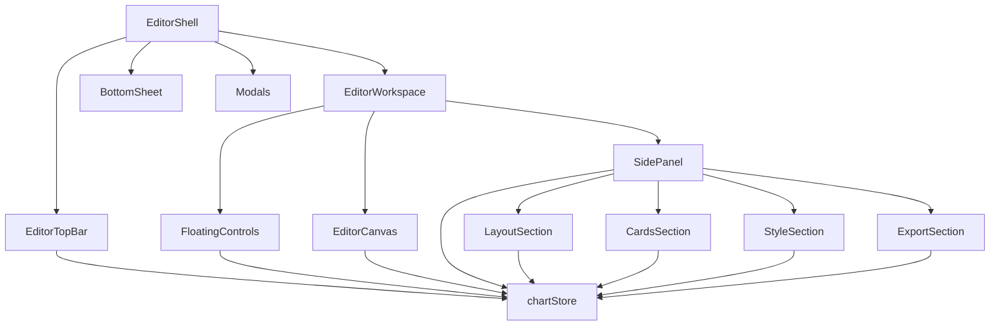
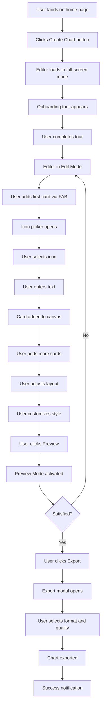
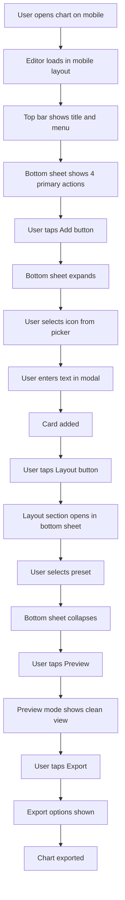
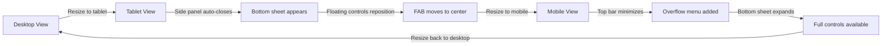
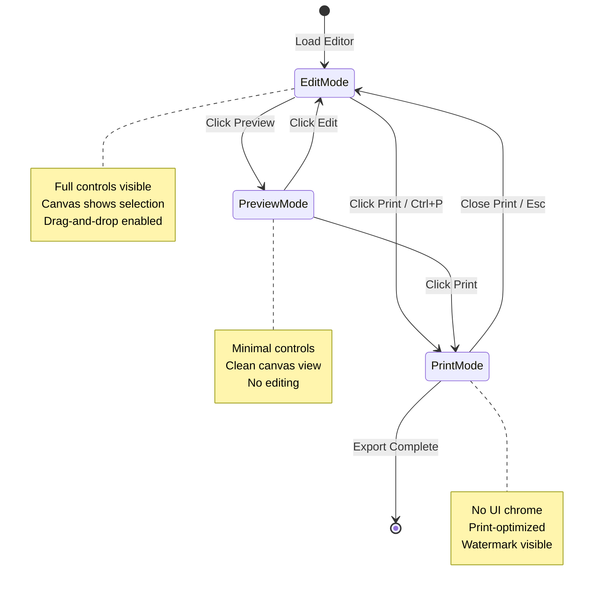

# Charts Page Layout Redesign

## Executive Summary

This document outlines a comprehensive redesign of the charts page layout for The Talking Chart visual communication app. The new design addresses critical UX issues by creating a dedicated editor layout that maximizes canvas space, provides responsive controls across all device sizes, and implements a clean separation between editing and viewing modes.

**Key Improvements:**
- Full-screen editor layout without site header/footer
- Responsive control placement (floating on desktop, bottom sheet on mobile)
- Canvas-first design maximizing available screen real estate
- Progressive disclosure of controls
- Seamless transitions between edit, preview, and print modes
- Enhanced mobile/tablet experience

---

## 1. Layout Architecture

### 1.1 New Layout Hierarchy

```
layouts/editor.vue (NEW - dedicated editor layout)
└── EditorShell.vue (NEW - main editor wrapper)
    ├── EditorTopBar.vue (NEW - compact top control bar)
    │   ├── Back to Home button
    │   ├── Chart title input
    │   ├── Undo/Redo controls
    │   ├── Save indicator
    │   └── Preview/Export actions
    ├── EditorWorkspace.vue (NEW - main workspace area)
    │   ├── FloatingControls.vue (NEW - floating action buttons)
    │   │   ├── Add card button (FAB)
    │   │   ├── Layout toggle
    │   │   ├── Settings toggle
    │   │   └── Zoom controls
    │   ├── EditorCanvas.vue (existing - enhanced)
    │   └── SidePanel.vue (NEW - collapsible side panel)
    │       ├── LayoutSection.vue (extracted from EditorToolbar)
    │       ├── CardsSection.vue (extracted from EditorToolbar)
    │       ├── StyleSection.vue (extracted from EditorToolbar)
    │       └── ExportSection.vue (extracted from EditorToolbar)
    ├── BottomSheet.vue (NEW - mobile controls)
    │   └── MobileControls.vue (NEW - touch-optimized controls)
    └── Modals (existing - IconPicker, ExportModal, etc.)
```

### 1.2 Component Communication Flow



### 1.3 Layout State Management

```typescript
// New store: stores/editorLayout.ts
interface EditorLayoutState {
  // Panel state
  sidePanelOpen: boolean
  activePanelSection: 'layout' | 'cards' | 'style' | 'export' | null
  
  // Floating controls state
  floatingControlsVisible: boolean
  floatingControlsPosition: 'left' | 'right'
  
  // Mode state
  editorMode: 'edit' | 'preview' | 'print'
  
  // Responsive state
  viewportSize: 'mobile' | 'tablet' | 'desktop'
  bottomSheetOpen: boolean
  
  // User preferences (persisted)
  preferredPanelPosition: 'left' | 'right'
  autoHideControls: boolean
  rememberPanelState: boolean
}
```

---

## 2. Layout Variants by Device

### 2.1 Desktop Layout (≥ 1024px)

**Layout Structure:**
```
┌─────────────────────────────────────────────────────────────┐
│ EditorTopBar (48px height)                                  │
│ [←] [Title Input] [Undo] [Redo] [Save] [Preview] [Export]  │
├─────────────────────────────────────────────────────────────┤
│                                                             │
│  ┌─────────┐  ┌─────────────────────────────────────────┐ │
│  │ Floating│  │                                         │ │
│  │ Controls│  │         EditorCanvas                    │ │
│  │ (FAB)   │  │                                         │ │
│  │         │  │                                         │ │
│  │ + Add   │  │                                         │ │
│  │ Layout  │  │                                         │ │
│  │ Settings│  │                                         │ │
│  │ Zoom    │  │                                         │ │
│  └─────────┘  │                                         │ │
│              │                                         │ │
│  ┌─────────┐  │                                         │ │
│  │ Side    │  │                                         │ │
│  │ Panel   │  │                                         │ │
│  │ (320px) │  │                                         │ │
│  │         │  │                                         │ │
│  │ [Layout]│  │                                         │ │
│  │ [Cards] │  │                                         │ │
│  │ [Style] │  │                                         │ │
│  │ [Export]│  │                                         │ │
│  └─────────┘  └─────────────────────────────────────────┘ │
│                                                             │
└─────────────────────────────────────────────────────────────┘
```

**Key Features:**
- Full-screen canvas with minimal chrome
- Floating controls on left side (configurable)
- Collapsible side panel (320px width) with accordion sections
- Top bar for primary actions
- Canvas takes remaining space
- Side panel can be toggled via floating controls or keyboard shortcut

**Responsive Behavior:**
- Side panel slides in/out with smooth animation
- Floating controls auto-hide when not interacting (configurable)
- Canvas maintains aspect ratio while maximizing space

### 2.2 Tablet Layout (768px - 1023px)

**Layout Structure:**
```
┌─────────────────────────────────────────────────────────────┐
│ EditorTopBar (48px height)                                  │
│ [←] [Title] [Undo] [Redo] [Save] [Preview] [Export]        │
├─────────────────────────────────────────────────────────────┤
│                                                             │
│  ┌─────────────────────────────────────────────────────┐   │
│  │              EditorCanvas                           │   │
│  │                                                     │   │
│  │                                                     │   │
│  └─────────────────────────────────────────────────────┘   │
│                                                             │
│  ┌─────────────────────────────────────────────────────┐   │
│  │ BottomSheet (collapsed - 60px)                       │   │
│  │ [Add] [Layout] [Style] [Export] [More ▲]           │   │
│  └─────────────────────────────────────────────────────┘   │
│                                                             │
└─────────────────────────────────────────────────────────────┘
```

**Key Features:**
- Compact top bar
- Bottom sheet for controls (collapsed by default)
- Tap bottom sheet to expand and show full controls
- Floating FAB for quick actions (add card)
- Swipe gestures for bottom sheet

**Expanded Bottom Sheet:**
```
┌─────────────────────────────────────────────────────────────┐
│ BottomSheet (expanded - 300px)                              │
│ ┌────────┐ ┌────────┐ ┌────────┐ ┌────────┐ ┌────────┐    │
│ │ Layout │ │ Cards  │ │ Style  │ │ Export │ │ More   │    │
│ └────────┘ └────────┘ └────────┘ └────────┘ └────────┘    │
│                                                             │
│ [Active Section Content - e.g., Layout Presets]            │
│                                                             │
│ [▼ Collapse]                                               │
└─────────────────────────────────────────────────────────────┘
```

### 2.3 Mobile Layout (< 768px)

**Layout Structure:**
```
┌─────────────────────────────────────────────────────────────┐
│ EditorTopBar (44px height)                                  │
│ [←] [Title...] [⋮]                                         │
├─────────────────────────────────────────────────────────────┤
│                                                             │
│  ┌─────────────────────────────────────────────────────┐   │
│  │              EditorCanvas                           │   │
│  │                                                     │   │
│  │                                                     │   │
│  │                                                     │   │
│  └─────────────────────────────────────────────────────┘   │
│                                                             │
│  ┌─────────────────────────────────────────────────────┐   │
│  │ BottomSheet (collapsed - 56px)                       │   │
│  │ [Add +] [Layout □] [Style 🎨] [Export ⬇]           │   │
│  └─────────────────────────────────────────────────────┘   │
│                                                             │
└─────────────────────────────────────────────────────────────┘
```

**Key Features:**
- Minimal top bar with overflow menu
- Bottom sheet with 4 primary action buttons
- Tap any button to expand bottom sheet with full controls
- Full-screen modal for detailed editing
- Touch-optimized controls (larger touch targets)

**Expanded Bottom Sheet (Mobile):**
```
┌─────────────────────────────────────────────────────────────┐
│ BottomSheet (expanded - 80% viewport height)               │
│ ┌────┐ ┌────┐ ┌────┐ ┌────┐ ┌────┐ ┌────┐ ┌────┐          │
│ │Layout│ │Cards│ │Style│ │Export│ │Zoom│ │Undo│ │Redo│    │
│ └────┘ └────┘ └────┘ └────┘ └────┘ └────┘ └────┘          │
│                                                             │
│ [Active Section Content - scrollable]                       │
│                                                             │
│ [▼ Close]                                                   │
└─────────────────────────────────────────────────────────────┘
```

---

## 3. Editor Mode States

### 3.1 Edit Mode (Default)

**Characteristics:**
- All controls visible/accessible
- Canvas shows selection indicators
- Drag-and-drop enabled
- Text editing enabled
- Side panel/bottom sheet expanded by default

**Layout:**
- Desktop: Side panel open, floating controls visible
- Tablet: Bottom sheet collapsed, FAB visible
- Mobile: Bottom sheet collapsed, minimal controls

### 3.2 Preview Mode

**Characteristics:**
- Minimal controls visible (only exit preview, zoom, export)
- Canvas shows final output
- No selection indicators
- No drag-and-drop
- Clean, print-like appearance

**Layout:**
```
┌─────────────────────────────────────────────────────────────┐
│ Preview Bar (40px)                                          │
│ [← Edit] [Zoom -] [100%] [Zoom +] [Export]                 │
├─────────────────────────────────────────────────────────────┤
│                                                             │
│  ┌─────────────────────────────────────────────────────┐   │
│  │              EditorCanvas (Preview)                  │   │
│  │                                                     │   │
│  │                                                     │   │
│  │                                                     │   │
│  └─────────────────────────────────────────────────────┘   │
│                                                             │
└─────────────────────────────────────────────────────────────┘
```

### 3.3 Print Mode

**Characteristics:**
- No UI chrome (header, controls hidden)
- Canvas centered and sized for print
- Watermark visible at bottom
- Print-optimized styles

**Layout:**
```
┌─────────────────────────────────────────────────────────────┐
│                                                             │
│  ┌─────────────────────────────────────────────────────┐   │
│  │              EditorCanvas (Print)                   │   │
│  │                                                     │   │
│  │                                                     │   │
│  │                                                     │   │
│  │                                                     │   │
│  │         Created with The Talking Chart              │   │
│  └─────────────────────────────────────────────────────┘   │
│                                                             │
└─────────────────────────────────────────────────────────────┘
```

---

## 4. Component Specifications

### 4.1 New Components

#### EditorShell.vue
**Purpose:** Main wrapper component for editor layout
**Responsibilities:**
- Manage editor layout state
- Handle responsive breakpoints
- Coordinate between child components
- Manage keyboard shortcuts for layout
- Handle print mode transitions

**Props:**
```typescript
interface EditorShellProps {
  // None - uses store for state
}
```

**Emits:**
```typescript
interface EditorShellEmits {
  'mode-change': [mode: 'edit' | 'preview' | 'print']
  'exit-editor': []
}
```

#### EditorTopBar.vue
**Purpose:** Compact top control bar for primary actions
**Responsibilities:**
- Display chart title (editable)
- Show undo/redo controls
- Display save status
- Provide preview/export actions
- Handle back to home navigation

**Props:**
```typescript
interface EditorTopBarProps {
  title: string
  isDirty: boolean
  canUndo: boolean
  canRedo: boolean
  isPreviewMode: boolean
  isSaving: boolean
  lastSavedTime?: Date
}
```

**Emits:**
```typescript
interface EditorTopBarEmits {
  'update:title': [title: string]
  'undo': []
  'redo': []
  'save': []
  'toggle-preview': []
  'export': []
  'back': []
}
```

#### EditorWorkspace.vue
**Purpose:** Main workspace containing canvas and controls
**Responsibilities:**
- Manage canvas sizing and positioning
- Coordinate floating controls and side panel
- Handle workspace-level interactions
- Manage focus and keyboard navigation

**Props:**
```typescript
interface EditorWorkspaceProps {
  viewportSize: 'mobile' | 'tablet' | 'desktop'
  editorMode: 'edit' | 'preview' | 'print'
}
```

**Emits:**
```typescript
interface EditorWorkspaceEmits {
  'panel-toggle': []
  'panel-section-change': [section: string]
}
```

#### FloatingControls.vue
**Purpose:** Floating action buttons for quick access
**Responsibilities:**
- Display FAB for add card
- Show quick toggles for layout, settings, zoom
- Handle auto-hide behavior
- Position based on user preference

**Props:**
```typescript
interface FloatingControlsProps {
  position: 'left' | 'right'
  visible: boolean
  canAddCard: boolean
  zoom: number
}
```

**Emits:**
```typescript
interface FloatingControlsEmits {
  'add-card': []
  'toggle-panel': [section: string]
  'zoom-in': []
  'zoom-out': []
  'zoom-reset': []
}
```

#### SidePanel.vue
**Purpose:** Collapsible side panel for detailed controls
**Responsibilities:**
- Display accordion-style sections
- Manage section expansion state
- Persist open section to localStorage
- Handle panel collapse/expand animation

**Props:**
```typescript
interface SidePanelProps {
  isOpen: boolean
  activeSection: string | null
  sections: PanelSection[]
}
```

**Emits:**
```typescript
interface SidePanelEmits {
  'toggle-panel': []
  'section-change': [section: string | null]
}
```

#### BottomSheet.vue
**Purpose:** Mobile/tablet bottom sheet for controls
**Responsibilities:**
- Handle swipe gestures for expand/collapse
- Display collapsed/expanded states
- Provide smooth animations
- Handle backdrop interactions

**Props:**
```typescript
interface BottomSheetProps {
  isOpen: boolean
  isExpanded: boolean
  activeSection: string | null
  viewportSize: 'mobile' | 'tablet'
}
```

**Emits:**
```typescript
interface BottomSheetEmits {
  'toggle': []
  'expand': [section: string]
  'collapse': []
}
```

#### MobileControls.vue
**Purpose:** Touch-optimized controls for mobile
**Responsibilities:**
- Display large touch targets
- Provide mobile-specific control layouts
- Handle touch gestures
- Optimize for single-handed use

**Props:**
```typescript
interface MobileControlsProps {
  activeSection: string | null
}
```

**Emits:**
```typescript
interface MobileControlsEmits {
  'section-change': [section: string]
  'close': []
}
```

### 4.2 Modified Components

#### EditorCanvas.vue (Enhanced)
**Changes:**
- Add responsive sizing logic
- Support different editor modes
- Improve keyboard navigation
- Add print-specific styles
- Better touch handling for mobile

#### EditorToolbar.vue (Refactored)
**Changes:**
- Split into separate section components
- Move to SidePanel structure
- Extract LayoutSection, CardsSection, StyleSection, ExportSection
- Maintain backward compatibility during migration

#### EditorHeader.vue (Deprecated)
**Status:** Will be replaced by EditorTopBar
**Migration:** Functionality moved to EditorTopBar

#### ChartEditor.vue (Refactored)
**Changes:**
- Remove layout responsibilities
- Focus on business logic
- Delegate layout to EditorShell
- Simplify component structure

### 4.3 Extracted Section Components

#### LayoutSection.vue
**Purpose:** Layout preset controls
**Source:** Extracted from EditorToolbar
**Props:**
```typescript
interface LayoutSectionProps {
  currentLayout: LayoutPreset
  columns: number
  rows: number
  cardGap: number
}
```

#### CardsSection.vue
**Purpose:** Card management controls
**Source:** Extracted from EditorToolbar
**Props:**
```typescript
interface CardsSectionProps {
  cardCount: number
  canAddCard: boolean
  selectedCardId: string | null
}
```

#### StyleSection.vue
**Purpose:** Style and theme controls
**Source:** Extracted from EditorToolbar
**Props:**
```typescript
interface StyleSectionProps {
  styleSettings: StyleSettings
  themes: ColorTheme[]
}
```

#### ExportSection.vue
**Purpose:** Export settings and controls
**Source:** Extracted from EditorToolbar
**Props:**
```typescript
interface ExportSectionProps {
  exportSettings: ExportSettings
  isExporting: boolean
}
```

---

## 5. UX Flows

### 5.1 User Journey: Creating a New Chart



### 5.2 User Journey: Mobile Experience



### 5.3 User Journey: Responsive Behavior



### 5.4 User Journey: Mode Transitions



---

## 6. Technical Implementation Notes

### 6.1 Layout Implementation Approach

**CSS Grid for Main Layout:**
```css
/* EditorShell layout */
.editor-shell {
  display: grid;
  grid-template-rows: auto 1fr;
  grid-template-areas:
    "topbar"
    "workspace";
  height: 100vh;
  overflow: hidden;
}

/* EditorWorkspace layout (desktop) */
.editor-workspace {
  display: grid;
  grid-template-columns: auto 1fr 320px;
  grid-template-areas:
    "floating canvas sidepanel";
  gap: 0;
  height: 100%;
}
```

**Flexbox for Component Layouts:**
```css
/* EditorTopBar */
.editor-topbar {
  display: flex;
  align-items: center;
  justify-content: space-between;
  padding: 0 16px;
  height: 48px;
  border-bottom: 1px solid var(--border-color);
}

/* SidePanel sections */
.side-panel-section {
  display: flex;
  flex-direction: column;
  gap: 8px;
}
```

**Absolute Positioning for Floating Controls:**
```css
.floating-controls {
  position: absolute;
  left: 16px;
  top: 50%;
  transform: translateY(-50%);
  display: flex;
  flex-direction: column;
  gap: 12px;
  z-index: 100;
}

.floating-controls.right {
  left: auto;
  right: 16px;
}
```

### 6.2 Responsive Breakpoints

```typescript
// Breakpoint constants
const BREAKPOINTS = {
  mobile: 0,
  tablet: 768,
  desktop: 1024,
  wide: 1440,
} as const

// Computed viewport size
const viewportSize = computed(() => {
  const width = window.innerWidth
  if (width < BREAKPOINTS.tablet) return 'mobile'
  if (width < BREAKPOINTS.desktop) return 'tablet'
  return 'desktop'
})
```

### 6.3 State Management

**New Store: stores/editorLayout.ts**
```typescript
import { defineStore } from 'pinia'

export const useEditorLayoutStore = defineStore('editorLayout', () => {
  // State
  const sidePanelOpen = ref(true)
  const activePanelSection = ref<string | null>('layout')
  const floatingControlsVisible = ref(true)
  const floatingControlsPosition = ref<'left' | 'right'>('left')
  const editorMode = ref<'edit' | 'preview' | 'print'>('edit')
  const bottomSheetOpen = ref(false)
  const bottomSheetExpanded = ref(false)
  
  // User preferences (persisted)
  const preferredPanelPosition = useStorage('editor-panel-position', 'left' as const)
  const autoHideControls = useStorage('editor-auto-hide', false)
  const rememberPanelState = useStorage('editor-remember-panel', true)
  
  // Computed
  const viewportSize = computed(() => {
    if (process.client) {
      const width = window.innerWidth
      if (width < 768) return 'mobile'
      if (width < 1024) return 'tablet'
      return 'desktop'
    }
    return 'desktop'
  })
  
  const shouldShowSidePanel = computed(() => {
    return viewportSize.value === 'desktop' && sidePanelOpen.value
  })
  
  const shouldShowBottomSheet = computed(() => {
    return viewportSize.value !== 'desktop'
  })
  
  // Actions
  function toggleSidePanel() {
    sidePanelOpen.value = !sidePanelOpen.value
    if (rememberPanelState.value) {
      localStorage.setItem('editor-panel-open', String(sidePanelOpen.value))
    }
  }
  
  function setActiveSection(section: string | null) {
    activePanelSection.value = section
  }
  
  function setEditorMode(mode: 'edit' | 'preview' | 'print') {
    editorMode.value = mode
  }
  
  function toggleBottomSheet() {
    bottomSheetOpen.value = !bottomSheetOpen.value
  }
  
  function expandBottomSheet(section: string) {
    bottomSheetExpanded.value = true
    activePanelSection.value = section
  }
  
  function collapseBottomSheet() {
    bottomSheetExpanded.value = false
  }
  
  function toggleFloatingControls() {
    floatingControlsVisible.value = !floatingControlsVisible.value
  }
  
  return {
    // State
    sidePanelOpen,
    activePanelSection,
    floatingControlsVisible,
    floatingControlsPosition,
    editorMode,
    bottomSheetOpen,
    bottomSheetExpanded,
    preferredPanelPosition,
    autoHideControls,
    rememberPanelState,
    
    // Computed
    viewportSize,
    shouldShowSidePanel,
    shouldShowBottomSheet,
    
    // Actions
    toggleSidePanel,
    setActiveSection,
    setEditorMode,
    toggleBottomSheet,
    expandBottomSheet,
    collapseBottomSheet,
    toggleFloatingControls,
  }
})
```

### 6.4 Keyboard Shortcuts

```typescript
// Keyboard shortcuts for layout control
const LAYOUT_SHORTCUTS = {
  // Panel controls
  'Ctrl+\\': 'toggleSidePanel',
  'Ctrl+Shift+P': 'openPanelSection',
  
  // Mode controls
  'Ctrl+P': 'togglePreviewMode',
  'Escape': 'exitPreviewMode',
  
  // Zoom controls
  'Ctrl++': 'zoomIn',
  'Ctrl+-': 'zoomOut',
  'Ctrl+0': 'zoomReset',
  
  // Quick actions
  'Ctrl+N': 'addCard',
  'Ctrl+S': 'saveChart',
  'Ctrl+E': 'openExport',
} as const
```

### 6.5 Animation and Transitions

**Panel Slide Animation:**
```css
.side-panel {
  transition: transform 0.3s cubic-bezier(0.4, 0, 0.2, 1);
}

.side-panel.collapsed {
  transform: translateX(-100%);
}
```

**Bottom Sheet Animation:**
```css
.bottom-sheet {
  transition: transform 0.4s cubic-bezier(0.4, 0, 0.2, 1);
}

.bottom-sheet.collapsed {
  transform: translateY(100%);
}

.bottom-sheet.expanded {
  transform: translateY(0);
}
```

**Mode Transition:**
```css
.editor-canvas {
  transition: all 0.3s ease;
}

.editor-canvas.preview-mode {
  box-shadow: 0 0 20px rgba(0, 0, 0, 0.1);
}
```

### 6.6 Performance Considerations

**Virtual Scrolling for Icon Picker:**
```typescript
// Use vue-virtual-scroller for large icon lists
import { RecycleScroller } from 'vue-virtual-scroller'
```

**Debounced Resize Handler:**
```typescript
import { useDebounceFn } from '@vueuse/core'

const handleResize = useDebounceFn(() => {
  // Update viewport size
  editorLayoutStore.updateViewportSize()
}, 100)
```

**Lazy Loading for Modals:**
```vue
<template>
  <LazyIconPicker v-if="showIconPicker" />
</template>
```

**Canvas Optimization:**
```typescript
// Use requestAnimationFrame for smooth canvas updates
function animateCanvas() {
  requestAnimationFrame(() => {
    // Update canvas
    animateCanvas()
  })
}
```

### 6.7 Accessibility

**ARIA Attributes:**
```vue
<aside
  class="side-panel"
  :aria-hidden="!sidePanelOpen"
  :aria-expanded="sidePanelOpen"
  role="complementary"
  aria-label="Editor controls"
>
```

**Keyboard Navigation:**
```typescript
// Focus management for modals
function focusFirstElement(container: HTMLElement) {
  const focusable = container.querySelectorAll(
    'button, [href], input, select, textarea, [tabindex]:not([tabindex="-1"])'
  )
  if (focusable.length > 0) {
    (focusable[0] as HTMLElement).focus()
  }
}
```

**Screen Reader Support:**
```vue
<button
  @click="addCard"
  :aria-label="`Add new card${canAddCard ? '' : ' (maximum reached)'}`"
  :aria-disabled="!canAddCard"
>
  <span class="sr-only">Add Card</span>
  <Icon name="plus" aria-hidden="true" />
</button>
```

### 6.8 Print Optimization

```css
/* Print-specific styles */
@media print {
  .editor-topbar,
  .floating-controls,
  .side-panel,
  .bottom-sheet {
    display: none !important;
  }
  
  .editor-canvas {
    box-shadow: none !important;
    margin: 0 !important;
    padding: 0 !important;
  }
  
  .canvas-watermark {
    display: block !important;
  }
  
  @page {
    size: A4 landscape;
    margin: 0;
  }
}
```

---

## 7. Migration Strategy

### 7.1 Phase 1: Foundation (Week 1)

**Tasks:**
1. Create new layout structure
   - Create `layouts/editor.vue`
   - Create `components/EditorShell.vue`
   - Set up new `stores/editorLayout.ts`

2. Create new components
   - Create `components/EditorTopBar.vue`
   - Create `components/EditorWorkspace.vue`
   - Create `components/FloatingControls.vue`

3. Set up routing
   - Update `pages/chart.vue` to use new layout
   - Add layout switching logic

**Deliverables:**
- New layout structure in place
- Basic editor shell functional
- Routing configured

### 7.2 Phase 2: Desktop Layout (Week 2)

**Tasks:**
1. Implement side panel
   - Create `components/SidePanel.vue`
   - Extract sections from EditorToolbar
   - Implement accordion behavior

2. Enhance EditorCanvas
   - Add responsive sizing
   - Implement mode switching
   - Add keyboard navigation

3. Integrate controls
   - Connect FloatingControls to store
   - Implement panel toggle logic
   - Add animations

**Deliverables:**
- Full desktop layout functional
- Side panel working
- Mode switching implemented

### 7.3 Phase 3: Responsive Layout (Week 3)

**Tasks:**
1. Implement tablet layout
   - Create `components/BottomSheet.vue`
   - Implement collapsed/expanded states
   - Add swipe gestures

2. Implement mobile layout
   - Create `components/MobileControls.vue`
   - Optimize touch targets
   - Implement mobile-specific flows

3. Add responsive breakpoints
   - Implement viewport detection
   - Add smooth transitions
   - Test across devices

**Deliverables:**
- Full responsive layout
- Mobile/tablet experience working
- Smooth transitions between breakpoints

### 7.4 Phase 4: Polish & Testing (Week 4)

**Tasks:**
1. Refine interactions
   - Add micro-interactions
   - Improve animations
   - Add loading states

2. Accessibility audit
   - Test keyboard navigation
   - Verify screen reader support
   - Fix ARIA issues

3. Performance optimization
   - Implement lazy loading
   - Add debouncing
   - Optimize re-renders

4. Testing
   - Unit tests for components
   - Integration tests for flows
   - E2E tests for critical paths

**Deliverables:**
- Production-ready layout
- Full test coverage
- Documentation updated

### 7.5 Phase 5: Rollout (Week 5)

**Tasks:**
1. Feature flag
   - Add feature flag for new layout
   - Enable for beta users
   - Monitor performance

2. Gradual rollout
   - Roll out to 10% of users
   - Monitor metrics
   - Increase to 50%

3. Full rollout
   - Remove feature flag
   - Deprecate old layout
   - Remove old components

**Deliverables:**
- New layout fully deployed
- Old layout removed
- All users migrated

### 7.6 Backward Compatibility

During migration, maintain backward compatibility:

```typescript
// Feature flag for new layout
const USE_NEW_LAYOUT = process.env.FEATURE_NEW_LAYOUT === 'true'

// pages/chart.vue
<template>
  <div>
    <EditorShell v-if="USE_NEW_LAYOUT">
      <!-- New layout -->
    </EditorShell>
    <ChartEditor v-else>
      <!-- Old layout -->
    </ChartEditor>
  </div>
</template>
```

### 7.7 Data Migration

```typescript
// Migrate user preferences from old to new format
function migrateUserPreferences() {
  const oldPreferences = localStorage.getItem('talking-chart-ui')
  if (oldPreferences) {
    const parsed = JSON.parse(oldPreferences)
    
    // Map old preferences to new format
    const newPreferences = {
      preferredPanelPosition: parsed.toolbarPosition || 'left',
      autoHideControls: parsed.autoHideToolbar || false,
      rememberPanelState: parsed.rememberToolbarState || true,
    }
    
    // Save new preferences
    localStorage.setItem('editor-layout-preferences', JSON.stringify(newPreferences))
    
    // Remove old preferences
    localStorage.removeItem('talking-chart-ui')
  }
}
```

---

## 8. Wireframe Descriptions

### 8.1 Desktop: Edit Mode

**Visual Description:**
- Full-screen dark gray background (#f8fafc)
- Top bar (48px) with white background, subtle bottom border
  - Left: Back arrow icon, editable title input with unsaved indicator
  - Center: Undo/Redo buttons with keyboard shortcuts shown in tooltips
  - Right: Save status indicator, Preview toggle button, Export button
- Canvas area with light gray background (#f1f5f9)
  - White A4-sized canvas centered with subtle shadow
  - Cards displayed in grid layout with selection highlights
- Left side: Vertical floating controls (16px from edge, centered vertically)
  - Large FAB (56px) with plus icon for adding cards
  - Smaller buttons (40px) for Layout, Settings, Zoom
- Right side: Collapsible side panel (320px width)
  - White background with left border
  - Accordion sections: Layout, Cards, Style, Export
  - Each section has icon, title, and chevron
  - Active section expanded with content

**Interactions:**
- Click floating FAB → Add new card
- Click Layout button → Open Layout section in side panel
- Click side panel header → Toggle section expansion
- Drag side panel edge → Resize panel (future enhancement)
- Press Ctrl+\ → Toggle side panel
- Press Ctrl+P → Toggle preview mode

### 8.2 Desktop: Preview Mode

**Visual Description:**
- Minimal top bar (40px) with gray background
  - Left: "Edit" button with pencil icon
  - Center: Zoom controls (-, percentage, +)
  - Right: Export button
- Canvas area with darker background (#e2e8f0)
  - Clean white canvas without selection highlights
  - No drag handles or editing controls
  - Watermark at bottom: "Created with The Talking Chart"
- No floating controls or side panel visible

**Interactions:**
- Click Edit button → Return to edit mode
- Click zoom controls → Adjust zoom level
- Click Export button → Open export modal
- Press Escape → Return to edit mode

### 8.3 Tablet: Edit Mode (Collapsed)

**Visual Description:**
- Compact top bar (44px)
  - Left: Back arrow, truncated title with ellipsis
  - Center: Undo/Redo buttons (smaller)
  - Right: Save status, Preview, Export (icons only, no labels)
- Large canvas area
- Bottom sheet (60px height) at bottom of screen
  - White background with top border and shadow
  - 4 evenly spaced buttons: Add (+), Layout (grid icon), Style (palette), Export (download)
  - Each button has icon and label
- Floating FAB (48px) positioned above bottom sheet, right-aligned

**Interactions:**
- Tap bottom sheet → Expand to show full controls
- Tap any button in bottom sheet → Expand and show that section
- Tap FAB → Add new card
- Swipe up on bottom sheet → Expand
- Swipe down on expanded bottom sheet → Collapse

### 8.4 Tablet: Edit Mode (Expanded)

**Visual Description:**
- Top bar unchanged
- Canvas area slightly reduced (300px from bottom)
- Expanded bottom sheet (300px height)
  - Tab bar at top with 5 tabs: Layout, Cards, Style, Export, More
  - Active tab highlighted with underline
  - Content area below tabs showing active section
  - Collapse handle at bottom with down arrow
  - Backdrop overlay with slight transparency

**Interactions:**
- Tap different tab → Switch section content
- Tap collapse handle → Collapse bottom sheet
- Tap backdrop → Collapse bottom sheet
- Swipe down on content → Collapse bottom sheet

### 8.5 Mobile: Edit Mode (Collapsed)

**Visual Description:**
- Minimal top bar (44px)
  - Left: Back arrow icon
  - Center: Title (truncated if long)
  - Right: Overflow menu (three dots)
- Canvas area takes most of screen
- Bottom sheet (56px height) with 4 buttons
  - Large touch targets (48x48px)
  - Icons only for space efficiency
  - Buttons: Add (+), Layout (□), Style (🎨), Export (⬇)
- No floating controls (integrated into bottom sheet)

**Interactions:**
- Tap any bottom sheet button → Expand bottom sheet with full controls
- Tap overflow menu → Show additional options (undo, redo, zoom)
- Tap canvas card → Open card edit modal
- Long press card → Show context menu

### 8.6 Mobile: Edit Mode (Expanded)

**Visual Description:**
- Top bar unchanged
- Canvas area reduced (80% of viewport height)
- Expanded bottom sheet (80% viewport height)
  - Grid of 7 action buttons at top
  - Scrollable content area below
  - Close button (X) at top right
  - Backdrop overlay
- Card edit modal (when card selected)
  - Full-screen modal with slide-up animation
  - Icon picker at top (searchable)
  - Text input fields below
  - Save/Cancel buttons at bottom

**Interactions:**
- Tap action button → Show section content
- Scroll content area → View all options
- Tap close button → Collapse bottom sheet
- Tap backdrop → Collapse bottom sheet
- Swipe down on modal → Close modal

### 8.7 Mobile: Preview Mode

**Visual Description:**
- Minimal preview bar (36px)
  - Left: "Edit" text button
  - Right: "Export" text button
- Canvas takes full remaining space
- Clean preview without any editing controls
- Watermark visible at bottom of canvas

**Interactions:**
- Tap Edit → Return to edit mode
- Tap Export → Show export options (bottom sheet)
- Pinch to zoom → Adjust zoom level

### 8.8 Print View

**Visual Description:**
- No UI chrome (no header, controls, panels)
- White canvas centered on page
- Content sized for A4 landscape
- Subtle watermark at bottom right: "Created with The Talking Chart"
- Clean, professional appearance

**Interactions:**
- Browser print dialog opens automatically
- User selects printer/PDF
- User confirms print

---

## 9. Design Principles Applied

### 9.1 Canvas-First
- Maximum screen real estate allocated to canvas
- Controls positioned to minimize canvas obstruction
- Floating controls can be hidden when not needed
- Preview mode shows canvas without distractions

### 9.2 Progressive Disclosure
- Primary actions always visible (add card, export)
- Secondary actions in collapsible panels/sheets
- Advanced options hidden until needed
- Context-sensitive controls based on selection

### 9.3 Responsive
- Three distinct layouts for mobile/tablet/desktop
- Smooth transitions between breakpoints
- Touch-optimized controls for mobile
- Keyboard shortcuts for power users

### 9.4 Accessible
- Full keyboard navigation support
- ARIA labels and roles throughout
- Screen reader compatible
- High contrast options available

### 9.5 Performant
- Lazy loading for modals and heavy components
- Debounced resize handlers
- Virtual scrolling for large lists
- Optimized re-renders with proper key usage

### 9.6 Intuitive
- Clear visual hierarchy
- Predictable control placement
- Consistent interaction patterns
- Helpful tooltips and hints

---

## 10. Success Metrics

### 10.1 User Engagement
- Increase in average time spent in editor
- Increase in charts created per user
- Decrease in editor abandonment rate

### 10.2 User Satisfaction
- Increase in user satisfaction scores
- Decrease in support tickets related to layout
- Positive feedback on new layout

### 10.3 Performance
- Page load time < 2 seconds
- First contentful paint < 1 second
- Time to interactive < 3 seconds

### 10.4 Accessibility
- WCAG 2.1 AA compliance
- Keyboard navigation coverage > 95%
- Screen reader compatibility verified

### 10.5 Mobile Usage
- Increase in mobile editor usage
- Decrease in mobile bounce rate
- Increase in mobile chart creation

---

## 11. Future Enhancements

### 11.1 Short-Term (3-6 months)
- Resizable side panel
- Drag-and-drop floating controls
- Customizable control layouts
- More layout presets

### 11.2 Medium-Term (6-12 months)
- Collaborative editing mode
- Real-time preview
- Advanced export options
- Template library

### 11.3 Long-Term (12+ months)
- AI-powered layout suggestions
- Voice control integration
- Advanced accessibility features
- Plugin system for extensions

---

## Appendix

### A. Component Props Reference

Full reference of all component props, emits, and slots.

### B. CSS Custom Properties

```css
:root {
  --editor-topbar-height: 48px;
  --editor-topbar-height-mobile: 44px;
  --side-panel-width: 320px;
  --floating-controls-gap: 12px;
  --fab-size: 56px;
  --fab-size-mobile: 48px;
  --bottom-sheet-height-collapsed: 60px;
  --bottom-sheet-height-collapsed-mobile: 56px;
  --bottom-sheet-height-expanded: 300px;
  --bottom-sheet-height-expanded-mobile: 80%;
}
```

### C. Keyboard Shortcuts Reference

Complete list of keyboard shortcuts and their functions.

### D. Testing Checklist

- [ ] Desktop layout renders correctly
- [ ] Tablet layout renders correctly
- [ ] Mobile layout renders correctly
- [ ] Responsive transitions work smoothly
- [ ] All keyboard shortcuts functional
- [ ] Screen reader compatibility verified
- [ ] Touch gestures work on mobile
- [ ] Print layout renders correctly
- [ ] Export functionality works
- [ ] State persistence works
- [ ] Performance benchmarks met

### E. Migration Checklist

- [ ] Feature flag implemented
- [ ] New layout components created
- [ ] Old layout components deprecated
- [ ] User preferences migrated
- [ ] Documentation updated
- [ ] Tests updated
- [ ] Beta rollout completed
- [ ] Full rollout completed
- [ ] Old layout removed
- [ ] Cleanup completed

---

**Document Version:** 1.0  
**Last Updated:** 2025-03-28  
**Author:** Architecture Team  
**Status:** Ready for Review
