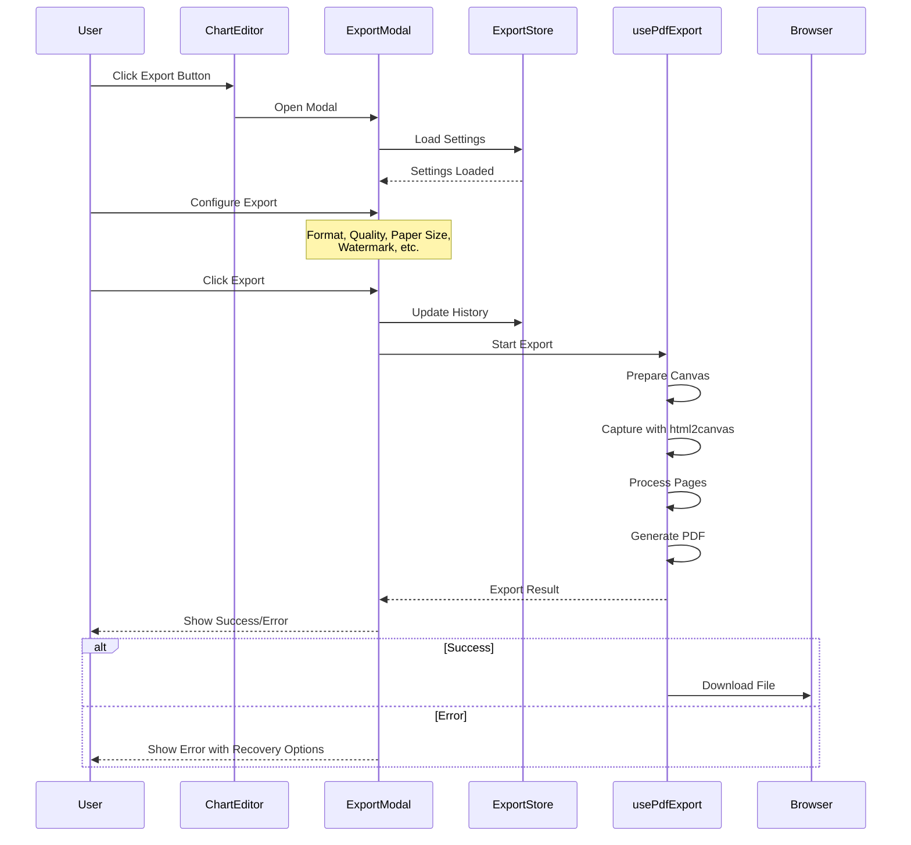
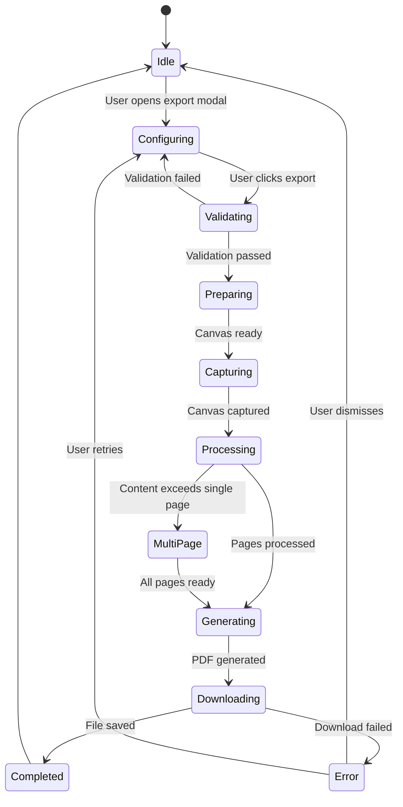
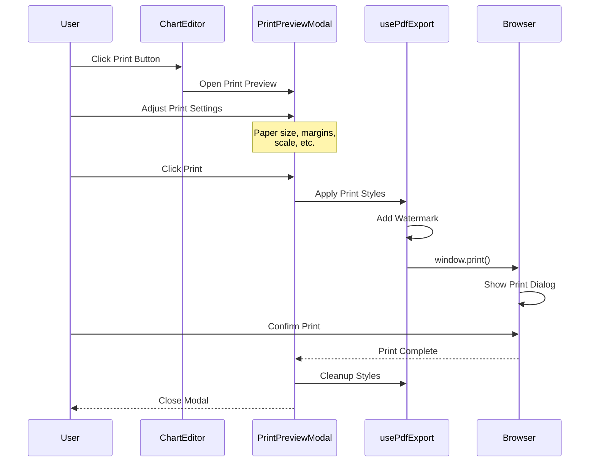

# Export System Improvements: PDF Export, Printing, and Watermark

**Date:** 2026-03-28  
**Project:** The Talking Chart - Visual Communication App  
**Version:** 2.0

---

## Executive Summary

This plan outlines comprehensive improvements to the chart editor's export functionality, addressing critical limitations in the current implementation. The enhancements focus on three core areas:

1. **PDF Export**: Multi-page support, multiple paper sizes, quality optimization, and progress tracking
2. **Print Support**: Print-optimized CSS, print preview modal, and print-specific layout adjustments
3. **Watermark System**: Customizable watermarks with positioning, styling, and preview capabilities

The current implementation uses [`html2canvas`](composables/usePdfExport.ts:1) and [`jspdf`](composables/usePdfExport.ts:2) but suffers from limitations including fixed A4 format, single-page constraint, hardcoded watermark, and no print optimization. This plan provides a phased approach to transform the export system into a production-ready, user-friendly feature.

---

## 1. Feature Specifications

### 1.1 PDF Export Improvements

#### 1.1.1 Paper Size Support

**Paper Sizes:**
- A4 (297mm × 210mm) - Default, landscape
- Letter (279.4mm × 215.9mm) - US standard
- Legal (355.6mm × 215.9mm) - US legal documents
- A3 (420mm × 297mm) - Larger format
- A5 (210mm × 148mm) - Smaller format
- Custom - User-defined dimensions

**Orientation:**
- Landscape (default)
- Portrait

**Implementation:**
```typescript
export type PaperSize = 'a4' | 'letter' | 'legal' | 'a3' | 'a5' | 'custom'
export type Orientation = 'landscape' | 'portrait'

export interface PaperDimensions {
  width: number  // in mm
  height: number // in mm
}

export const PAPER_SIZES: Record<PaperSize, PaperDimensions> = {
  a4: { width: 297, height: 210 },
  letter: { width: 279.4, height: 215.9 },
  legal: { width: 355.6, height: 215.9 },
  a3: { width: 420, height: 297 },
  a5: { width: 210, height: 148 },
  custom: { width: 297, height: 210 }, // Default, user can override
}
```

#### 1.1.2 Multi-Page Export

**Behavior:**
- Automatically detect when content exceeds single page
- Split content intelligently across pages
- Maintain card boundaries (no card splitting across pages)
- Add page numbers and headers to multi-page exports

**Algorithm:**
1. Calculate total content height
2. Determine pages needed based on paper size
3. Identify card boundaries for clean breaks
4. Create canvas sections for each page
5. Generate multi-page PDF with proper margins

**Implementation:**
```typescript
interface MultiPageConfig {
  maxPages: number        // Maximum pages allowed (default: 10)
  pageMargins: {          // Margins in mm
    top: number
    right: number
    bottom: number
    left: number
  }
  showPageNumbers: boolean
  showHeaders: boolean
}

async function exportMultiPagePdf(
  element: HTMLElement,
  config: MultiPageConfig,
  options: ExportOptions
): Promise<void>
```

#### 1.1.3 Quality Presets with File Size Optimization

**Quality Levels:**

| Level | Scale | DPI | Max File Size | Use Case |
|-------|-------|-----|---------------|----------|
| Draft | 1.5x | 150 | < 1 MB | Quick previews, testing |
| Standard | 2x | 200 | < 3 MB | Regular exports |
| High | 3x | 300 | < 8 MB | Print quality |
| Ultra | 4x | 400 | < 15 MB | Professional printing |

**File Size Optimization:**
- JPEG compression for raster formats
- SVG vectorization where possible
- Progressive loading indicators
- Estimated file size preview

**Implementation:**
```typescript
export type ExportQuality = 'draft' | 'standard' | 'high' | 'ultra'

export interface QualityPreset {
  scale: number
  dpi: number
  maxFileSize: number  // in bytes
  compression: number  // 0-1 for JPEG
  description: string
}

export const QUALITY_PRESETS: Record<ExportQuality, QualityPreset> = {
  draft: {
    scale: 1.5,
    dpi: 150,
    maxFileSize: 1024 * 1024,      // 1 MB
    compression: 0.8,
    description: 'Fast export, smaller file size'
  },
  standard: {
    scale: 2,
    dpi: 200,
    maxFileSize: 3 * 1024 * 1024,  // 3 MB
    compression: 0.85,
    description: 'Good quality, balanced file size'
  },
  high: {
    scale: 3,
    dpi: 300,
    maxFileSize: 8 * 1024 * 1024,  // 8 MB
    compression: 0.9,
    description: 'Print quality, larger file size'
  },
  ultra: {
    scale: 4,
    dpi: 400,
    maxFileSize: 15 * 1024 * 1024, // 15 MB
    compression: 0.95,
    description: 'Professional printing, largest file size'
  }
}
```

#### 1.1.4 Progress Indicators

**Progress Stages:**
1. Preparing canvas (0-20%)
2. Capturing content (20-60%)
3. Processing pages (60-90%)
4. Generating PDF (90-100%)

**UI Elements:**
- Progress bar with percentage
- Current stage text
- Estimated time remaining
- Cancel button (if not too far along)

**Implementation:**
```typescript
interface ExportProgress {
  stage: 'preparing' | 'capturing' | 'processing' | 'generating' | 'complete'
  percentage: number
  current: number  // Current page/item
  total: number    // Total pages/items
  estimatedTime?: number  // in seconds
}

export function useExportProgress() {
  const progress = ref<ExportProgress>({
    stage: 'preparing',
    percentage: 0,
    current: 0,
    total: 1
  })
  
  function updateProgress(update: Partial<ExportProgress>) {
    progress.value = { ...progress.value, ...update }
  }
  
  return { progress, updateProgress }
}
```

#### 1.1.5 Error Handling and Recovery

**Error Types:**
- Canvas capture failure
- PDF generation error
- File size exceeded
- Browser compatibility issue
- Memory limit exceeded

**Recovery Strategies:**
- Retry with lower quality
- Suggest alternative format
- Provide detailed error message
- Offer to save as image instead

**Implementation:**
```typescript
interface ExportError {
  code: 'canvas_capture' | 'pdf_generation' | 'file_size' | 'compatibility' | 'memory'
  message: string
  details?: Record<string, unknown>
  recovery?: RecoveryAction
}

interface RecoveryAction {
  label: string
  action: () => void
}

async function handleExportError(error: ExportError): Promise<void> {
  // Show user-friendly error with recovery options
  // Log detailed error for debugging
  // Offer alternative export methods
}
```

### 1.2 Print Support

#### 1.2.1 Print-Optimized CSS

**`@media print` Rules:**

```css
/* Hide non-print elements */
@media print {
  .editor-toolbar,
  .editor-header,
  .preview-toggle,
  .export-button,
  .onboarding-tour,
  .notifications {
    display: none !important;
  }
  
  /* Optimize canvas for print */
  .editor-canvas {
    width: 100% !important;
    max-width: none !important;
    transform: none !important;
    page-break-inside: avoid;
  }
  
  /* Watermark positioning */
  .canvas-watermark {
    position: fixed;
    bottom: 10mm;
    left: 50%;
    transform: translateX(-50%);
    font-size: 10pt;
    color: #999 !important;
  }
  
  /* Page breaks */
  .canvas-card-wrapper {
    page-break-inside: avoid;
    break-inside: avoid;
  }
  
  /* Print margins */
  @page {
    margin: 10mm;
    size: A4 landscape;
  }
  
  /* High contrast for print */
  body {
    -webkit-print-color-adjust: exact;
    print-color-adjust: exact;
  }
}
```

#### 1.2.2 Print Preview Modal

**Features:**
- Live preview of print layout
- Show page boundaries
- Display print settings (paper size, margins)
- Watermark preview in print position
- Zoom controls for preview
- Print button to trigger browser print

**UI Layout:**
```
┌─────────────────────────────────────────────┐
│ Print Preview                    [×] [Print] │
├─────────────────────────────────────────────┤
│                                             │
│  ┌─────────────────────────────────────┐   │
│  │                                     │   │
│  │    [Preview Canvas Area]            │   │
│  │    with page boundary overlay      │   │
│  │                                     │   │
│  └─────────────────────────────────────┘   │
│                                             │
│  Paper Size: [A4 ▼]  Orientation: [Landscape▼] │
│  Margins: [Standard ▼]  Scale: [100% ▼]     │
│                                             │
│  Pages: 1 of 1                               │
└─────────────────────────────────────────────┘
```

#### 1.2.3 Print-Specific Layout Adjustments

**Adjustments:**
- Remove zoom transform for print
- Ensure proper scaling to fit paper
- Optimize font sizes for print
- Adjust colors for grayscale printing
- Add print-friendly spacing

**Implementation:**
```typescript
interface PrintSettings {
  paperSize: PaperSize
  orientation: Orientation
  margins: {
    top: number
    right: number
    bottom: number
    left: number
  }
  scale: number  // 0.5 to 2.0
  fitToPage: boolean
  removeBackground: boolean  // For ink saving
}

function applyPrintSettings(element: HTMLElement, settings: PrintSettings): void {
  // Apply print-specific styles
  // Adjust element dimensions
  // Set print margins
}
```

#### 1.2.4 Watermark Positioning in Print Mode

**Options:**
- Bottom-left
- Bottom-center (default)
- Bottom-right
- Top-left
- Top-center
- Top-right
- Center (overlay)

**Print-Specific Styling:**
- Smaller font size (10pt)
- Lower opacity (0.5)
- Gray color (#999)
- Fixed position relative to page

#### 1.2.5 Print Quality Settings

**Settings:**
- DPI selection (150, 300, 600)
- Color mode (color, grayscale, black & white)
- Background graphics (include/exclude)
- Image quality

### 1.3 Watermark System

#### 1.3.1 Watermark Configuration

**Default Watermark:**
```typescript
export interface WatermarkSettings {
  enabled: boolean
  text: string
  position: WatermarkPosition
  style: WatermarkStyle
}

export type WatermarkPosition = 
  | 'bottom-left'
  | 'bottom-center'
  | 'bottom-right'
  | 'top-left'
  | 'top-center'
  | 'top-right'
  | 'center'

export interface WatermarkStyle {
  fontFamily: string
  fontSize: number      // in pt
  fontWeight: string
  color: string
  opacity: number       // 0 to 1
  rotation: number      // in degrees, -45 to 45
  margin: {             // in mm
    horizontal: number
    vertical: number
  }
}

export const DEFAULT_WATERMARK: WatermarkSettings = {
  enabled: true,
  text: 'Created with The Talking Chart',
  position: 'bottom-center',
  style: {
    fontFamily: 'Inter',
    fontSize: 10,
    fontWeight: 'normal',
    color: '#999999',
    opacity: 0.7,
    rotation: 0,
    margin: {
      horizontal: 10,
      vertical: 10
    }
  }
}
```

#### 1.3.2 Watermark Positioning Options

**Position Grid:**

```
┌─────────────────────────────────────┐
│  [top-left]      [top-center]      [top-right]  │
│                                     │
│                                     │
│                                     │
│                                     │
│                                     │
│  [bottom-left]  [bottom-center]  [bottom-right]│
└─────────────────────────────────────┘
```

**Position Calculation:**
```typescript
function getWatermarkPosition(
  containerWidth: number,
  containerHeight: number,
  position: WatermarkPosition,
  margin: { horizontal: number; vertical: number }
): { x: number; y: number } {
  const xMargin = margin.horizontal
  const yMargin = margin.vertical
  
  switch (position) {
    case 'top-left':
      return { x: xMargin, y: yMargin }
    case 'top-center':
      return { x: containerWidth / 2, y: yMargin }
    case 'top-right':
      return { x: containerWidth - xMargin, y: yMargin }
    case 'bottom-left':
      return { x: xMargin, y: containerHeight - yMargin }
    case 'bottom-center':
      return { x: containerWidth / 2, y: containerHeight - yMargin }
    case 'bottom-right':
      return { x: containerWidth - xMargin, y: containerHeight - yMargin }
    case 'center':
      return { x: containerWidth / 2, y: containerHeight / 2 }
  }
}
```

#### 1.3.3 Watermark Styling

**Style Options:**
- Font family (Inter, Roboto, Open Sans, etc.)
- Font size (8pt to 24pt)
- Font weight (normal, bold, light)
- Color (hex, rgb, or named color)
- Opacity (0.1 to 1.0)
- Rotation (-45° to 45°)
- Margin adjustments

**Preview Styles:**
```css
.watermark-preview {
  position: absolute;
  pointer-events: none;
  user-select: none;
  z-index: 100;
  transition: all 0.3s ease;
}

.watermark-preview.bottom-center {
  bottom: 10mm;
  left: 50%;
  transform: translateX(-50%);
}
```

#### 1.3.4 Watermark Toggle

**Toggle States:**
- Enabled (default)
- Disabled

**Storage:**
- Saved in export settings
- Persisted to localStorage
- Included in chart save data

#### 1.3.5 Watermark Preview in Editor

**Preview Features:**
- Real-time preview as settings change
- Show watermark on canvas in preview mode
- Different appearance in editor vs export
- Toggle preview on/off

**Implementation:**
```vue
<template>
  <div class="editor-canvas">
    <!-- Chart content -->
    
    <!-- Watermark preview -->
    <div 
      v-if="isPreviewMode && watermarkSettings.enabled"
      class="canvas-watermark"
      :style="watermarkStyle"
    >
      {{ watermarkSettings.text }}
    </div>
  </div>
</template>

<script setup lang="ts">
const watermarkStyle = computed(() => ({
  fontFamily: watermarkSettings.style.fontFamily,
  fontSize: `${watermarkSettings.style.fontSize}pt`,
  fontWeight: watermarkSettings.style.fontWeight,
  color: watermarkSettings.style.color,
  opacity: watermarkSettings.style.opacity,
  transform: `rotate(${watermarkSettings.style.rotation}deg)`,
  ...getPositionStyles(watermarkSettings.position)
}))
</script>
```

### 1.4 Export UX Improvements

#### 1.4.1 Export History

**Features:**
- Track last 10 exports
- Show export date, format, quality, filename
- Re-export with same settings
- Clear history option

**Data Structure:**
```typescript
interface ExportHistoryItem {
  id: string
  timestamp: Date
  format: ExportFormat
  quality: ExportQuality
  filename: string
  fileSize: number  // in bytes
  pageCount: number
  settings: ExportSettings
}

export function useExportHistory() {
  const history = ref<ExportHistoryItem[]>([])
  const maxHistorySize = 10
  
  function addToHistory(item: ExportHistoryItem): void {
    history.value.unshift(item)
    if (history.value.length > maxHistorySize) {
      history.value.pop()
    }
    saveToLocalStorage()
  }
  
  function clearHistory(): void {
    history.value = []
    saveToLocalStorage()
  }
  
  return { history, addToHistory, clearHistory }
}
```

#### 1.4.2 Batch Export Capability

**Features:**
- Export multiple formats at once
- Export multiple quality levels
- Export to multiple destinations
- Progress tracking for batch operations

**Batch Configuration:**
```typescript
interface BatchExportConfig {
  formats: ExportFormat[]
  qualities: ExportQuality[]
  destinations: ExportDestination[]
  filename: string
}

type ExportDestination = 'download' | 'clipboard' | 'cloud' // Cloud for future

async function exportBatch(
  element: HTMLElement,
  config: BatchExportConfig,
  onProgress: (progress: BatchProgress) => void
): Promise<BatchExportResult[]>
```

#### 1.4.3 Export Templates

**Features:**
- Save export settings as templates
- Predefined templates (Print, Web, Email, etc.)
- Custom template creation
- Template management (save, edit, delete)

**Template Structure:**
```typescript
interface ExportTemplate {
  id: string
  name: string
  description: string
  settings: ExportSettings
  watermark: WatermarkSettings
  printSettings: PrintSettings
  isDefault?: boolean
}

export const DEFAULT_TEMPLATES: ExportTemplate[] = [
  {
    id: 'print-standard',
    name: 'Standard Print',
    description: 'A4 landscape, high quality for printing',
    settings: {
      format: 'pdf',
      quality: 'high',
      includeWatermark: true,
      filename: 'my-chart'
    },
    watermark: { ...DEFAULT_WATERMARK },
    printSettings: {
      paperSize: 'a4',
      orientation: 'landscape',
      margins: { top: 10, right: 10, bottom: 10, left: 10 },
      scale: 1.0,
      fitToPage: true,
      removeBackground: false
    }
  },
  {
    id: 'web-sharing',
    name: 'Web Sharing',
    description: 'PNG image optimized for web',
    settings: {
      format: 'png',
      quality: 'standard',
      includeWatermark: true,
      filename: 'my-chart'
    },
    watermark: { ...DEFAULT_WATERMARK },
    printSettings: {
      paperSize: 'a4',
      orientation: 'landscape',
      margins: { top: 10, right: 10, bottom: 10, left: 10 },
      scale: 1.0,
      fitToPage: true,
      removeBackground: false
    }
  }
]
```

#### 1.4.4 Quick Export Buttons

**One-Click Presets:**
- Export as PDF (A4, High Quality)
- Export as PNG (Standard Quality)
- Print Now
- Copy to Clipboard

**UI Placement:**
- In toolbar dropdown
- Right-click context menu
- Keyboard shortcuts (Ctrl+E, Ctrl+P)

#### 1.4.5 Export to Cloud Storage (Future)

**Planned Integrations:**
- Google Drive
- Dropbox
- OneDrive
- AWS S3 (custom)

**Implementation:**
```typescript
interface CloudExportConfig {
  provider: 'google-drive' | 'dropbox' | 'onedrive' | 's3'
  destination: string
  credentials?: CloudCredentials
}

async function exportToCloud(
  element: HTMLElement,
  config: CloudExportConfig,
  options: ExportOptions
): Promise<string> // Returns file URL
```

---

## 2. Component Architecture

### 2.1 Component Hierarchy

```mermaid
graph TD
    A[ChartEditor.vue] --> B[EditorHeader.vue]
    A --> C[EditorToolbar.vue]
    A --> D[EditorCanvas.vue]
    A --> E[ExportModal.vue]
    
    E --> F[ExportFormatSelector.vue]
    E --> G[ExportQualitySelector.vue]
    E --> H[ExportPaperSizeSelector.vue]
    E --> I[ExportWatermarkSettings.vue]
    E --> J[ExportPreview.vue]
    E --> K[ExportProgress.vue]
    E --> L[ExportHistory.vue]
    E --> M[ExportTemplates.vue]
    
    D --> N[WatermarkPreview.vue]
    
    O[PrintPreviewModal.vue] --> P[PrintSettingsPanel.vue]
    O --> Q[PrintCanvasPreview.vue]
    
    R[ExportStore] --> S[Export Settings]
    R --> T[Watermark Settings]
    R --> U[Print Settings]
    R --> V[Export History]
    R --> W[Export Templates]
    
    X[usePdfExport Composable] --> Y[PDF Export]
    X --> Z[Image Export]
    X --> AA[Print Export]
```



### 2.2 Component Responsibilities

#### 2.2.1 ExportModal.vue (Enhanced)

**Responsibilities:**
- Main export configuration dialog
- Coordinate all export sub-components
- Handle export workflow
- Show progress and errors

**Props:**
```typescript
interface ExportModalProps {
  modelValue: boolean
  canvasRef: Ref<HTMLElement | undefined>
  defaultFormat?: ExportFormat
  defaultQuality?: ExportQuality
  defaultFilename?: string
}
```

**Emits:**
```typescript
interface ExportModalEmits {
  'update:modelValue': [value: boolean]
  'export': [result: ExportResult]
  'export-start': []
  'export-complete': [result: ExportResult]
  'export-error': [error: ExportError]
}
```

#### 2.2.2 ExportFormatSelector.vue (New)

**Responsibilities:**
- Display format options (PDF, PNG, JPG, SVG)
- Show format descriptions
- Handle format selection
- Show format-specific options

**Props:**
```typescript
interface ExportFormatSelectorProps {
  modelValue: ExportFormat
  availableFormats?: ExportFormat[]
}
```

#### 2.2.3 ExportQualitySelector.vue (New)

**Responsibilities:**
- Display quality presets
- Show quality descriptions and file size estimates
- Handle quality selection
- Show quality comparison preview

**Props:**
```typescript
interface ExportQualitySelectorProps {
  modelValue: ExportQuality
  format: ExportFormat
}
```

#### 2.2.4 ExportPaperSizeSelector.vue (New)

**Responsibilities:**
- Display paper size options
- Show orientation toggle
- Handle paper size selection
- Show paper preview

**Props:**
```typescript
interface ExportPaperSizeSelectorProps {
  modelValue: PaperSize
  orientation: Orientation
  showOrientation?: boolean
}
```

#### 2.2.5 ExportWatermarkSettings.vue (New)

**Responsibilities:**
- Watermark enable/disable toggle
- Watermark text input
- Position selector
- Style controls (font, size, color, opacity, rotation)
- Real-time preview

**Props:**
```typescript
interface ExportWatermarkSettingsProps {
  modelValue: WatermarkSettings
}
```

#### 2.2.6 ExportPreview.vue (New)

**Responsibilities:**
- Show live preview of export
- Display page boundaries
- Show watermark in export position
- Zoom controls
- Preview format switching

**Props:**
```typescript
interface ExportPreviewProps {
  canvasRef: Ref<HTMLElement | undefined>
  format: ExportFormat
  quality: ExportQuality
  paperSize: PaperSize
  watermark: WatermarkSettings
}
```

#### 2.2.7 ExportProgress.vue (Enhanced)

**Responsibilities:**
- Display export progress
- Show current stage
- Progress bar
- Estimated time remaining
- Cancel button

**Props:**
```typescript
interface ExportProgressProps {
  progress: ExportProgress
  showCancel?: boolean
}
```

#### 2.2.8 ExportHistory.vue (New)

**Responsibilities:**
- Display export history
- Show export details
- Re-export option
- Clear history

**Props:**
```typescript
interface ExportHistoryProps {
  history: ExportHistoryItem[]
  onReExport: (item: ExportHistoryItem) => void
  onClearHistory: () => void
}
```

#### 2.2.9 ExportTemplates.vue (New)

**Responsibilities:**
- Display available templates
- Template selection
- Create custom template
- Edit/delete templates

**Props:**
```typescript
interface ExportTemplatesProps {
  modelValue: ExportTemplate | null
  templates: ExportTemplate[]
  onCreateTemplate: () => void
  onEditTemplate: (template: ExportTemplate) => void
  onDeleteTemplate: (id: string) => void
}
```

#### 2.2.10 WatermarkPreview.vue (New)

**Responsibilities:**
- Display watermark on canvas
- Update in real-time
- Handle different positions
- Apply styling

**Props:**
```typescript
interface WatermarkPreviewProps {
  settings: WatermarkSettings
  containerWidth: number
  containerHeight: number
}
```

#### 2.2.11 PrintPreviewModal.vue (New)

**Responsibilities:**
- Print preview dialog
- Print settings panel
- Print canvas preview
- Trigger browser print

**Props:**
```typescript
interface PrintPreviewModalProps {
  modelValue: boolean
  canvasRef: Ref<HTMLElement | undefined>
}
```

#### 2.2.12 PrintSettingsPanel.vue (New)

**Responsibilities:**
- Print settings controls
- Paper size selector
- Orientation toggle
- Margin controls
- Scale controls

**Props:**
```typescript
interface PrintSettingsPanelProps {
  modelValue: PrintSettings
}
```

#### 2.2.13 PrintCanvasPreview.vue (New)

**Responsibilities:**
- Display print preview
- Show page boundaries
- Zoom controls
- Page navigation (for multi-page)

**Props:**
```typescript
interface PrintCanvasPreviewProps {
  canvasRef: Ref<HTMLElement | undefined>
  settings: PrintSettings
  currentPage: number
  totalPages: number
}
```

### 2.3 Component Communication Patterns

#### 2.3.1 Parent-Child Communication

**Export Flow:**
```
ChartEditor.vue
    ↓ (props)
ExportModal.vue
    ↓ (props)
ExportFormatSelector.vue, ExportQualitySelector.vue, etc.
    ↑ (emits)
ExportModal.vue
    ↑ (emits)
ChartEditor.vue
```

**Pattern:**
- Props for configuration
- Emits for user actions
- Ref for direct method calls when needed

#### 2.3.2 Store-Based Communication

**ExportStore:**
```typescript
export const useExportStore = defineStore('export', () => {
  // State
  const settings = ref<ExportSettings>({ ...DEFAULT_EXPORT_SETTINGS })
  const watermark = ref<WatermarkSettings>({ ...DEFAULT_WATERMARK })
  const printSettings = ref<PrintSettings>({ ...DEFAULT_PRINT_SETTINGS })
  const history = ref<ExportHistoryItem[]>([])
  const templates = ref<ExportTemplate[]>([...DEFAULT_TEMPLATES])
  
  // Actions
  function updateSettings(newSettings: Partial<ExportSettings>): void {
    settings.value = { ...settings.value, ...newSettings }
    saveToLocalStorage()
  }
  
  function addToHistory(item: ExportHistoryItem): void {
    history.value.unshift(item)
    if (history.value.length > 10) history.value.pop()
    saveToLocalStorage()
  }
  
  // Getters
  const currentTemplate = computed(() => 
    templates.value.find(t => t.id === settings.value.templateId)
  )
  
  return {
    settings,
    watermark,
    printSettings,
    history,
    templates,
    updateSettings,
    addToHistory
  }
})
```

#### 2.3.3 Composable Communication

**usePdfExport:**
```typescript
export function usePdfExport() {
  const exportStore = useExportStore()
  
  async function exportToPdf(
    element: HTMLElement,
    options: ExportOptions
  ): Promise<ExportResult> {
    // Use store settings
    const settings = exportStore.settings
    const watermark = exportStore.watermark
    
    // Perform export
    // ...
    
    return result
  }
  
  return {
    exportToPdf,
    exportToImage,
    exportToPrint
  }
}
```

---

## 3. Technical Implementation

### 3.1 Enhanced usePdfExport Composable

**File:** `composables/usePdfExport.ts`

**Enhanced Functions:**

```typescript
import html2canvas from 'html2canvas'
import jsPDF from 'jspdf'
import type { 
  ExportOptions, 
  ExportResult,
  ExportProgress,
  PaperSize,
  Orientation,
  WatermarkSettings,
  PrintSettings
} from '~/types'

export function usePdfExport() {
  // ===== PDF Export =====
  
  async function exportToPdf(
    element: HTMLElement,
    options: ExportOptions & {
      paperSize?: PaperSize
      orientation?: Orientation
      watermark?: WatermarkSettings
      onProgress?: (progress: ExportProgress) => void
    }
  ): Promise<ExportResult> {
    const {
      quality = 'standard',
      paperSize = 'a4',
      orientation = 'landscape',
      watermark,
      onProgress
    } = options
    
    try {
      // Get quality preset
      const preset = QUALITY_PRESETS[quality]
      
      // Report progress
      onProgress?.({
        stage: 'preparing',
        percentage: 10,
        current: 0,
        total: 1
      })
      
      // Capture canvas
      onProgress?.({
        stage: 'capturing',
        percentage: 20,
        current: 0,
        total: 1
      })
      
      const canvas = await html2canvas(element, {
        scale: preset.scale,
        useCORS: true,
        logging: false,
        backgroundColor: '#ffffff',
        allowTaint: true,
      })
      
      // Check if multi-page needed
      const paperDimensions = PAPER_SIZES[paperSize]
      const contentHeight = canvas.height
      const contentWidth = canvas.width
      const pageHeight = orientation === 'landscape' 
        ? paperDimensions.height 
        : paperDimensions.width
      const pageWidth = orientation === 'landscape'
        ? paperDimensions.width
        : paperDimensions.height
      
      const contentHeightMm = (contentHeight * pageWidth) / contentWidth
      const needsMultiPage = contentHeightMm > pageHeight
      
      if (needsMultiPage) {
        return await exportMultiPagePdf(
          canvas,
          { paperSize, orientation, watermark, quality },
          onProgress
        )
      }
      
      // Single page export
      onProgress?.({
        stage: 'generating',
        percentage: 90,
        current: 1,
        total: 1
      })
      
      const pdf = new jsPDF({
        orientation,
        unit: 'mm',
        format: paperSize
      })
      
      // Add watermark if enabled
      if (watermark?.enabled) {
        addWatermarkToPdf(pdf, watermark, pageWidth, pageHeight)
      }
      
      // Add image to PDF
      pdf.addImage(
        canvas.toDataURL('image/jpeg', preset.compression),
        'JPEG',
        0,
        0,
        pageWidth,
        pageHeight
      )
      
      // Generate result
      const result: ExportResult = {
        success: true,
        format: 'pdf',
        quality,
        fileSize: canvas.toDataURL('image/jpeg', preset.compression).length,
        pageCount: 1,
        timestamp: new Date()
      }
      
      onProgress?.({
        stage: 'complete',
        percentage: 100,
        current: 1,
        total: 1
      })
      
      return result
      
    } catch (error) {
      throw new ExportError({
        code: 'pdf_generation',
        message: 'Failed to generate PDF',
        details: error
      })
    }
  }
  
  // ===== Multi-Page PDF Export =====
  
  async function exportMultiPagePdf(
    canvas: HTMLCanvasElement,
    config: {
      paperSize: PaperSize
      orientation: Orientation
      watermark?: WatermarkSettings
      quality: ExportQuality
    },
    onProgress?: (progress: ExportProgress) => void
  ): Promise<ExportResult> {
    const { paperSize, orientation, watermark, quality } = config
    const preset = QUALITY_PRESETS[quality]
    const paperDimensions = PAPER_SIZES[paperSize]
    
    const pageWidth = orientation === 'landscape'
      ? paperDimensions.width
      : paperDimensions.height
    const pageHeight = orientation === 'landscape'
      ? paperDimensions.height
      : paperDimensions.width
    
    // Calculate pages needed
    const contentHeightMm = (canvas.height * pageWidth) / canvas.width
    const pagesNeeded = Math.ceil(contentHeightMm / pageHeight)
    
    const pdf = new jsPDF({
      orientation,
      unit: 'mm',
      format: paperSize
    })
    
    // Process each page
    for (let i = 0; i < pagesNeeded; i++) {
      const progress = Math.floor((i / pagesNeeded) * 80) + 10
      onProgress?.({
        stage: 'processing',
        percentage: progress,
        current: i + 1,
        total: pagesNeeded
      })
      
      if (i > 0) {
        pdf.addPage()
      }
      
      // Add watermark to each page
      if (watermark?.enabled) {
        addWatermarkToPdf(pdf, watermark, pageWidth, pageHeight)
      }
      
      // Add page number
      pdf.setFontSize(10)
      pdf.setTextColor(150)
      pdf.text(
        `Page ${i + 1} of ${pagesNeeded}`,
        pageWidth / 2,
        pageHeight - 5,
        { align: 'center' }
      )
      
      // Calculate image position for this page
      const yOffset = -(i * pageHeight)
      const imageHeight = pageHeight
      
      // Add image segment
      pdf.addImage(
        canvas.toDataURL('image/jpeg', preset.compression),
        'JPEG',
        0,
        yOffset,
        pageWidth,
        (canvas.height * pageWidth) / canvas.width
      )
    }
    
    return {
      success: true,
      format: 'pdf',
      quality,
      fileSize: canvas.toDataURL('image/jpeg', preset.compression).length,
      pageCount: pagesNeeded,
      timestamp: new Date()
    }
  }
  
  // ===== Watermark to PDF =====
  
  function addWatermarkToPdf(
    pdf: jsPDF,
    watermark: WatermarkSettings,
    pageWidth: number,
    pageHeight: number
  ): void {
    const { text, position, style } = watermark
    
    pdf.setFont(style.fontFamily)
    pdf.setFontSize(style.fontSize)
    pdf.setTextColor(
      parseInt(style.color.slice(1, 3), 16),
      parseInt(style.color.slice(3, 5), 16),
      parseInt(style.color.slice(5, 7), 16)
    )
    
    const { x, y } = getWatermarkPosition(
      pageWidth,
      pageHeight,
      position,
      style.margin
    )
    
    pdf.text(text, x, y, {
      align: getHorizontalAlignment(position),
      angle: style.rotation
    })
  }
  
  // ===== Image Export =====
  
  async function exportToImage(
    element: HTMLElement,
    options: ExportOptions & {
      format?: 'png' | 'jpg' | 'svg'
      watermark?: WatermarkSettings
      onProgress?: (progress: ExportProgress) => void
    }
  ): Promise<ExportResult> {
    const {
      format = 'png',
      quality = 'standard',
      watermark,
      onProgress
    } = options
    
    const preset = QUALITY_PRESETS[quality]
    
    onProgress?.({
      stage: 'capturing',
      percentage: 50,
      current: 0,
      total: 1
    })
    
    const canvas = await html2canvas(element, {
      scale: preset.scale,
      useCORS: true,
      logging: false,
      backgroundColor: format === 'png' ? null : '#ffffff',
      allowTaint: true,
    })
    
    // Add watermark if enabled
    if (watermark?.enabled) {
      const ctx = canvas.getContext('2d')
      if (ctx) {
        addWatermarkToCanvas(ctx, canvas, watermark)
      }
    }
    
    onProgress?.({
      stage: 'complete',
      percentage: 100,
      current: 1,
      total: 1
    })
    
    return {
      success: true,
      format: format as ExportFormat,
      quality,
      fileSize: canvas.toDataURL(
        `image/${format}`,
        preset.compression
      ).length,
      pageCount: 1,
      timestamp: new Date()
    }
  }
  
  // ===== Watermark to Canvas =====
  
  function addWatermarkToCanvas(
    ctx: CanvasRenderingContext2D,
    canvas: HTMLCanvasElement,
    watermark: WatermarkSettings
  ): void {
    const { text, position, style } = watermark
    
    ctx.save()
    ctx.font = `${style.fontWeight} ${style.fontSize}pt ${style.fontFamily}`
    ctx.fillStyle = style.color
    ctx.globalAlpha = style.opacity
    
    const { x, y } = getWatermarkPosition(
      canvas.width,
      canvas.height,
      position,
      style.margin
    )
    
    ctx.translate(x, y)
    ctx.rotate((style.rotation * Math.PI) / 180)
    ctx.textAlign = getCanvasAlignment(position)
    ctx.fillText(text, 0, 0)
    
    ctx.restore()
  }
  
  // ===== Print Export =====
  
  async function exportToPrint(
    element: HTMLElement,
    settings: PrintSettings,
    watermark?: WatermarkSettings
  ): Promise<void> {
    // Apply print-specific styles
    applyPrintStyles(element, settings)
    
    // Add watermark element if enabled
    if (watermark?.enabled) {
      addWatermarkElement(element, watermark)
    }
    
    // Trigger browser print
    window.print()
    
    // Clean up
    removePrintStyles(element)
    if (watermark?.enabled) {
      removeWatermarkElement(element)
    }
  }
  
  return {
    exportToPdf,
    exportToImage,
    exportToPrint
  }
}
```

### 3.2 New Export Store

**File:** `stores/export.ts`

```typescript
import { defineStore } from 'pinia'
import type {
  ExportSettings,
  WatermarkSettings,
  PrintSettings,
  ExportHistoryItem,
  ExportTemplate,
  PaperSize,
  Orientation,
  ExportFormat,
  ExportQuality
} from '~/types'
import {
  DEFAULT_EXPORT_SETTINGS,
  DEFAULT_WATERMARK,
  DEFAULT_PRINT_SETTINGS,
  DEFAULT_TEMPLATES,
  STORAGE_KEYS
} from '~/types'

export const useExportStore = defineStore('export', () => {
  // ===== STATE =====
  
  const settings = ref<ExportSettings>({ ...DEFAULT_EXPORT_SETTINGS })
  const watermark = ref<WatermarkSettings>({ ...DEFAULT_WATERMARK })
  const printSettings = ref<PrintSettings>({ ...DEFAULT_PRINT_SETTINGS })
  const history = ref<ExportHistoryItem[]>([])
  const templates = ref<ExportTemplate[]>([...DEFAULT_TEMPLATES])
  const currentTemplateId = ref<string | null>(null)
  
  // ===== GETTERS =====
  
  const currentTemplate = computed(() => 
    templates.value.find(t => t.id === currentTemplateId.value)
  )
  
  const recentExports = computed(() => 
    history.value.slice(0, 5)
  )
  
  const exportCount = computed(() => history.value.length)
  
  // ===== ACTIONS =====
  
  function updateSettings(newSettings: Partial<ExportSettings>): void {
    settings.value = { ...settings.value, ...newSettings }
    saveToLocalStorage()
  }
  
  function updateWatermark(newWatermark: Partial<WatermarkSettings>): void {
    watermark.value = { ...watermark.value, ...newWatermark }
    saveToLocalStorage()
  }
  
  function updatePrintSettings(newSettings: Partial<PrintSettings>): void {
    printSettings.value = { ...printSettings.value, ...newSettings }
    saveToLocalStorage()
  }
  
  function addToHistory(item: ExportHistoryItem): void {
    history.value.unshift(item)
    if (history.value.length > 10) {
      history.value.pop()
    }
    saveToLocalStorage()
  }
  
  function clearHistory(): void {
    history.value = []
    saveToLocalStorage()
  }
  
  function selectTemplate(templateId: string): void {
    const template = templates.value.find(t => t.id === templateId)
    if (template) {
      currentTemplateId.value = templateId
      settings.value = { ...template.settings }
      watermark.value = { ...template.watermark }
      printSettings.value = { ...template.printSettings }
      saveToLocalStorage()
    }
  }
  
  function saveTemplate(template: Omit<ExportTemplate, 'id'>): ExportTemplate {
    const newTemplate: ExportTemplate = {
      ...template,
      id: `custom-${Date.now()}`
    }
    templates.value.push(newTemplate)
    saveToLocalStorage()
    return newTemplate
  }
  
  function deleteTemplate(templateId: string): void {
    templates.value = templates.value.filter(t => t.id !== templateId)
    if (currentTemplateId.value === templateId) {
      currentTemplateId.value = null
    }
    saveToLocalStorage()
  }
  
  function resetToDefaults(): void {
    settings.value = { ...DEFAULT_EXPORT_SETTINGS }
    watermark.value = { ...DEFAULT_WATERMARK }
    printSettings.value = { ...DEFAULT_PRINT_SETTINGS }
    currentTemplateId.value = null
    saveToLocalStorage()
  }
  
  // ===== PERSISTENCE =====
  
  function saveToLocalStorage(): void {
    localStorage.setItem(
      STORAGE_KEYS.EXPORT_SETTINGS,
      JSON.stringify({
        settings: settings.value,
        watermark: watermark.value,
        printSettings: printSettings.value,
        history: history.value,
        templates: templates.value,
        currentTemplateId: currentTemplateId.value
      })
    )
  }
  
  function loadFromLocalStorage(): void {
    const saved = localStorage.getItem(STORAGE_KEYS.EXPORT_SETTINGS)
    if (saved) {
      try {
        const data = JSON.parse(saved)
        settings.value = { ...settings.value, ...data.settings }
        watermark.value = { ...watermark.value, ...data.watermark }
        printSettings.value = { ...printSettings.value, ...data.printSettings }
        history.value = data.history || []
        templates.value = [...DEFAULT_TEMPLATES, ...(data.templates || [])]
        currentTemplateId.value = data.currentTemplateId || null
      } catch (error) {
        console.error('Failed to load export settings:', error)
      }
    }
  }
  
  // Initialize on store creation
  loadFromLocalStorage()
  
  return {
    // State
    settings,
    watermark,
    printSettings,
    history,
    templates,
    currentTemplateId,
    
    // Getters
    currentTemplate,
    recentExports,
    exportCount,
    
    // Actions
    updateSettings,
    updateWatermark,
    updatePrintSettings,
    addToHistory,
    clearHistory,
    selectTemplate,
    saveTemplate,
    deleteTemplate,
    resetToDefaults
  }
})
```

### 3.3 Print CSS Strategy

**File:** `assets/css/print.css`

```css
/* ===== Print Media Query ===== */

@media print {
  /* ===== Hide Non-Print Elements ===== */
  
  .editor-toolbar,
  .editor-header,
  .preview-toggle,
  .export-button,
  .onboarding-tour,
  .notifications,
  .modal-backdrop,
  .tooltip,
  .context-menu,
  .keyboard-shortcuts-hint {
    display: none !important;
    visibility: hidden !important;
  }
  
  /* ===== Optimize Canvas for Print ===== */
  
  .editor-canvas {
    width: 100% !important;
    max-width: none !important;
    height: auto !important;
    transform: none !important;
    page-break-inside: avoid;
    break-inside: avoid;
    box-shadow: none !important;
    border: none !important;
  }
  
  /* ===== Watermark Styling ===== */
  
  .canvas-watermark {
    position: fixed !important;
    bottom: 10mm !important;
    left: 50% !important;
    transform: translateX(-50%) !important;
    font-size: 10pt !important;
    color: #999 !important;
    opacity: 0.7 !important;
    z-index: 9999 !important;
    pointer-events: none !important;
  }
  
  .canvas-watermark.bottom-left {
    left: 10mm !important;
    transform: none !important;
  }
  
  .canvas-watermark.bottom-right {
    left: auto !important;
    right: 10mm !important;
    transform: none !important;
  }
  
  .canvas-watermark.top-left {
    bottom: auto !important;
    top: 10mm !important;
    left: 10mm !important;
    transform: none !important;
  }
  
  .canvas-watermark.top-center {
    bottom: auto !important;
    top: 10mm !important;
    left: 50% !important;
    transform: translateX(-50%) !important;
  }
  
  .canvas-watermark.top-right {
    bottom: auto !important;
    top: 10mm !important;
    left: auto !important;
    right: 10mm !important;
    transform: none !important;
  }
  
  /* ===== Card Styling ===== */
  
  .canvas-card-wrapper {
    page-break-inside: avoid;
    break-inside: avoid;
    orphans: 2;
    widows: 2;
  }
  
  .editor-card {
    break-inside: avoid;
    page-break-inside: avoid;
  }
  
  /* ===== Page Settings ===== */
  
  @page {
    margin: 10mm;
    size: A4 landscape;
  }
  
  @page :first {
    margin-top: 10mm;
  }
  
  /* ===== Color Adjustment ===== */
  
  body {
    -webkit-print-color-adjust: exact !important;
    print-color-adjust: exact !important;
    background: white !important;
  }
  
  /* ===== Typography ===== */
  
  .canvas-title {
    font-size: 18pt !important;
    margin-bottom: 10mm !important;
  }
  
  .card-heading {
    font-size: 14pt !important;
  }
  
  .card-subtitle {
    font-size: 10pt !important;
  }
  
  /* ===== Grid Layout ===== */
  
  .canvas-grid {
    display: grid !important;
    gap: 5mm !important;
  }
  
  /* ===== Backgrounds ===== */
  
  .editor-card {
    background-color: white !important;
    border: 1px solid #ccc !important;
  }
  
  /* ===== Print-Specific Classes ===== */
  
  .print-only {
    display: block !important;
  }
  
  .screen-only {
    display: none !important;
  }
  
  /* ===== High Contrast Mode ===== */
  
  @media print and (forced-colors: active) {
    .editor-card {
      border: 2px solid black !important;
    }
    
    .canvas-watermark {
      color: black !important;
    }
  }
}

/* ===== Print Preview Styles ===== */

.print-preview-container {
  background: #f5f5f5;
  padding: 20px;
  overflow: auto;
}

.print-preview-page {
  background: white;
  box-shadow: 0 2px 8px rgba(0, 0, 0, 0.1);
  margin: 0 auto;
  position: relative;
}

.print-preview-page::after {
  content: '';
  position: absolute;
  top: 0;
  left: 0;
  right: 0;
  bottom: 0;
  border: 1px dashed #ccc;
  pointer-events: none;
}

.print-page-number {
  position: absolute;
  bottom: 5mm;
  right: 10mm;
  font-size: 10pt;
  color: #999;
}
```

### 3.4 Watermark Component

**File:** `components/WatermarkPreview.vue`

```vue
<template>
  <div
    v-if="settings.enabled"
    class="watermark-preview"
    :class="positionClass"
    :style="watermarkStyle"
    role="contentinfo"
    :aria-label="'Watermark: ' + settings.text"
  >
    {{ settings.text }}
  </div>
</template>

<script setup lang="ts">
import type { WatermarkSettings } from '~/types'

interface Props {
  settings: WatermarkSettings
  containerWidth: number
  containerHeight: number
}

const props = withDefaults(defineProps<Props>(), {
  containerWidth: 1123,  // A4 landscape at 96 DPI
  containerHeight: 794
})

const positionClass = computed(() => `watermark-${props.settings.position}`)

const watermarkStyle = computed(() => {
  const { style, position } = props.settings
  const { x, y } = getWatermarkPosition(
    props.containerWidth,
    props.containerHeight,
    position,
    style.margin
  )
  
  return {
    fontFamily: style.fontFamily,
    fontSize: `${style.fontSize}pt`,
    fontWeight: style.fontWeight,
    color: style.color,
    opacity: style.opacity,
    transform: `translate(${x}px, ${y}px) rotate(${style.rotation}deg)`,
    textAlign: getHorizontalAlignment(position)
  }
})

function getWatermarkPosition(
  containerWidth: number,
  containerHeight: number,
  position: string,
  margin: { horizontal: number; vertical: number }
): { x: number; y: number } {
  const xMargin = margin.horizontal
  const yMargin = margin.vertical
  
  switch (position) {
    case 'top-left':
      return { x: xMargin, y: yMargin }
    case 'top-center':
      return { x: containerWidth / 2, y: yMargin }
    case 'top-right':
      return { x: containerWidth - xMargin, y: yMargin }
    case 'bottom-left':
      return { x: xMargin, y: containerHeight - yMargin }
    case 'bottom-center':
      return { x: containerWidth / 2, y: containerHeight - yMargin }
    case 'bottom-right':
      return { x: containerWidth - xMargin, y: containerHeight - yMargin }
    case 'center':
      return { x: containerWidth / 2, y: containerHeight / 2 }
    default:
      return { x: containerWidth / 2, y: containerHeight - yMargin }
  }
}

function getHorizontalAlignment(position: string): string {
  if (position.includes('left')) return 'left'
  if (position.includes('right')) return 'right'
  return 'center'
}
</script>

<style scoped>
.watermark-preview {
  position: absolute;
  pointer-events: none;
  user-select: none;
  z-index: 100;
  white-space: nowrap;
  transition: all 0.3s ease;
}

.watermark-top-left {
  top: 0;
  left: 0;
}

.watermark-top-center {
  top: 0;
  left: 50%;
  transform: translateX(-50%);
}

.watermark-top-right {
  top: 0;
  right: 0;
}

.watermark-bottom-left {
  bottom: 0;
  left: 0;
}

.watermark-bottom-center {
  bottom: 0;
  left: 50%;
  transform: translateX(-50%);
}

.watermark-bottom-right {
  bottom: 0;
  right: 0;
}

.watermark-center {
  top: 50%;
  left: 50%;
  transform: translate(-50%, -50%);
}

@media print {
  .watermark-preview {
    position: fixed !important;
  }
}
</style>
```

### 3.5 Export Queue System

**File:** `composables/useExportQueue.ts`

```typescript
export interface ExportQueueItem {
  id: string
  type: 'pdf' | 'image' | 'print'
  element: HTMLElement
  options: ExportOptions
  status: 'pending' | 'processing' | 'completed' | 'failed'
  progress: number
  result?: ExportResult
  error?: Error
}

export function useExportQueue() {
  const queue = ref<ExportQueueItem[]>([])
  const isProcessing = ref(false)
  const currentItem = ref<ExportQueueItem | null>(null)
  
  const { exportToPdf, exportToImage } = usePdfExport()
  
  function addToQueue(
    type: ExportQueueItem['type'],
    element: HTMLElement,
    options: ExportOptions
  ): string {
    const id = `export-${Date.now()}-${Math.random().toString(36).substr(2, 9)}`
    
    queue.value.push({
      id,
      type,
      element,
      options,
      status: 'pending',
      progress: 0
    })
    
    if (!isProcessing.value) {
      processQueue()
    }
    
    return id
  }
  
  async function processQueue(): Promise<void> {
    if (isProcessing.value || queue.value.length === 0) {
      return
    }
    
    isProcessing.value = true
    
    while (queue.value.length > 0) {
      const item = queue.value[0]
      
      if (item.status === 'pending') {
        currentItem.value = item
        item.status = 'processing'
        
        try {
          const onProgress = (progress: ExportProgress) => {
            item.progress = progress.percentage
          }
          
          let result: ExportResult
          
          if (item.type === 'pdf') {
            result = await exportToPdf(item.element, item.options, onProgress)
          } else if (item.type === 'image') {
            result = await exportToImage(item.element, item.options, onProgress)
          } else {
            throw new Error('Unsupported export type')
          }
          
          item.result = result
          item.status = 'completed'
          item.progress = 100
          
        } catch (error) {
          item.error = error as Error
          item.status = 'failed'
        }
      }
      
      // Remove completed or failed items after a delay
      if (item.status === 'completed' || item.status === 'failed') {
        await new Promise(resolve => setTimeout(resolve, 1000))
        queue.value.shift()
      }
    }
    
    currentItem.value = null
    isProcessing.value = false
  }
  
  function removeFromQueue(id: string): void {
    const index = queue.value.findIndex(item => item.id === id)
    if (index !== -1) {
      queue.value.splice(index, 1)
    }
  }
  
  function clearQueue(): void {
    queue.value = []
  }
  
  return {
    queue,
    isProcessing,
    currentItem,
    addToQueue,
    removeFromQueue,
    clearQueue
  }
}
```

---

## 4. Export Flow

### 4.1 User Journey Through Export Process



### 4.2 Export Workflow States

**State Machine:**



### 4.3 Print Flow



---

## 5. Migration Strategy

### 5.1 Phase 1: Foundation (Week 1-2)

**Goals:**
- Set up new type definitions
- Create export store
- Enhance usePdfExport composable
- Add print CSS

**Tasks:**
1. Update [`types/index.ts`](types/index.ts) with new types
2. Create [`stores/export.ts`](stores/export.ts)
3. Enhance [`composables/usePdfExport.ts`](composables/usePdfExport.ts)
4. Create [`assets/css/print.css`](assets/css/print.css)
5. Update [`DEFAULT_EXPORT_SETTINGS`](types/index.ts:245) in types

**Deliverables:**
- Enhanced type system
- Working export store with persistence
- Enhanced PDF export with multi-page support
- Print-optimized CSS

### 5.2 Phase 2: Core Components (Week 3-4)

**Goals:**
- Build new export components
- Update existing components
- Integrate watermark system

**Tasks:**
1. Create [`ExportFormatSelector.vue`](components/ExportFormatSelector.vue)
2. Create [`ExportQualitySelector.vue`](components/ExportQualitySelector.vue)
3. Create [`ExportPaperSizeSelector.vue`](components/ExportPaperSizeSelector.vue)
4. Create [`ExportWatermarkSettings.vue`](components/ExportWatermarkSettings.vue)
5. Create [`ExportPreview.vue`](components/ExportPreview.vue)
6. Create [`WatermarkPreview.vue`](components/WatermarkPreview.vue)
7. Update [`ExportModal.vue`](components/ExportModal.vue) with new components
8. Update [`EditorCanvas.vue`](components/EditorCanvas.vue) with watermark preview
9. Update [`ExportControls.vue`](components/ExportControls.vue) with progress tracking

**Deliverables:**
- All new export components
- Updated export modal with all features
- Watermark preview in editor canvas
- Progress tracking for exports

### 5.3 Phase 3: Print Support (Week 5)

**Goals:**
- Build print preview modal
- Implement print settings
- Add print-specific features

**Tasks:**
1. Create [`PrintPreviewModal.vue`](components/PrintPreviewModal.vue)
2. Create [`PrintSettingsPanel.vue`](components/PrintSettingsPanel.vue)
3. Create [`PrintCanvasPreview.vue`](components/PrintCanvasPreview.vue)
4. Add print button to toolbar
5. Implement print keyboard shortcut (Ctrl+P)
6. Test print output across browsers

**Deliverables:**
- Working print preview modal
- Print settings panel
- Print-optimized output

### 5.4 Phase 4: UX Enhancements (Week 6)

**Goals:**
- Add export history
- Implement templates
- Add quick export buttons
- Improve error handling

**Tasks:**
1. Create [`ExportHistory.vue`](components/ExportHistory.vue)
2. Create [`ExportTemplates.vue`](components/ExportTemplates.vue)
3. Add quick export buttons to toolbar
4. Implement export queue system
5. Add comprehensive error handling
6. Add recovery options for failed exports

**Deliverables:**
- Export history feature
- Template system
- Quick export buttons
- Robust error handling

### 5.5 Phase 5: Testing & Polish (Week 7-8)

**Goals:**
- Comprehensive testing
- Performance optimization
- Documentation
- Bug fixes

**Tasks:**
1. Write unit tests for composables
2. Write component tests
3. Write E2E tests for export flows
4. Performance profiling and optimization
5. Write documentation
6. Fix identified bugs
7. Accessibility audit and fixes

**Deliverables:**
- Comprehensive test coverage
- Optimized performance
- Complete documentation
- Production-ready code

### 5.6 Backward Compatibility

**Strategy:**
- Maintain existing API where possible
- Deprecate old features gracefully
- Provide migration guide
- Keep old components as fallback

**Migration Steps:**
1. Keep existing [`usePdfExport`](composables/usePdfExport.ts) function signature
2. Add new parameters as optional
3. Deprecate old quality levels (map to new ones)
4. Update documentation with migration guide

### 5.7 Data Migration

**Settings Migration:**
```typescript
function migrateExportSettings(oldSettings: any): ExportSettings {
  return {
    format: oldSettings.format || 'pdf',
    quality: mapOldQualityToNew(oldSettings.quality),
    includeWatermark: oldSettings.includeWatermark ?? true,
    filename: oldSettings.filename || 'my-communication-chart',
    paperSize: oldSettings.paperSize || 'a4',
    orientation: oldSettings.orientation || 'landscape'
  }
}

function mapOldQualityToNew(oldQuality: string): ExportQuality {
  switch (oldQuality) {
    case 'ultra':
      return 'ultra'
    case 'high':
      return 'high'
    default:
      return 'standard'
  }
}
```

---

## 6. Wireframe Descriptions

### 6.1 Export Modal (Enhanced)

**Layout:**
```
┌─────────────────────────────────────────────────────────────────┐
│ Export Chart                                    [×] [?]         │
├─────────────────────────────────────────────────────────────────┤
│                                                                 │
│  ┌─────────────────────────────────────────────────────────┐  │
│  │ Template                                                 │  │
│  │ [Standard Print ▼]  [Save as Template] [Manage...]      │  │
│  └─────────────────────────────────────────────────────────┘  │
│                                                                 │
│  ┌─────────────────────────────────────────────────────────┐  │
│  │ Format                                                   │  │
│  │ ○ PDF Document (.pdf)                                    │  │
│  │ ○ PNG Image (.png)                                       │  │
│  │ ○ JPEG Image (.jpg)                                      │  │
│  │ ○ SVG Image (.svg)                                       │  │
│  └─────────────────────────────────────────────────────────┘  │
│                                                                 │
│  ┌─────────────────────────────────────────────────────────┐  │
│  │ Quality                                                  │  │
│  │ ○ Draft (Fast, < 1 MB)                                  │  │
│  │ ● Standard (Good quality, < 3 MB)                       │  │
│  │ ○ High (Print quality, < 8 MB)                          │  │
│  │ ○ Ultra (Professional, < 15 MB)                         │  │
│  └─────────────────────────────────────────────────────────┘  │
│                                                                 │
│  ┌─────────────────────────────────────────────────────────┐  │
│  │ Paper Size (PDF only)                                    │  │
│  │ Size: [A4 ▼]  Orientation: [Landscape ▼]                │  │
│  │ ○ Single page  ● Multi-page (auto)                      │  │
│  └─────────────────────────────────────────────────────────┘  │
│                                                                 │
│  ┌─────────────────────────────────────────────────────────┐  │
│  │ Filename                                                 │  │
│  │ [my-communication-chart________________________]         │  │
│  │ my-communication-chart.pdf                                │  │
│  └─────────────────────────────────────────────────────────┘  │
│                                                                 │
│  ┌─────────────────────────────────────────────────────────┐  │
│  │ Watermark                                                │  │
│  │ [✓] Enable watermark                                    │  │
│  │ Text: [Created with The Talking Chart________________]   │  │
│  │ Position: [Bottom-center ▼]                              │  │
│  │ Style: Font: [Inter ▼]  Size: [10pt ▼]  Color: [■]     │  │
│  │        Opacity: [===O===] 70%  Rotation: [0° ▼]        │  │
│  │ [Preview in editor]                                      │  │
│  └─────────────────────────────────────────────────────────┘  │
│                                                                 │
│  ┌─────────────────────────────────────────────────────────┐  │
│  │ Preview                                                  │  │
│  │ ┌─────────────────────────────────────────────────────┐ │  │
│  │ │                                                     │ │  │
│  │ │    [Live preview of export with watermark]          │ │  │
│  │ │                                                     │ │  │
│  │ └─────────────────────────────────────────────────────┘ │  │
│  │ Zoom: [-] [100%] [+]  Fullscreen                        │  │
│  └─────────────────────────────────────────────────────────┘  │
│                                                                 │
│  ┌─────────────────────────────────────────────────────────┐  │
│  │ Recent Exports                                           │  │
│  │ • my-chart.pdf (PDF, High) - 2 min ago  [Re-export]    │  │
│  │ • chart-v2.png (PNG, Standard) - 1 hour ago  [Re-export] │  │
│  │ [View all history]                                      │  │
│  └─────────────────────────────────────────────────────────┘  │
│                                                                 │
│  [Cancel]                    [Export...] [Quick Export PDF]   │
└─────────────────────────────────────────────────────────────────┘
```

**Features:**
- Template selection with quick presets
- Format radio buttons with descriptions
- Quality presets with file size estimates
- Paper size and orientation for PDF
- Multi-page auto-detection
- Filename input with extension preview
- Watermark toggle and settings
- Live preview with zoom controls
- Recent exports with re-export option
- Quick export dropdown for common actions

### 6.2 Print Preview Modal

**Layout:**
```
┌─────────────────────────────────────────────────────────────────┐
│ Print Preview                                    [×] [Print]    │
├─────────────────────────────────────────────────────────────────┤
│                                                                 │
│  ┌─────────────────────────────────────────────────────────┐  │
│  │ Print Settings                                          │  │
│  │ Paper Size: [A4 ▼]  Orientation: [Landscape ▼]        │  │
│  │ Margins: [Standard ▼]  Scale: [100% ▼]                 │  │
│  │ Color: [● Color ○ Grayscale ○ B&W]                     │  │
│  │ [✓] Include background graphics                         │  │
│  └─────────────────────────────────────────────────────────┘  │
│                                                                 │
│  ┌─────────────────────────────────────────────────────────┐  │
│  │ Preview                                                  │  │
│  │ ┌─────────────────────────────────────────────────────┐ │  │
│  │ │                                                     │ │  │
│  │ │    [Print preview with page boundary overlay]      │ │  │
│  │ │    Shows watermark in print position               │ │  │
│  │ │                                                     │ │  │
│  │ └─────────────────────────────────────────────────────┘ │  │
│  │ Zoom: [-] [100%] [+]  Page 1 of 1  [◀] [▶]             │  │
│  └─────────────────────────────────────────────────────────┘  │
│                                                                 │
│  [Close]                                        [Print Now]    │
└─────────────────────────────────────────────────────────────────┘
```

**Features:**
- Print settings panel
- Live preview with page boundaries
- Watermark in print position
- Zoom controls
- Page navigation for multi-page
- Print Now button

### 6.3 Watermark Settings Panel

**Layout:**
```
┌─────────────────────────────────────────────────────────────────┐
│ Watermark Settings                                               │
├─────────────────────────────────────────────────────────────────┤
│                                                                 │
│  [✓] Enable watermark                                          │
│                                                                 │
│  Text                                                           │
│  [Created with The Talking Chart_____________________________]  │
│                                                                 │
│  Position                                                       │
│  ┌─────────────────────────────────────────────────────────┐  │
│  │  [top-left]      [top-center]      [top-right]          │  │
│  │                                                         │  │
│  │                                                         │  │
│  │                                                         │  │
│  │                                                         │  │
│  │  [bottom-left]  [●bottom-center]  [bottom-right]       │  │
│  └─────────────────────────────────────────────────────────┘  │
│                                                                 │
│  Style                                                          │
│  Font Family: [Inter ▼]                                        │
│  Font Size:  [10pt ▼]                                           │
│  Font Weight: [Normal ▼]                                        │
│  Color:       [■ #999999]                                      │
│                                                                 │
│  Opacity:   [=======O=======] 70%                              │
│  Rotation:   [-45° ▼] 0°  [45° ▼]                              │
│                                                                 │
│  Margin                                                         │
│  Horizontal: [10mm ▼]  Vertical: [10mm ▼]                      │
│                                                                 │
│  [Preview in editor]  [Reset to defaults]                       │
└─────────────────────────────────────────────────────────────────┘
```

**Features:**
- Enable/disable toggle
- Text input
- Visual position selector grid
- Style controls (font, size, weight, color)
- Opacity slider
- Rotation slider
- Margin controls
- Preview toggle
- Reset button

### 6.4 Export Progress Dialog

**Layout:**
```
┌─────────────────────────────────────────────────────────────────┐
│ Exporting Chart...                                [×] [Cancel]  │
├─────────────────────────────────────────────────────────────────┤
│                                                                 │
│  ┌─────────────────────────────────────────────────────────┐  │
│  │                                                         │  │
│  │  ████████████████░░░░░░░░░░░░░░░░░░░░░░░░░░░░░░░░░░░░  │  │
│  │  65% - Processing pages (2 of 3)                       │  │
│  │                                                         │  │
│  └─────────────────────────────────────────────────────────┘  │
│                                                                 │
│  Stage: Processing pages                                        │
│  Progress: 65%                                                  │
│  Current: Page 2 of 3                                           │
│  Estimated time: ~12 seconds remaining                          │
│                                                                 │
│  [Cancel Export]                                                │
└─────────────────────────────────────────────────────────────────┘
```

**Features:**
- Progress bar with percentage
- Current stage description
- Current/total items
- Estimated time remaining
- Cancel button

### 6.5 Export Error Dialog

**Layout:**
```
┌─────────────────────────────────────────────────────────────────┐
│ Export Failed                                    [×] [Close]    │
├─────────────────────────────────────────────────────────────────┤
│                                                                 │
│  ⚠️ Export Failed                                               │
│                                                                 │
│  The PDF file size exceeded the maximum limit for the selected │
│  quality setting.                                               │
│                                                                 │
│  Details:                                                       │
│  • Expected size: < 15 MB                                      │
│  • Actual size: 18.2 MB                                        │
│  • Error code: file_size_exceeded                              │
│                                                                 │
│  Suggested solutions:                                           │
│  • [Try with lower quality]                                     │
│  • [Export as PNG instead]                                      │
│  • [Reduce chart content]                                      │
│                                                                 │
│  [Close]              [Try with High Quality