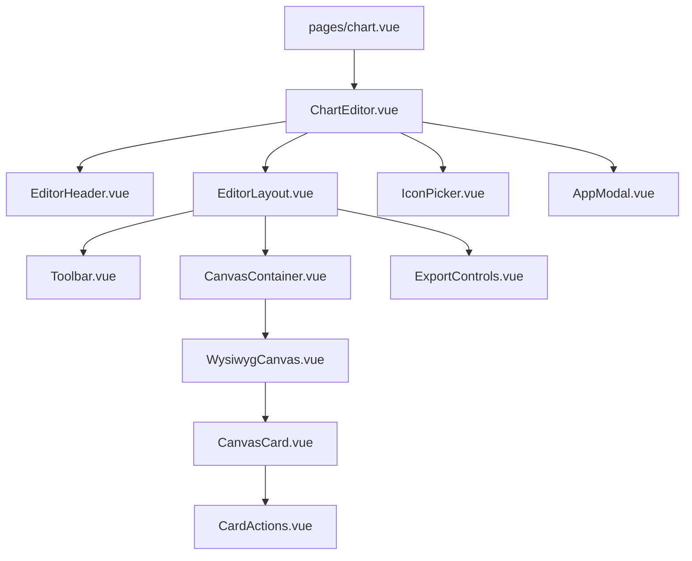
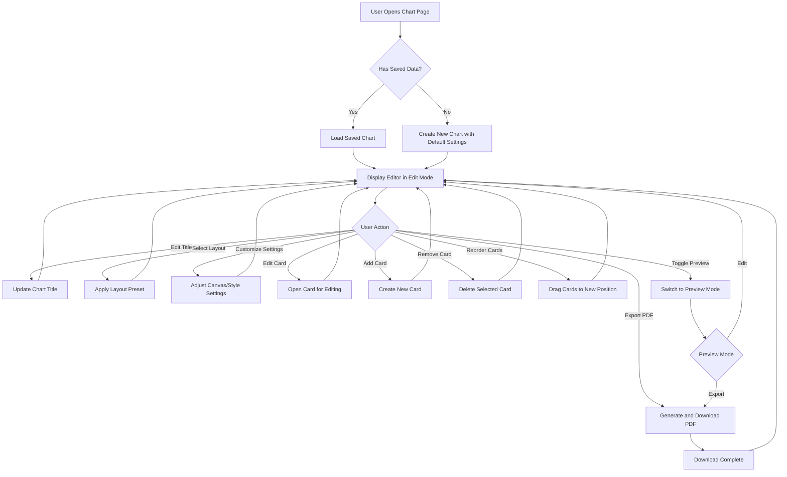
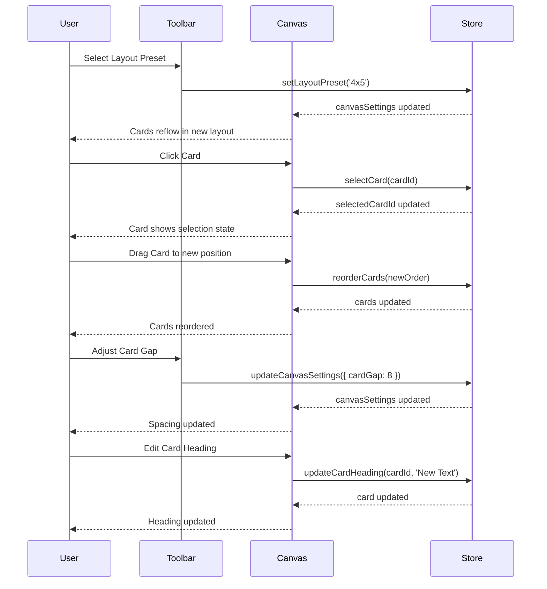
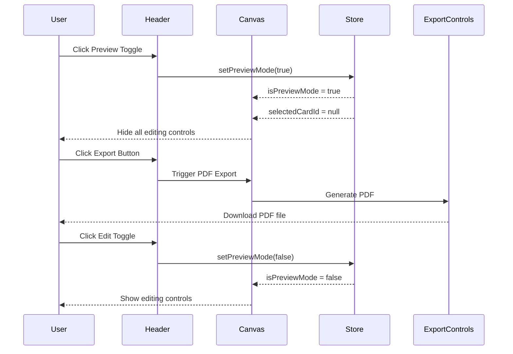
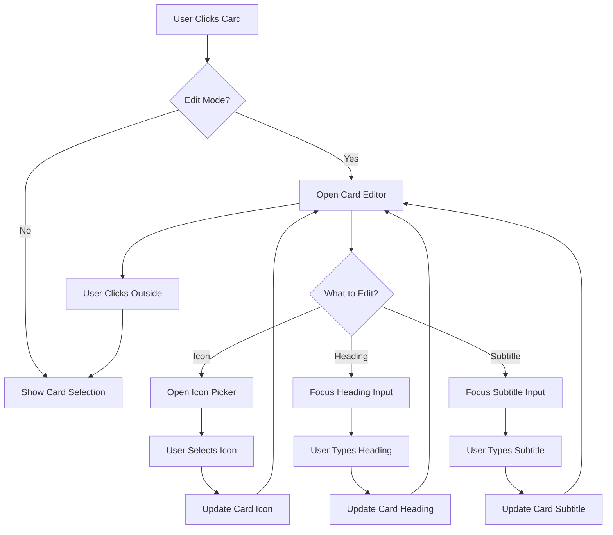

# WYSIWYG Chart Interface Design Specification

## Document Information
- **Project**: Visual Communication App
- **Version**: 2.0 (WYSIWYG Redesign)
- **Date**: 2026-03-28
- **Status**: Design Phase

---

## 1. Executive Summary

This document outlines the design specification for transforming the current fixed-grid chart system into a true WYSIWYG (What You See Is What You Get) editor with PDF export capabilities. The redesign introduces a canvas-based editing experience, flexible layouts, drag-and-drop functionality, and professional PDF generation.

### Key Objectives
- **WYSIWYG Experience**: Users see exactly what will be printed/exported
- **Single-Page PDF Export**: Charts fit on a single A4 landscape page
- **True Visual Editor**: Full control over layout, spacing, and appearance
- **Backward Compatibility**: Existing data structure is preserved and extended

---

## 2. Current System Analysis

### 2.1 Existing Architecture

```
pages/chart.vue
    └── ChartContainer.vue
            ├── ChartCard.vue (×20)
            ├── IconPicker.vue
            └── AppModal.vue
```

### 2.2 Current Data Model

```typescript
// Card
interface Card {
  id: string
  iconId: string | null
  heading: string
  subtitle: string
}

// Chart State
interface ChartSaveData {
  title: string
  cards: Card[]
}
```

### 2.3 Current Limitations
- Fixed 20-card grid layout (2/4/5 columns responsive)
- No visual preview of printed output
- Browser print dialog only (no PDF control)
- No layout customization options
- No drag-and-drop reordering
- Fixed spacing and margins
- Limited styling options

---

## 3. New Component Architecture

### 3.1 Component Hierarchy



### 3.2 Component Descriptions

#### 3.2.1 ChartEditor.vue (New)
**Purpose**: Main editor container coordinating all editor components

**Responsibilities**:
- Manage editor state (edit/preview mode)
- Coordinate between toolbar and canvas
- Handle global keyboard shortcuts
- Manage layout state

**Props**: None

**Emits**: None

**Key Features**:
- Mode switching (edit/preview)
- Keyboard shortcuts (Ctrl+Z, Ctrl+Y, Ctrl+S, Ctrl+P)
- Responsive layout management

#### 3.2.2 EditorHeader.vue (New)
**Purpose**: Header section with title and primary actions

**Responsibilities**:
- Display and edit chart title
- Show export button
- Show preview mode toggle
- Display save status

**Props**:
```typescript
interface EditorHeaderProps {
  title: string
  isPreviewMode: boolean
  isDirty: boolean
  isExporting: boolean
}
```

**Emits**:
```typescript
interface EditorHeaderEmits {
  'update:title': [title: string]
  'toggle-preview': []
  'export': []
}
```

#### 3.2.3 EditorLayout.vue (New)
**Purpose**: Layout container for toolbar and canvas

**Responsibilities**:
- Responsive sidebar/canvas layout
- Handle window resize events
- Manage canvas zoom level
- Coordinate toolbar and canvas sizing

**Props**:
```typescript
interface EditorLayoutProps {
  isPreviewMode: boolean
}
```

**Emits**: None

#### 3.2.4 Toolbar.vue (New)
**Purpose**: Control panel for all editing options

**Responsibilities**:
- Layout selection
- Card management (add, remove, duplicate)
- Style controls (fonts, colors, themes)
- Spacing and margin controls
- Zoom controls

**Props**:
```typescript
interface ToolbarProps {
  canvasSettings: CanvasSettings
  styleSettings: StyleSettings
  zoom: number
  isPreviewMode: boolean
}
```

**Emits**:
```typescript
interface ToolbarEmits {
  'update:canvas-settings': [settings: CanvasSettings]
  'update:style-settings': [settings: StyleSettings]
  'update:zoom': [zoom: number]
  'add-card': []
  'remove-selected': []
  'duplicate-selected': []
}
```

#### 3.2.5 CanvasContainer.vue (New)
**Purpose**: Scrollable container for the WYSIWYG canvas

**Responsibilities**:
- Provide scrollable viewport
- Handle canvas zoom transformations
- Show page boundaries and guides
- Manage canvas selection state

**Props**:
```typescript
interface CanvasContainerProps {
  zoom: number
  isPreviewMode: boolean
}
```

**Emits**:
```typescript
interface CanvasContainerEmits {
  'select-card': [cardId: string | null]
  'deselect-all': []
}
```

#### 3.2.6 WysiwygCanvas.vue (New)
**Purpose**: Main A4 landscape canvas component

**Responsibilities**:
- Render A4 landscape canvas (297mm × 210mm)
- Apply canvas settings (margins, spacing, layout)
- Render cards in configured layout
- Handle drag-and-drop reordering
- Show print preview styling

**Props**:
```typescript
interface WysiwygCanvasProps {
  cards: Card[]
  canvasSettings: CanvasSettings
  styleSettings: StyleSettings
  zoom: number
  isPreviewMode: boolean
  selectedCardId: string | null
}
```

**Emits**:
```typescript
interface WysiwygCanvasEmits {
  'update:cards': [cards: Card[]]
  'select-card': [cardId: string]
  'update-card': [cardId: string, updates: Partial<Card>]
  'delete-card': [cardId: string]
  'duplicate-card': [cardId: string]
}
```

**Key Features**:
- Fixed aspect ratio A4 landscape
- CSS transforms for zoom
- Grid layout based on canvas settings
- Drag-and-drop using Vue Draggable or similar

#### 3.2.7 CanvasCard.vue (New/Enhanced)
**Purpose**: Enhanced card component with drag/resize capabilities

**Responsibilities**:
- Display card content (icon, heading, subtitle)
- Show selection state
- Handle drag events
- Show action buttons (delete, duplicate)
- Apply style settings

**Props**:
```typescript
interface CanvasCardProps {
  card: Card
  isSelected: boolean
  isPreviewMode: boolean
  styleSettings: StyleSettings
  canDrag: boolean
}
```

**Emits**:
```typescript
interface CanvasCardEmits {
  'select': []
  'update': [updates: Partial<Card>]
  'delete': []
  'duplicate': []
}
```

**Key Features**:
- Visual selection indicator
- Hover actions in edit mode
- Direct text editing
- Icon click to open picker

#### 3.2.8 CardActions.vue (New)
**Purpose**: Action buttons for card manipulation

**Responsibilities**:
- Show delete button
- Show duplicate button
- Handle action clicks

**Props**:
```typescript
interface CardActionsProps {
  cardId: string
  show: boolean
}
```

**Emits**:
```typescript
interface CardActionsEmits {
  'delete': [cardId: string]
  'duplicate': [cardId: string]
}
```

#### 3.2.9 ExportControls.vue (New)
**Purpose**: PDF export configuration and execution

**Responsibilities**:
- Show export button
- Configure export quality
- Show export progress
- Handle export errors

**Props**:
```typescript
interface ExportControlsProps {
  isExporting: boolean
  exportSettings: ExportSettings
}
```

**Emits**:
```typescript
interface ExportControlsEmits {
  'export': [settings: ExportSettings]
  'update:export-settings': [settings: ExportSettings]
}
```

### 3.3 Modified Components

#### 3.3.1 ChartContainer.vue (Modified)
**Changes**:
- Renamed to `ChartEditor.vue`
- Enhanced with WYSIWYG capabilities
- New layout structure

#### 3.3.2 ChartCard.vue (Modified)
**Changes**:
- Enhanced with drag-and-drop support
- Added selection state
- Added action buttons
- Improved styling options

---

## 4. Data Model Extensions

### 4.1 Extended Type Definitions

```typescript
// types/index.ts

// ===== EXISTING TYPES (PRESERVED) =====

export type IconCategory = 'alphabet' | 'disability' | 'family' | 'feminine-hygiene' | 'health'

export interface Icon {
  id: string
  filename: string
  category: IconCategory
  alt: string
  keywords: string[]
}

export interface Card {
  id: string
  iconId: string | null
  heading: string
  subtitle: string
}

export interface ChartSaveData {
  title: string
  cards: Card[]
}

export interface CategoryInfo {
  id: IconCategory
  label: string
  icon: string
  color: string
}

export const STORAGE_KEYS = {
  CHART: 'talking-chart-data',
} as const

export const CARD_COUNT = 20
export const MAX_HEADING_LENGTH = 12
export const MAX_SUBTITLE_LENGTH = 19

// ===== NEW TYPES =====

// Layout presets
export type LayoutPreset = '2x10' | '4x5' | '5x4' | '3x7' | 'custom'

// Font families
export type FontFamily = 'Inter' | 'Roboto' | 'Open Sans' | 'Lato' | 'Poppins'

// Color themes
export type ColorTheme = 'neutral' | 'colorful' | 'high-contrast' | 'pastel' | 'dark'

// Background types
export type BackgroundType = 'solid' | 'gradient'

// Export quality
export type ExportQuality = 'standard' | 'high'

// Canvas settings
export interface CanvasSettings {
  layout: LayoutPreset
  columns: number
  rows: number
  cardGap: number // in mm
  marginTop: number // in mm
  marginBottom: number // in mm
  marginLeft: number // in mm
  marginRight: number // in mm
}

// Style settings
export interface StyleSettings {
  fontFamily: FontFamily
  headingFontSize: number // in pt
  subtitleFontSize: number // in pt
  theme: ColorTheme
  backgroundType: BackgroundType
  backgroundColor: string
  backgroundGradient: {
    start: string
    end: string
    direction: 'horizontal' | 'vertical' | 'diagonal'
  }
}

// Export settings
export interface ExportSettings {
  quality: ExportQuality
  includeWatermark: boolean
  filename: string
}

// Extended chart save data (backward compatible)
export interface ChartSaveDataV2 extends ChartSaveData {
  version: 2
  canvasSettings?: CanvasSettings
  styleSettings?: StyleSettings
  exportSettings?: ExportSettings
}

// Theme definitions
export interface ThemeDefinition {
  id: ColorTheme
  name: string
  colors: {
    primary: string
    secondary: string
    text: string
    background: string
    cardBackground: string
    border: string
  }
}

// Layout preset definitions
export interface LayoutPresetDefinition {
  id: LayoutPreset
  name: string
  columns: number
  rows: number
  description: string
}

// Font family definitions
export interface FontFamilyDefinition {
  id: FontFamily
  name: string
  googleFont: string
  weights: number[]
}
```

### 4.2 Default Values

```typescript
// Default canvas settings
export const DEFAULT_CANVAS_SETTINGS: CanvasSettings = {
  layout: '4x5',
  columns: 4,
  rows: 5,
  cardGap: 5,
  marginTop: 15,
  marginBottom: 15,
  marginLeft: 15,
  marginRight: 15,
}

// Default style settings
export const DEFAULT_STYLE_SETTINGS: StyleSettings = {
  fontFamily: 'Inter',
  headingFontSize: 12,
  subtitleFontSize: 10,
  theme: 'neutral',
  backgroundType: 'solid',
  backgroundColor: '#ffffff',
  backgroundGradient: {
    start: '#ffffff',
    end: '#f0f0f0',
    direction: 'horizontal',
  },
}

// Default export settings
export const DEFAULT_EXPORT_SETTINGS: ExportSettings = {
  quality: 'standard',
  includeWatermark: true,
  filename: 'my-communication-chart',
}

// A4 landscape dimensions (in mm)
export const A4_LANDSCAPE = {
  width: 297,
  height: 210,
}

// Zoom levels
export const ZOOM_LEVELS = [0.5, 0.75, 1.0, 1.25, 1.5]
```

---

## 5. State Management Schema

### 5.1 Extended Chart Store

```typescript
// stores/chart.ts (extended)

import { defineStore } from 'pinia'
import type { 
  Card, 
  ChartSaveData, 
  ChartSaveDataV2,
  CanvasSettings,
  StyleSettings,
  ExportSettings
} from '~/types'
import { 
  STORAGE_KEYS,
  DEFAULT_CANVAS_SETTINGS,
  DEFAULT_STYLE_SETTINGS,
  DEFAULT_EXPORT_SETTINGS
} from '~/types'
import { useIconsStore } from './icons'

export const useChartStore = defineStore('chart', () => {
  // ===== STATE =====
  
  // Existing state (preserved)
  const title = ref('My Communication Chart')
  const cards = ref<Card[]>([])
  const isDirty = ref(false)
  
  // New state
  const canvasSettings = ref<CanvasSettings>({ ...DEFAULT_CANVAS_SETTINGS })
  const styleSettings = ref<StyleSettings>({ ...DEFAULT_STYLE_SETTINGS })
  const exportSettings = ref<ExportSettings>({ ...DEFAULT_EXPORT_SETTINGS })
  
  // Editor state
  const selectedCardId = ref<string | null>(null)
  const isPreviewMode = ref(false)
  const zoom = ref(1.0)
  const isExporting = ref(false)
  
  // ===== GETTERS =====
  
  // Existing getters (preserved)
  const hasCards = computed(() => cards.value.length > 0)
  const cardCount = computed(() => cards.value.length)
  
  // New getters
  const selectedCard = computed(() => 
    cards.value.find(c => c.id === selectedCardId.value) || null
  )
  
  const canAddCard = computed(() => cards.value.length < 50) // Max 50 cards
  
  const canvasAspectRatio = computed(() => {
    return A4_LANDSCAPE.width / A4_LANDSCAPE.height
  })
  
  const effectiveCardCount = computed(() => {
    const { columns, rows } = canvasSettings.value
    return Math.min(cards.value.length, columns * rows)
  })
  
  // ===== ACTIONS =====
  
  // Existing actions (preserved)
  function initializeChart() {
    const iconsStore = useIconsStore()
    
    // Try to load from localStorage
    const saved = loadFromStorage()
    if (saved) {
      title.value = saved.title
      cards.value = saved.cards
      
      // Load new settings if available (v2)
      if ('version' in saved && saved.version === 2) {
        const v2Data = saved as ChartSaveDataV2
        if (v2Data.canvasSettings) {
          canvasSettings.value = { ...DEFAULT_CANVAS_SETTINGS, ...v2Data.canvasSettings }
        }
        if (v2Data.styleSettings) {
          styleSettings.value = { ...DEFAULT_STYLE_SETTINGS, ...v2Data.styleSettings }
        }
        if (v2Data.exportSettings) {
          exportSettings.value = { ...DEFAULT_EXPORT_SETTINGS, ...v2Data.exportSettings }
        }
      }
      
      return
    }
    
    // Create new chart with random icons
    title.value = 'My Communication Chart'
    cards.value = Array.from({ length: CARD_COUNT }, (_, i) => createEmptyCard(i))
    
    // Assign random icons
    const randomIcons = iconsStore.getRandomIcons(CARD_COUNT)
    cards.value.forEach((card, i) => {
      if (randomIcons[i]) {
        card.iconId = randomIcons[i].id
      }
    })
    
    saveToStorage()
  }
  
  function createEmptyCard(index: number): Card {
    return {
      id: `card-${Date.now()}-${index}`,
      iconId: null,
      heading: '',
      subtitle: '',
    }
  }
  
  function updateCardIcon(cardId: string, iconId: string | null) {
    const card = cards.value.find(c => c.id === cardId)
    if (card) {
      card.iconId = iconId
      isDirty.value = true
      saveToStorage()
    }
  }
  
  function updateCardHeading(cardId: string, heading: string) {
    const card = cards.value.find(c => c.id === cardId)
    if (card) {
      card.heading = heading.slice(0, MAX_HEADING_LENGTH)
      isDirty.value = true
      saveToStorage()
    }
  }
  
  function updateCardSubtitle(cardId: string, subtitle: string) {
    const card = cards.value.find(c => c.id === cardId)
    if (card) {
      card.subtitle = subtitle.slice(0, MAX_SUBTITLE_LENGTH)
      isDirty.value = true
      saveToStorage()
    }
  }
  
  function updateTitle(newTitle: string) {
    title.value = newTitle
    isDirty.value = true
    saveToStorage()
  }
  
  function clearChart() {
    const iconsStore = useIconsStore()
    
    title.value = 'My Communication Chart'
    cards.value = Array.from({ length: CARD_COUNT }, (_, i) => createEmptyCard(i))
    
    // Assign new random icons
    const randomIcons = iconsStore.getRandomIcons(CARD_COUNT)
    cards.value.forEach((card, i) => {
      if (randomIcons[i]) {
        card.iconId = randomIcons[i].id
      }
    })
    
    isDirty.value = false
    saveToStorage()
  }
  
  // New actions
  
  // Card management
  function addCard() {
    if (!canAddCard.value) return
    
    const newCard = createEmptyCard(cards.value.length)
    cards.value.push(newCard)
    isDirty.value = true
    saveToStorage()
  }
  
  function removeCard(cardId: string) {
    const index = cards.value.findIndex(c => c.id === cardId)
    if (index !== -1) {
      cards.value.splice(index, 1)
      if (selectedCardId.value === cardId) {
        selectedCardId.value = null
      }
      isDirty.value = true
      saveToStorage()
    }
  }
  
  function duplicateCard(cardId: string) {
    if (!canAddCard.value) return
    
    const card = cards.value.find(c => c.id === cardId)
    if (card) {
      const newCard: Card = {
        id: `card-${Date.now()}`,
        iconId: card.iconId,
        heading: card.heading,
        subtitle: card.subtitle,
      }
      
      // Insert after the original card
      const index = cards.value.findIndex(c => c.id === cardId)
      cards.value.splice(index + 1, 0, newCard)
      
      isDirty.value = true
      saveToStorage()
    }
  }
  
  function reorderCards(newOrder: Card[]) {
    cards.value = newOrder
    isDirty.value = true
    saveToStorage()
  }
  
  // Selection
  function selectCard(cardId: string | null) {
    selectedCardId.value = cardId
  }
  
  function deselectAll() {
    selectedCardId.value = null
  }
  
  // Canvas settings
  function updateCanvasSettings(settings: Partial<CanvasSettings>) {
    canvasSettings.value = { ...canvasSettings.value, ...settings }
    isDirty.value = true
    saveToStorage()
  }
  
  function setLayoutPreset(preset: LayoutPreset) {
    const presetConfig = LAYOUT_PRESETS[preset]
    if (presetConfig) {
      canvasSettings.value = {
        ...canvasSettings.value,
        layout: preset,
        columns: presetConfig.columns,
        rows: presetConfig.rows,
      }
      isDirty.value = true
      saveToStorage()
    }
  }
  
  // Style settings
  function updateStyleSettings(settings: Partial<StyleSettings>) {
    styleSettings.value = { ...styleSettings.value, ...settings }
    isDirty.value = true
    saveToStorage()
  }
  
  function setTheme(theme: ColorTheme) {
    const themeConfig = THEMES[theme]
    if (themeConfig) {
      styleSettings.value = {
        ...styleSettings.value,
        theme,
        backgroundColor: themeConfig.colors.background,
      }
      isDirty.value = true
      saveToStorage()
    }
  }
  
  // Export settings
  function updateExportSettings(settings: Partial<ExportSettings>) {
    exportSettings.value = { ...exportSettings.value, ...settings }
    saveToStorage()
  }
  
  // Zoom
  function setZoom(level: number) {
    zoom.value = Math.max(0.5, Math.min(1.5, level))
  }
  
  function zoomIn() {
    const currentIndex = ZOOM_LEVELS.indexOf(zoom.value)
    if (currentIndex < ZOOM_LEVELS.length - 1) {
      zoom.value = ZOOM_LEVELS[currentIndex + 1]
    }
  }
  
  function zoomOut() {
    const currentIndex = ZOOM_LEVELS.indexOf(zoom.value)
    if (currentIndex > 0) {
      zoom.value = ZOOM_LEVELS[currentIndex - 1]
    }
  }
  
  function resetZoom() {
    zoom.value = 1.0
  }
  
  // Preview mode
  function togglePreviewMode() {
    isPreviewMode.value = !isPreviewMode.value
    if (isPreviewMode.value) {
      deselectAll()
    }
  }
  
  function setPreviewMode(enabled: boolean) {
    isPreviewMode.value = enabled
    if (enabled) {
      deselectAll()
    }
  }
  
  // Export
  async function exportToPDF() {
    isExporting.value = true
    try {
      // Export logic will be handled by ExportControls component
      // This is a placeholder for the action
      return true
    } finally {
      isExporting.value = false
    }
  }
  
  // Storage
  function saveToStorage() {
    const data: ChartSaveDataV2 = {
      version: 2,
      title: title.value,
      cards: cards.value,
      canvasSettings: canvasSettings.value,
      styleSettings: styleSettings.value,
      exportSettings: exportSettings.value,
    }
    localStorage.setItem(STORAGE_KEYS.CHART, JSON.stringify(data))
  }
  
  function loadFromStorage(): ChartSaveDataV2 | null {
    try {
      const stored = localStorage.getItem(STORAGE_KEYS.CHART)
      if (stored) {
        return JSON.parse(stored)
      }
    } catch (error) {
      console.error('Failed to load chart from storage:', error)
    }
    return null
  }
  
  return {
    // State
    title,
    cards,
    isDirty,
    canvasSettings,
    styleSettings,
    exportSettings,
    selectedCardId,
    isPreviewMode,
    zoom,
    isExporting,
    
    // Getters
    hasCards,
    cardCount,
    selectedCard,
    canAddCard,
    canvasAspectRatio,
    effectiveCardCount,
    
    // Actions
    initializeChart,
    updateCardIcon,
    updateCardHeading,
    updateCardSubtitle,
    updateTitle,
    clearChart,
    addCard,
    removeCard,
    duplicateCard,
    reorderCards,
    selectCard,
    deselectAll,
    updateCanvasSettings,
    setLayoutPreset,
    updateStyleSettings,
    setTheme,
    updateExportSettings,
    setZoom,
    zoomIn,
    zoomOut,
    resetZoom,
    togglePreviewMode,
    setPreviewMode,
    exportToPDF,
    saveToStorage,
  }
})

// Preset definitions
const LAYOUT_PRESETS: Record<LayoutPreset, { columns: number; rows: number }> = {
  '2x10': { columns: 2, rows: 10 },
  '4x5': { columns: 4, rows: 5 },
  '5x4': { columns: 5, rows: 4 },
  '3x7': { columns: 3, rows: 7 },
  'custom': { columns: 4, rows: 5 },
}

const THEMES: Record<ColorTheme, ThemeDefinition> = {
  neutral: {
    id: 'neutral',
    name: 'Neutral',
    colors: {
      primary: '#1f2937',
      secondary: '#4b5563',
      text: '#111827',
      background: '#ffffff',
      cardBackground: '#ffffff',
      border: '#e5e7eb',
    },
  },
  colorful: {
    id: 'colorful',
    name: 'Colorful',
    colors: {
      primary: '#3b82f6',
      secondary: '#8b5cf6',
      text: '#111827',
      background: '#f0f9ff',
      cardBackground: '#ffffff',
      border: '#bfdbfe',
    },
  },
  'high-contrast': {
    id: 'high-contrast',
    name: 'High Contrast',
    colors: {
      primary: '#000000',
      secondary: '#000000',
      text: '#000000',
      background: '#ffffff',
      cardBackground: '#ffffff',
      border: '#000000',
    },
  },
  pastel: {
    id: 'pastel',
    name: 'Pastel',
    colors: {
      primary: '#6b7280',
      secondary: '#9ca3af',
      text: '#374151',
      background: '#fef3c7',
      cardBackground: '#ffffff',
      border: '#fde68a',
    },
  },
  dark: {
    id: 'dark',
    name: 'Dark',
    colors: {
      primary: '#f3f4f6',
      secondary: '#d1d5db',
      text: '#f9fafb',
      background: '#1f2937',
      cardBackground: '#374151',
      border: '#4b5563',
    },
  },
}
```

---

## 6. UI/UX Flow

### 6.1 User Journey



### 6.2 Edit Mode Workflow



### 6.3 Preview Mode Workflow



### 6.4 Card Editing Flow



---

## 7. Technical Recommendations

### 7.1 PDF Generation Library

#### Recommendation: **html2canvas + jspdf**

**Rationale**:

| Criteria | html2canvas + jspdf | @vue-pdf-embed | pdfmake |
|----------|-------------------|----------------|---------|
| Vue 3 Compatibility | ✅ Excellent | ✅ Native | ✅ Good |
| DOM Rendering | ✅ Full DOM | ❌ Limited | ❌ Template-based |
| Styling Support | ✅ Full CSS | ⚠️ Limited | ❌ Custom syntax |
| Image Quality | ✅ High | ⚠️ Medium | ✅ High |
| Performance | ✅ Good | ⚠️ Medium | ✅ Excellent |
| Bundle Size | ~200KB | ~150KB | ~100KB |
| Learning Curve | ✅ Low | ✅ Low | ⚠️ Medium |
| Community | ✅ Large | ⚠️ Medium | ✅ Large |

**Key Advantages**:
1. **True WYSIWYG**: Renders the actual DOM, so what you see is exactly what you get
2. **Full CSS Support**: All Tailwind CSS classes work without modification
3. **Vue 3 Compatible**: Works seamlessly with Nuxt 3
4. **Image Handling**: Properly handles SVG icons and images
5. **Proven Solution**: Used by many production applications

**Implementation Approach**:

```typescript
// composables/usePdfExport.ts
import html2canvas from 'html2canvas'
import jsPDF from 'jspdf'

export function usePdfExport() {
  async function exportToPdf(
    element: HTMLElement,
    filename: string,
    quality: 'standard' | 'high' = 'standard'
  ): Promise<void> {
    // Configure canvas options based on quality
    const scale = quality === 'high' ? 3 : 2
    
    // Capture the element as canvas
    const canvas = await html2canvas(element, {
      scale,
      useCORS: true,
      logging: false,
      backgroundColor: '#ffffff',
    })
    
    // Create PDF with A4 landscape dimensions
    const pdf = new jsPDF({
      orientation: 'landscape',
      unit: 'mm',
      format: 'a4',
    })
    
    // Calculate dimensions to fit A4 landscape
    const imgWidth = 297 // A4 landscape width in mm
    const imgHeight = (canvas.height * imgWidth) / canvas.width
    
    // Add image to PDF
    pdf.addImage(canvas.toDataURL('image/png'), 'PNG', 0, 0, imgWidth, imgHeight)
    
    // Save PDF
    pdf.save(`${filename}.pdf`)
  }
  
  return {
    exportToPdf,
  }
}
```

**Usage in Component**:

```vue
<script setup lang="ts">
const canvasRef = ref<HTMLElement>()
const { exportToPdf } = usePdfExport()

async function handleExport() {
  if (!canvasRef.value) return
  
  const chartStore = useChartStore()
  await exportToPdf(
    canvasRef.value,
    chartStore.exportSettings.filename,
    chartStore.exportSettings.quality
  )
}
</script>

<template>
  <div ref="canvasRef" class="wysiwyg-canvas">
    <!-- Canvas content -->
  </div>
</template>
```

### 7.2 Drag-and-Drop Library

#### Recommendation: **Vue Draggable Next** (vuedraggable@next)

**Rationale**:

| Criteria | Vue Draggable | SortableJS | dnd-kit |
|----------|--------------|------------|---------|
| Vue 3 Support | ✅ Native | ✅ Wrapper | ❌ React only |
| Grid Support | ✅ Excellent | ✅ Good | ❌ N/A |
| Performance | ✅ Excellent | ✅ Excellent | ⚠️ Medium |
| Bundle Size | ~50KB | ~30KB | N/A |
| API | ✅ Simple | ⚠️ Complex | N/A |
| TypeScript | ✅ Full | ✅ Full | N/A |

**Key Advantages**:
1. **Vue 3 Native**: Built specifically for Vue 3 Composition API
2. **Grid Support**: Excellent support for grid-based layouts
3. **Simple API**: Easy to integrate with existing components
4. **TypeScript**: Full TypeScript support
5. **Performance**: Optimized for large lists

**Installation**:
```bash
bun add vuedraggable@next
```

**Implementation**:

```vue
<script setup lang="ts">
import draggable from 'vuedraggable'

const chartStore = useChartStore()
const cards = computed({
  get: () => chartStore.cards,
  set: (value) => chartStore.reorderCards(value),
})
</script>

<template>
  <draggable
    v-model="cards"
    :disabled="isPreviewMode"
    item-key="id"
    class="canvas-grid"
    ghost-class="card-ghost"
    drag-class="card-dragging"
  >
    <template #item="{ element: card }">
      <CanvasCard :card="card" />
    </template>
  </draggable>
</template>
```

### 7.3 WYSIWYG Canvas Implementation

#### Approach: CSS Transform-based Zoom with Fixed Aspect Ratio

**Rationale**:
1. **Performance**: CSS transforms are GPU-accelerated
2. **Precision**: Maintains exact A4 aspect ratio
3. **Responsive**: Scales to fit any viewport
4. **Simple**: No complex canvas calculations needed

**Implementation**:

```vue
<template>
  <div class="canvas-container">
    <div
      ref="canvasRef"
      class="wysiwyg-canvas"
      :style="canvasStyle"
    >
      <!-- Canvas content -->
    </div>
  </div>
</template>

<script setup lang="ts">
const props = defineProps<{
  zoom: number
  isPreviewMode: boolean
}>()

const canvasStyle = computed(() => ({
  transform: `scale(${props.zoom})`,
  transformOrigin: 'top left',
}))
</script>

<style scoped>
/* A4 landscape dimensions at 96 DPI */
.wysiwyg-canvas {
  width: 1123px;  /* 297mm at 96 DPI */
  height: 794px; /* 210mm at 96 DPI */
  background: white;
  box-shadow: 0 4px 6px -1px rgba(0, 0, 0, 0.1);
}

.canvas-container {
  overflow: auto;
  display: flex;
  justify-content: center;
  padding: 2rem;
}
</style>
```

### 7.4 Font Loading Strategy

**Approach**: Google Fonts with Nuxt Font Module

**Installation**:
```bash
bun add @nuxtjs/google-fonts
```

**Configuration**:

```typescript
// nuxt.config.ts
export default defineNuxtConfig({
  modules: [
    '@pinia/nuxt',
    '@nuxtjs/tailwindcss',
    '@nuxtjs/google-fonts',
  ],
  
  googleFonts: {
    families: {
      Inter: [400, 500, 600, 700],
      Roboto: [400, 500, 700],
      'Open+Sans': [400, 500, 600, 700],
      Lato: [400, 500, 700],
      Poppins: [400, 500, 600, 700],
    },
    display: 'swap',
  },
})
```

### 7.5 Icon Optimization

**Approach**: SVG sprites for performance

**Benefits**:
1. **Single Request**: All icons loaded in one file
2. **Caching**: Better browser caching
3. **Styling**: Can be styled with CSS
4. **Performance**: Faster than individual SVG files

**Implementation**:

```vue
<template>
  <svg class="icon">
    <use :href="`/icons/sprite.svg#${iconId}`" />
  </svg>
</template>

<style scoped>
.icon {
  width: 100%;
  height: 100%;
  fill: currentColor;
}
</style>
```

---

## 8. Migration Strategy

### 8.1 Phase 1: Foundation (Week 1-2)

**Goals**: Set up the new architecture without breaking existing functionality

**Tasks**:
1. Create new type definitions in `types/index.ts`
2. Extend `stores/chart.ts` with new state and actions
3. Create new component stubs:
   - `ChartEditor.vue`
   - `EditorHeader.vue`
   - `EditorLayout.vue`
   - `Toolbar.vue`
   - `CanvasContainer.vue`
   - `WysiwygCanvas.vue`
   - `CanvasCard.vue`
   - `CardActions.vue`
   - `ExportControls.vue`
4. Install new dependencies:
   - `vuedraggable@next`
   - `html2canvas`
   - `jspdf`
   - `@nuxtjs/google-fonts`

**Deliverables**:
- Extended type definitions
- Extended chart store
- Component stubs
- Updated dependencies

### 8.2 Phase 2: Core Canvas (Week 2-3)

**Goals**: Implement the WYSIWYG canvas with basic functionality

**Tasks**:
1. Implement `WysiwygCanvas.vue` with A4 landscape dimensions
2. Implement `CanvasCard.vue` with enhanced styling
3. Implement zoom controls
4. Implement canvas settings (margins, spacing)
5. Implement layout presets (2x10, 4x5, 5x4, 3x7)
6. Add responsive canvas container

**Deliverables**:
- Working WYSIWYG canvas
- Zoom functionality
- Layout presets
- Canvas settings

### 8.3 Phase 3: Toolbar & Controls (Week 3-4)

**Goals**: Implement the toolbar with all controls

**Tasks**:
1. Implement `Toolbar.vue` with:
   - Layout selector
   - Card management (add, remove, duplicate)
   - Style controls (fonts, colors, themes)
   - Spacing and margin controls
   - Zoom controls
2. Implement `EditorHeader.vue`
3. Implement `EditorLayout.vue`
4. Connect toolbar to canvas

**Deliverables**:
- Complete toolbar
- Editor header
- Editor layout
- Toolbar-canvas integration

### 8.4 Phase 4: Drag-and-Drop (Week 4)

**Goals**: Implement card reordering

**Tasks**:
1. Integrate `vuedraggable` into `WysiwygCanvas.vue`
2. Implement drag-and-drop reordering
3. Add visual feedback during drag
4. Handle reordering in store

**Deliverables**:
- Working drag-and-drop
- Visual feedback
- Store integration

### 8.5 Phase 5: PDF Export (Week 5)

**Goals**: Implement PDF export functionality

**Tasks**:
1. Create `usePdfExport` composable
2. Implement `ExportControls.vue`
3. Integrate html2canvas and jspdf
4. Add export quality options
5. Add export progress indicator
6. Test PDF output quality

**Deliverables**:
- Working PDF export
- Export controls
- Quality options
- Progress indicator

### 8.6 Phase 6: Preview Mode (Week 5-6)

**Goals**: Implement preview mode

**Tasks**:
1. Implement preview mode toggle
2. Hide editing controls in preview mode
3. Show print-optimized view
4. Add keyboard shortcuts

**Deliverables**:
- Preview mode
- Keyboard shortcuts
- Print-optimized view

### 8.7 Phase 7: Polish & Testing (Week 6-7)

**Goals**: Polish UI and test thoroughly

**Tasks**:
1. UI polish and refinement
2. Accessibility testing
3. Cross-browser testing
4. Performance optimization
5. Bug fixes
6. Documentation updates

**Deliverables**:
- Polished UI
- Accessibility compliance
- Cross-browser compatibility
- Performance optimizations
- Updated documentation

### 8.8 Phase 8: Launch (Week 8)

**Goals**: Deploy and monitor

**Tasks**:
1. Final testing
2. Deploy to production
3. Monitor for issues
4. Gather user feedback
5. Plan future improvements

**Deliverables**:
- Production deployment
- Monitoring setup
- User feedback collection

### 8.9 Rollback Plan

**If issues arise**:
1. Keep old `ChartContainer.vue` as `ChartContainerLegacy.vue`
2. Use feature flag to switch between old and new editor
3. Gradual rollout to users
4. Monitor metrics and user feedback

**Feature Flag Implementation**:

```typescript
// stores/features.ts
export const useFeaturesStore = defineStore('features', () => {
  const useNewEditor = ref(false)
  
  function enableNewEditor() {
    useNewEditor.value = true
  }
  
  function disableNewEditor() {
    useNewEditor.value = false
  }
  
  return {
    useNewEditor,
    enableNewEditor,
    disableNewEditor,
  }
})
```

**Usage in Page**:

```vue
<template>
  <div class="container mx-auto px-4 py-8">
    <ChartEditor v-if="features.useNewEditor" />
    <ChartContainerLegacy v-else />
  </div>
</template>
```

---

## 9. Accessibility Considerations

### 9.1 Keyboard Navigation

**Requirements**:
- All controls must be keyboard accessible
- Tab order must be logical
- Focus indicators must be visible
- Keyboard shortcuts for common actions

**Implementation**:

```vue
<template>
  <button
    class="card-action"
    @click="handleDelete"
    @keydown.enter="handleDelete"
    @keydown.space.prevent="handleDelete"
    :aria-label="`Delete card ${card.heading}`"
  >
    Delete
  </button>
</template>
```

**Keyboard Shortcuts**:

| Shortcut | Action |
|----------|--------|
| Ctrl+Z | Undo |
| Ctrl+Y | Redo |
| Ctrl+S | Save |
| Ctrl+P | Export PDF |
| Ctrl+, | Open settings |
| Escape | Close modal / Deselect |
| Delete | Remove selected card |
| Ctrl+D | Duplicate selected card |
| +/- | Zoom in/out |
| 0 | Reset zoom |

### 9.2 Screen Reader Support

**Requirements**:
- All interactive elements must have ARIA labels
- Live regions for dynamic content updates
- Proper heading hierarchy
- Descriptive link and button text

**Implementation**:

```vue
<template>
  <div
    class="canvas-card"
    role="button"
    tabindex="0"
    :aria-label="`Card with heading ${card.heading} and subtitle ${card.subtitle}`"
    :aria-selected="isSelected"
  >
    <!-- Card content -->
  </div>
</template>
```

### 9.3 Color Contrast

**Requirements**:
- WCAG AA compliance (4.5:1 for normal text, 3:1 for large text)
- Ensure themes meet contrast requirements
- Provide high-contrast theme option

**Implementation**:

```typescript
// Theme definitions with contrast ratios
const THEMES: Record<ColorTheme, ThemeDefinition> = {
  'high-contrast': {
    id: 'high-contrast',
    name: 'High Contrast',
    colors: {
      primary: '#000000', // Contrast ratio: 21:1
      secondary: '#000000',
      text: '#000000',
      background: '#ffffff',
      cardBackground: '#ffffff',
      border: '#000000',
    },
  },
  // ... other themes
}
```

### 9.4 Focus Management

**Requirements**:
- Clear focus indicators
- Logical focus order
- Focus trapping in modals
- Focus restoration after closing modals

**Implementation**:

```vue
<template>
  <div
    ref="modalRef"
    class="modal"
    role="dialog"
    aria-modal="true"
    @keydown.esc="close"
  >
    <!-- Modal content -->
  </div>
</template>

<script setup lang="ts">
const modalRef = ref<HTMLElement>()

onMounted(() => {
  // Focus first focusable element
  const firstFocusable = modalRef.value?.querySelector(
    'button, [href], input, select, textarea, [tabindex]:not([tabindex="-1"])'
  )
  firstFocusable?.focus()
})

function close() {
  // Restore focus to trigger element
  triggerElement.value?.focus()
}
</script>
```

### 9.5 Reduced Motion

**Requirements**:
- Respect `prefers-reduced-motion` setting
- Provide option to disable animations
- Ensure essential functionality works without animations

**Implementation**:

```css
@media (prefers-reduced-motion: reduce) {
  *,
  *::before,
  *::after {
    animation-duration: 0.01ms !important;
    animation-iteration-count: 1 !important;
    transition-duration: 0.01ms !important;
  }
}
```

---

## 10. Responsive Design

### 10.1 Breakpoints

```typescript
// Tailwind CSS breakpoints
const BREAKPOINTS = {
  sm: '640px',   // Small tablets
  md: '768px',   // Tablets
  lg: '1024px',  // Small laptops
  xl: '1280px',  // Desktops
  '2xl': '1536px', // Large screens
}
```

### 10.2 Responsive Canvas Strategy

**Approach**: Scale canvas to fit viewport while maintaining aspect ratio

```vue
<template>
  <div class="canvas-wrapper">
    <div
      class="wysiwyg-canvas"
      :style="canvasStyle"
    >
      <!-- Canvas content -->
    </div>
  </div>
</template>

<script setup lang="ts">
const canvasStyle = computed(() => {
  const scale = calculateScale()
  return {
    transform: `scale(${scale})`,
    transformOrigin: 'top left',
  }
})

function calculateScale(): number {
  const viewportWidth = window.innerWidth
  const canvasWidth = 1123 // A4 landscape at 96 DPI
  const padding = 32 // 2rem on each side
  
  const availableWidth = viewportWidth - padding
  return Math.min(1, availableWidth / canvasWidth)
}
</script>
```

### 10.3 Responsive Toolbar

**Approach**: Collapsible sidebar on smaller screens

```vue
<template>
  <aside
    class="toolbar"
    :class="{ 'toolbar-collapsed': isCollapsed }"
  >
    <button
      class="toolbar-toggle"
      @click="isCollapsed = !isCollapsed"
      aria-label="Toggle toolbar"
    >
      <svg v-if="isCollapsed" class="w-6 h-6">...</svg>
      <svg v-else class="w-6 h-6">...</svg>
    </button>
    
    <div v-show="!isCollapsed" class="toolbar-content">
      <!-- Toolbar controls -->
    </div>
  </aside>
</template>

<style scoped>
.toolbar {
  width: 280px;
  transition: width 0.3s ease;
}

.toolbar-collapsed {
  width: 48px;
}

@media (max-width: 1024px) {
  .toolbar {
    position: fixed;
    left: 0;
    top: 0;
    bottom: 0;
    z-index: 50;
  }
}
</style>
```

### 10.4 Mobile Considerations

**Approach**: Full-screen canvas with overlay controls on mobile

```vue
<template>
  <div class="editor-mobile">
    <!-- Full-screen canvas -->
    <div class="canvas-fullscreen">
      <WysiwygCanvas />
    </div>
    
    <!-- Bottom sheet controls -->
    <div class="mobile-controls">
      <button @click="showControls = !showControls">
        <svg class="w-6 h-6">...</svg>
      </button>
      
      <div v-if="showControls" class="controls-sheet">
        <!-- Mobile controls -->
      </div>
    </div>
  </div>
</template>

<style scoped>
@media (max-width: 640px) {
  .canvas-fullscreen {
    position: fixed;
    inset: 0;
    overflow: auto;
  }
  
  .mobile-controls {
    position: fixed;
    bottom: 0;
    left: 0;
    right: 0;
    z-index: 100;
  }
}
</style>
```

---

## 11. Performance Considerations

### 11.1 Optimization Strategies

#### 11.1.1 Virtual Scrolling (if needed)

For very large card counts (50+), implement virtual scrolling:

```vue
<script setup lang="ts">
import { useVirtualList } from '@vueuse/core'

const cards = computed(() => chartStore.cards)
const { list, containerProps, wrapperProps } = useVirtualList(cards, {
  itemHeight: 150, // Approximate card height
  overscan: 5,
})
</script>
```

#### 11.1.2 Lazy Loading Icons

Load icons on demand:

```typescript
// composables/useLazyIcon.ts
export function useLazyIcon(iconId: string) {
  const iconSrc = ref<string | null>(null)
  const isLoading = ref(false)
  
  async function loadIcon() {
    if (iconSrc.value) return
    
    isLoading.value = true
    try {
      const icon = await import(`~/icons/${iconId}.svg`)
      iconSrc.value = icon.default
    } finally {
      isLoading.value = false
    }
  }
  
  return {
    iconSrc,
    isLoading,
    loadIcon,
  }
}
```

#### 11.1.3 Debounced Updates

Debounce store updates:

```typescript
import { useDebounceFn } from '@vueuse/core'

const debouncedSave = useDebounceFn(() => {
  saveToStorage()
}, 500)

function updateCardHeading(cardId: string, heading: string) {
  const card = cards.value.find(c => c.id === cardId)
  if (card) {
    card.heading = heading.slice(0, MAX_HEADING_LENGTH)
    isDirty.value = true
    debouncedSave()
  }
}
```

### 11.2 Bundle Size Optimization

#### 11.2.1 Tree Shaking

Ensure only used dependencies are bundled:

```typescript
// Good - Tree shakeable
import { exportToPdf } from 'html2canvas'
import jsPDF from 'jspdf'

// Bad - Imports entire library
import * as html2canvas from 'html2canvas'
```

#### 11.2.2 Code Splitting

Lazy load heavy components:

```vue
<script setup lang="ts">
const ExportControls = defineAsyncComponent(() => 
  import('~/components/ExportControls.vue')
)
</script>
```

### 11.3 Rendering Performance

#### 11.3.1 Keyed Lists

Always use keys in v-for:

```vue
<template>
  <div v-for="card in cards" :key="card.id">
    <CanvasCard :card="card" />
  </div>
</template>
```

#### 11.3.2 Computed Properties

Use computed properties for derived data:

```typescript
// Good - Computed
const visibleCards = computed(() => 
  cards.value.slice(0, effectiveCardCount.value)
)

// Bad - Computed in template
<div v-for="card in cards.slice(0, effectiveCardCount)">
```

---

## 12. Testing Strategy

### 12.1 Unit Testing

**Tools**: Vitest

**Coverage**:
- Store actions and getters
- Composable functions
- Utility functions

**Example**:

```typescript
// stores/chart.test.ts
import { setActivePinia, createPinia } from 'pinia'
import { useChartStore } from './chart'

describe('Chart Store', () => {
  beforeEach(() => {
    setActivePinia(createPinia())
  })
  
  it('adds a new card', () => {
    const store = useChartStore()
    const initialCount = store.cardCount
    
    store.addCard()
    
    expect(store.cardCount).toBe(initialCount + 1)
  })
  
  it('removes a card by id', () => {
    const store = useChartStore()
    const cardId = store.cards[0].id
    
    store.removeCard(cardId)
    
    expect(store.cards.find(c => c.id === cardId)).toBeUndefined()
  })
})
```

### 12.2 Component Testing

**Tools**: Vue Test Utils + Vitest

**Coverage**:
- Component rendering
- User interactions
- Props and emits

**Example**:

```typescript
// components/CanvasCard.test.ts
import { mount } from '@vue/test-utils'
import CanvasCard from './CanvasCard.vue'

describe('CanvasCard', () => {
  it('renders card content', () => {
    const wrapper = mount(CanvasCard, {
      props: {
        card: {
          id: 'test-1',
          iconId: 'icon-1',
          heading: 'Test',
          subtitle: 'Card',
        },
        isSelected: false,
        isPreviewMode: false,
        styleSettings: DEFAULT_STYLE_SETTINGS,
        canDrag: true,
      },
    })
    
    expect(wrapper.text()).toContain('Test')
    expect(wrapper.text()).toContain('Card')
  })
  
  it('emits select event on click', async () => {
    const wrapper = mount(CanvasCard, {
      props: {
        card: { id: 'test-1', iconId: null, heading: '', subtitle: '' },
        isSelected: false,
        isPreviewMode: false,
        styleSettings: DEFAULT_STYLE_SETTINGS,
        canDrag: true,
      },
    })
    
    await wrapper.trigger('click')
    
    expect(wrapper.emitted('select')).toBeTruthy()
  })
})
```

### 12.3 E2E Testing

**Tools**: Playwright

**Coverage**:
- User flows
- PDF export
- Drag-and-drop

**Example**:

```typescript
// e2e/chart-editor.spec.ts
import { test, expect } from '@playwright/test'

test('user can create and export a chart', async ({ page }) => {
  await page.goto('/chart')
  
  // Add a card
  await page.click('[data-testid="add-card-button"]')
  await expect(page.locator('[data-testid="canvas-card"]')).toHaveCount(21)
  
  // Edit card
  await page.click('[data-testid="canvas-card"]:first-child')
  await page.fill('[data-testid="heading-input"]', 'Test Heading')
  
  // Export PDF
  await page.click('[data-testid="export-button"]')
  
  // Verify download
  const downloadPromise = page.waitForEvent('download')
  const download = await downloadPromise
  expect(download.suggestedFilename()).toMatch(/\.pdf$/)
})
```

---

## 13. Security Considerations

### 13.1 XSS Prevention

**Sanitize user input**:

```typescript
import DOMPurify from 'dompurify'

function sanitizeHeading(heading: string): string {
  return DOMPurify.sanitize(heading, { ALLOWED_TAGS: [] })
}

function updateCardHeading(cardId: string, heading: string) {
  const card = cards.value.find(c => c.id === cardId)
  if (card) {
    card.heading = sanitizeHeading(heading).slice(0, MAX_HEADING_LENGTH)
    isDirty.value = true
    saveToStorage()
  }
}
```

### 13.2 Content Security Policy

**Configure CSP headers**:

```typescript
// nuxt.config.ts
export default defineNuxtConfig({
  nitro: {
    routeRules: {
      '/**': {
        headers: {
          'Content-Security-Policy': "default-src 'self'; script-src 'self' 'unsafe-inline' 'unsafe-eval'; style-src 'self' 'unsafe-inline'; img-src 'self' data: https:; font-src 'self' data:;",
        },
      },
    },
  },
})
```

### 13.3 Storage Security

**Encrypt sensitive data in localStorage**:

```typescript
import CryptoJS from 'crypto-js'

const SECRET_KEY = 'your-secret-key'

function encrypt(data: string): string {
  return CryptoJS.AES.encrypt(data, SECRET_KEY).toString()
}

function decrypt(encryptedData: string): string {
  const bytes = CryptoJS.AES.decrypt(encryptedData, SECRET_KEY)
  return bytes.toString(CryptoJS.enc.Utf8)
}

function saveToStorage() {
  const data: ChartSaveDataV2 = { /* ... */ }
  const encrypted = encrypt(JSON.stringify(data))
  localStorage.setItem(STORAGE_KEYS.CHART, encrypted)
}
```

---

## 14. Future Enhancements

### 14.1 Short-term (Post-Launch)

1. **Templates**: Pre-built chart templates for common use cases
2. **Undo/Redo**: Full undo/redo history
3. **Auto-save**: Automatic saving with visual indicator
4. **Collaboration**: Real-time collaboration features
5. **Cloud Storage**: Save charts to cloud

### 14.2 Long-term

1. **Multiple Pages**: Support for multi-page charts
2. **Custom Icons**: Upload custom icons
3. **Advanced Styling**: More customization options
4. **Export Formats**: Support for PNG, JPG, SVG export
5. **Analytics**: Track usage and popular configurations

---

## 15. Appendix

### 15.1 File Structure

```
visual-communication-app/
├── components/
│   ├── ChartEditor.vue          # New: Main editor container
│   ├── EditorHeader.vue         # New: Header with title and actions
│   ├── EditorLayout.vue         # New: Layout container
│   ├── Toolbar.vue              # New: Control panel
│   ├── CanvasContainer.vue      # New: Scrollable canvas container
│   ├── WysiwygCanvas.vue        # New: A4 landscape canvas
│   ├── CanvasCard.vue           # Enhanced: Card with drag/resize
│   ├── CardActions.vue          # New: Card action buttons
│   ├── ExportControls.vue       # New: PDF export controls
│   ├── ChartContainer.vue       # Legacy: Old container (keep for rollback)
│   ├── ChartCard.vue            # Legacy: Old card (keep for rollback)
│   ├── IconPicker.vue           # Existing: Icon selection modal
│   └── AppModal.vue             # Existing: Generic modal
├── composables/
│   ├── usePdfExport.ts          # New: PDF export composable
│   ├── useLazyIcon.ts           # New: Lazy icon loading
│   └── useKeyboardShortcuts.ts  # New: Keyboard shortcuts
├── stores/
│   ├── chart.ts                 # Extended: Chart store with new state
│   ├── icons.ts                 # Existing: Icons store
│   └── features.ts              # New: Feature flags
├── types/
│   └── index.ts                 # Extended: Type definitions
├── pages/
│   └── chart.vue                # Modified: Use ChartEditor
├── assets/
│   └── css/
│       └── main.css             # Extended: Canvas styles
├── plans/
│   └── wysiwyg-chart-interface-design.md  # This document
└── nuxt.config.ts               # Modified: Add new modules
```

### 15.2 Dependencies

**New Dependencies**:

```json
{
  "dependencies": {
    "vuedraggable": "^4.1.0",
    "html2canvas": "^1.4.1",
    "jspdf": "^2.5.1",
    "dompurify": "^3.0.6",
    "crypto-js": "^4.2.0"
  },
  "devDependencies": {
    "@nuxtjs/google-fonts": "^3.0.2",
    "@playwright/test": "^1.40.0"
  }
}
```

### 15.3 Environment Variables

```env
# .env
NUXT_PUBLIC_APP_NAME=The Talking Chart
NUXT_PUBLIC_APP_URL=https://your-domain.com

# Optional: Analytics
NUXT_PUBLIC_GA_ID=your-ga-id
```

### 15.4 Glossary

| Term | Definition |
|------|------------|
| WYSIWYG | What You See Is What You Get - editing interface that shows the final output |
| A4 Landscape | Standard paper size (297mm × 210mm) in horizontal orientation |
| Canvas | The editable area representing the final printed page |
| Card | Individual unit containing icon, heading, and subtitle |
| Layout Preset | Predefined grid configuration (e.g., 4x5 means 4 columns, 5 rows) |
| Drag-and-Drop | User interaction to reorder elements by dragging |
| Zoom Level | Scale factor for the canvas view (0.5 to 1.5) |
| Preview Mode | Read-only view of the canvas without editing controls |
| PDF Export | Generating a PDF file from the canvas content |

---

## 16. Approval Checklist

- [ ] Component architecture reviewed and approved
- [ ] Data model extensions reviewed and approved
- [ ] State management schema reviewed and approved
- [ ] UI/UX flow reviewed and approved
- [ ] Technical recommendations reviewed and approved
- [ ] Migration strategy reviewed and approved
- [ ] Accessibility considerations reviewed and approved
- [ ] Responsive design approach reviewed and approved
- [ ] Performance considerations reviewed and approved
- [ ] Testing strategy reviewed and approved
- [ ] Security considerations reviewed and approved
- [ ] Budget and timeline approved
- [ ] Stakeholder sign-off obtained

---

**Document Version**: 1.0  
**Last Updated**: 2026-03-28  
**Next Review**: After Phase 2 completion
